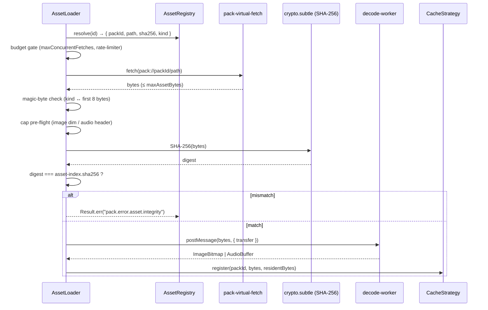

# Asset Loading

Canonical doctrine for the asset loader's hostile-input contract:
per-decoder caps, per-asset / per-pack budgets, fetch-rate policy,
and the pinned pre-flight pipeline. Every cap below is a
**load-bearing constant** for any task touching the loader, the
renderer atlas tracker, the audio engine, or the cache strategy.

Companion docs:
- [`asset-policy.md`](./asset-policy.md) — closed asset-kind enum +
  forbidden-format table.
- [`worker-csp.md`](./worker-csp.md) — Worker / Worklet security
  profile that decoders run inside.
- [`sandbox-model.md`](./sandbox-model.md) — trust-tier capability
  matrix; tier-aware budget hooks (§ 1.3 below).
- [`pack-contract.md`](./pack-contract.md) — pack-load verification
  ordering.
- [`csp.md`](./csp.md) — host CSP that bounds the loader's network
  reach.

---

## 1. Cap Table

Each row is a numeric ceiling enforced by the loader. A failed row
refuses the asset with a closed error code (see
[`pack-error-codes.md`](./pack-error-codes.md) and
[`error-taxonomy.md`](./error-taxonomy.md)).

### 1.1 Per-asset decoder caps

| Cap | Value | Applies to | Rationale |
|---|---|---|---|
| `maxImageWidth` | `4096` | sprite, atlas, tile, image | Caps decoder output before `createImageBitmap`. |
| `maxImageHeight` | `4096` | sprite, atlas, tile, image | Same. |
| `maxImagePixels` | `16_777_216` (4096²) | sprite, atlas, tile, image | Refuses a 30000×30000 PNG that would blow up to GB-scale RGBA. |
| `maxAudioDurationMs` | `60_000` | sound, music, ambient, audio, audio-bank | Refuses a 10-minute decoded buffer. |
| `maxAudioChannels` | `2` | sound, music, ambient, audio, audio-bank | Refuses 8-channel "channel-bomb" payloads. |
| `maxAudioSampleRate` | `48_000` | sound, music, ambient, audio, audio-bank | Refuses 384 kHz payloads that balloon PCM. |
| `maxAssetBytes` | `32_000_000` (32 MB) | every kind | Compressed bytes ceiling per single asset. |

### 1.2 Per-pack budgets

| Cap | Value | Rationale |
|---|---|---|
| `maxAssetsPerPack` | `10_000` | Refuses pathological asset indexes. |
| `maxResidentBytesPerPack` | `67_108_864` (64 MB) | LRU evicts inside the pack first, then escalates to global pressure per [`diagrams/17-cache-strategy.md`](./diagrams/17-cache-strategy.md). |
| `maxConcurrentFetches` | `8` | Per-pack token-bucket ceiling on simultaneous in-flight `fetch()` calls. |
| `maxFetchesPerSecondPerPack` | `32` | Per-pack rate ceiling; excess requests queue FIFO. |

### 1.3 Tier hooks

The numbers above are the **canonical-tier defaults**. Sandboxed
packs share the per-asset decoder caps in § 1.1 but receive
stricter per-pack budgets:

| Cap | Canonical / community-signed | Sandboxed |
|---|---|---|
| `maxFetchesPerSecondPerPack` | `32` | `16` |
| `maxResidentBytesPerPack` | `67_108_864` (64 MB) | `33_554_432` (32 MB) |

Every cap on the sandboxed tier is enforced as a hard refuse rather
than warn-and-degrade. The full per-tier matrix is canonical in
[`sandbox-model.md` § 2](./sandbox-model.md#2-capability-matrix).

---

## 2. Pre-flight Pipeline

Every binary asset runs through the gates below in order. Any gate
may refuse; refusal returns `Result.err(code, …)` and the bytes are
released without ever reaching a decoder.

**Ordering is load-bearing.** Reordering — e.g. running SHA-256
after `decodeAudioData` — would expose the decoder before the
integrity gate. The pipeline is pinned by the pack-load
verification ordering in
[`pack-contract.md` § Verification Ordering](./pack-contract.md#verification-ordering)
and consumed by the asset loader task in
[`tasks/mvp/02b-asset-pipeline/05-async-asset-loader-with-caching.md`](../../tasks/mvp/02b-asset-pipeline/05-async-asset-loader-with-caching.md).

---

## 3. Off-main-thread decode

| Decoder | Surface | Worker contract |
|---|---|---|
| Image (PNG / WebP) | `createImageBitmap(blob)` | Runs inside an `OffscreenCanvas`-capable Worker. |
| Audio (OGG / MP3) | `decodeAudioData(buffer)` | Runs inside an `AudioWorklet` registered under the host CSP. |
| JSON (data) | `JSON.parse` | Stays on the main thread; bounded by [`parser-hardening.md`](./parser-hardening.md) caps. |

Every Worker / Worklet adopts the security profile in
[`worker-csp.md`](./worker-csp.md). A decoder Worker that throws
restarts under the last-known-good policy in that doc; the loader
rejects the failing asset with a closed error code.

---

## 4. Magic-byte table

| Kind | First bytes (hex) | Notes |
|---|---|---|
| PNG (sprite, atlas, tile, image) | `89 50 4E 47 0D 0A 1A 0A` | Mandatory. |
| WebP (sprite, atlas, tile, image) | `52 49 46 46 .. .. .. .. 57 45 42 50` | RIFF + `WEBP` at byte 8. |
| OGG (sound, music, ambient, audio, audio-bank) | `4F 67 67 53` | OggS capture pattern. |
| JSON (data, animation, theme) | `7B` (`{`) after optional UTF-8 BOM (`EF BB BF`) | Streaming parse capped by `parser-hardening.md`. |

A mismatch between `asset-index[].kind` and the observed magic
bytes returns
`Result.err("pack.error.asset.mime-mismatch", { expected, observed })`.
Polyglot payloads (PNG/JS, OGG/HTML, etc.) refuse on the magic-byte
gate before any decoder runs.

The `pack://` virtual fetcher synthesizes
`X-Content-Type-Options: nosniff` on every response so a
same-origin / blob fallback path can never trip the legacy
content-sniffing surface.

---

## 5. Error codes

Every refusal path emits one of the closed codes registered in
[`pack-error-codes.md`](./pack-error-codes.md):

- `pack.error.asset.integrity` — SHA-256 mismatch.
- `pack.error.asset.mime-mismatch` — magic-byte / declared-kind
  divergence.
- `pack.error.asset.too-large` — `maxAssetBytes` or per-pack
  residency exceeded.
- `pack.error.asset.dim-cap` — image width / height / pixel cap
  exceeded.
- `pack.error.asset.audio-cap` — audio channel / sample-rate /
  duration cap exceeded.
- `pack.error.asset.fetch-rate` — per-pack token bucket exhausted
  (request queued > 5 s).

All six codes carry severity `fatal` per
[`pack-error-codes.md`](./pack-error-codes.md). Surface routing per
[`error-ux.md` § 1–2](./error-ux.md): pack-load failures (severity
`fatal`, prefix `pack.*`) render a **full-screen pre-game error**.
The `config.dev.placeholderSprites === true` toggle in
[`pack-contract.md` § Asset Fallback And Placeholders](./pack-contract.md#asset-fallback-and-placeholders)
governs the dev-only magenta-checker sprite fallback for missing
presentation assets — it is not part of error surfacing.

---

## 6. Cross-references

The same cap table is consumed by:

- [`pack-contract.md`](./pack-contract.md) — Asset Rule.
- [`diagrams/17-cache-strategy.md`](./diagrams/17-cache-strategy.md)
  — per-pack residency bucket.
- [`tasks/mvp/02b-asset-pipeline/05-async-asset-loader-with-caching.md`](../../tasks/mvp/02b-asset-pipeline/05-async-asset-loader-with-caching.md)
  — owning task for the loader.
- [`tasks/mvp/02b-asset-pipeline/04-asset-registry-id-based-resolution-no-hardcoded-paths.md`](../../tasks/mvp/02b-asset-pipeline/04-asset-registry-id-based-resolution-no-hardcoded-paths.md)
  — owning task for the registry.
- [`tasks/mvp/06-renderer/`](../../tasks/mvp/06-renderer/) — atlas
  tracker per-pack accounting.
- [`tests/security/escape-vectors/`](../../tests/security/escape-vectors/)
  — fixture corpus that asserts every cap above produces the
  expected refusal code.

To change a cap: update this doc first, then update the consumers
above. Numbers are not duplicated; consumers cite this doc by
section anchor.

---

## 🔍 Sync Check

- **UI: ✔** — Surface routing now matches [`error-ux.md` § 1](./error-ux.md) (`pack / asset` load-time → full-screen pre-game error) and § 2 (`PACK_*` prefix mapping). No screen-package copy strings are claimed by this file.
- **Schema: ✔** — All six refusal codes resolve in [`pack-error-codes.md`](./pack-error-codes.md) (`pack.error.asset.{integrity,mime-mismatch,too-large,dim-cap,audio-cap,fetch-rate}`). Asset-kind enums match [`asset-policy.md`](./asset-policy.md) and the magic-byte rows are consistent.
- **Tasks: ✔** — Owning runtime tasks `mvp.02b.04` and `mvp.02b.05` exist and reciprocally reference this doc; renderer cluster `tasks/mvp/06-renderer/` and security fixture corpus `tests/security/escape-vectors/` resolve.

## ⚠ Issues

- **Tier-hook section anchor (fixed in target).** Original text said "trust-tier overrides live in `sandbox-model.md` § 3", but [`sandbox-model.md`](./sandbox-model.md) § 3 is "Override-precedence trust rule" (pack-vs-pack record overrides). The tier-aware capability matrix is § 2. Per Hard Prohibition A (pick the interpretation consistent with the cross-checked file), the link was rewritten to [`sandbox-model.md` § 2](./sandbox-model.md#2-capability-matrix). No code change implied.
- **Sandboxed budgets are not the same as canonical (fixed in target).** Original § 1.3 said sandboxed packs "ship with the same budgets". [`sandbox-model.md` § 2](./sandbox-model.md#2-capability-matrix) registers stricter sandboxed values: `maxFetchesPerSecondPerPack` `16` (vs `32`) and `maxResidentBytesPerPack` `32 MB` (vs `64 MB`). The "hard refuse vs warn-and-degrade" enforcement difference is preserved; the false equivalence was corrected. Sandbox-model.md remains canonical for the per-tier matrix.
- **Surface routing claim contradicted `error-ux.md` (fixed in target).** Original § 5 said "all of the above route to `log-only` in production builds and to a dev-mode inline banner under `config.dev.placeholderSprites === true`". [`error-ux.md` § 1](./error-ux.md) maps `error/fatal` from pack/asset originator at load-time to "full-screen pre-game error", and § 2 maps the `PACK_*` prefix to the same surface. All six asset codes are `fatal` per [`pack-error-codes.md`](./pack-error-codes.md). The `placeholderSprites` flag is the dev-mode sprite-fallback toggle in [`pack-contract.md` § Asset Fallback And Placeholders](./pack-contract.md#asset-fallback-and-placeholders), not an error-surface toggle. Both facts were corrected in the target without altering any cap, code, or link target.
