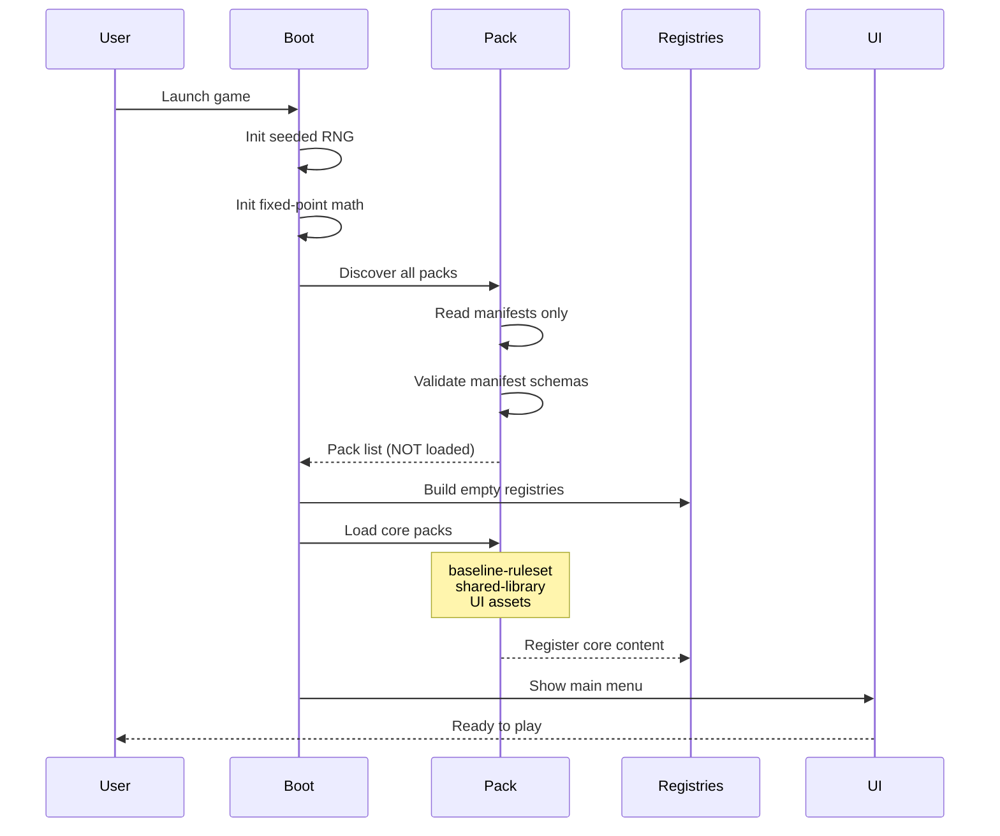

**What happens when you launch the game.** The engine scaffolds its
deterministic core, the pack runtime discovers installed packs by
reading manifests only, empty registries are built, then the
core packs (ruleset + shared library + UI assets) populate them and
the main menu renders. Faction and scenario packs are **not**
loaded at startup — they load lazily in [02 — New Game
Flow](./02-new-game-flow.md) and [04 — Map Loading](./04-map-loading.md).

Canonical contracts: deterministic-core scaffolding in
[`determinism.md` § Non-Negotiable Stack](../determinism.md#non-negotiable-stack);
pack discovery + manifest validation in
[`pack-resolver.md`](../pack-resolver.md); pack layout (including the
`shared-library` example) in
[`pack-contract.md`](../pack-contract.md); the full canvas-warmup
phase machine that this diagram abstracts over in
[28 — Loading Orchestration](./28-loading-orchestration.md).

## Notes

- **Seeded RNG.** PCG32 with named sub-streams; no `Math.random()`.
  The match seed itself is established later (single-player: from
  scenario / save; multiplayer: commit-reveal handshake). See
  [`determinism.md`](../determinism.md).
- **Manifests only.** Pack discovery reads `manifest.json` and
  validates against
  [`manifest.schema.json`](../../../content-schema/schemas/manifest.schema.json);
  pack records and assets stay on disk until a lazy load triggers
  them.
- **Invalid manifests fail loud.** Validation errors emit pack error
  codes catalogued in
  [`pack-error-codes.md`](../pack-error-codes.md); the loader never
  silently skips a malformed pack.
- **Core packs only at startup.** The startup load set is the
  baseline ruleset, the shared library (spells / abilities /
  artifacts), and UI assets. Faction packs load on race pick
  (see [02 — New Game Flow](./02-new-game-flow.md)); scenario and
  world packs load on map pick
  (see [04 — Map Loading](./04-map-loading.md)).
- **"Core packs" is a startup-load grouping, not a manifest kind.**
  The closed `manifest.kind` enum
  (`ruleset-pack | library-pack | faction-pack | world-pack | scenario-pack | asset-pack`)
  is in [`manifest.schema.json`](../../../content-schema/schemas/manifest.schema.json);
  see [`content-platform.md` § Pack Types](../content-platform.md#pack-types).

## Related diagrams

- [02 — New Game Flow](./02-new-game-flow.md) — lazy faction-pack
  load on race pick.
- [04 — Map Loading](./04-map-loading.md) — lazy scenario-pack +
  world-pack load on map pick.
- [28 — Loading Orchestration](./28-loading-orchestration.md) —
  the warmup-phase machine and progress-bar contract this overview
  abstracts over.

---

## 🔍 Sync Check

- **UI: ✔** — Diagram asserts no screen-spec copy strings; the
  detailed loading-screen orchestration (overlay, progress bar,
  recoverable-error panel) lives in
  [28 — Loading Orchestration](./28-loading-orchestration.md), which
  is the canonical UI surface and is cross-linked here.
- **Schema: ✔** — `baseline-ruleset` and `shared-library` pack-folder
  names match
  [`pack-contract.md` § Core Rule](../pack-contract.md); pack kinds
  referenced via prose (`ruleset-pack`, `library-pack`,
  `faction-pack`, `scenario-pack`) match the `manifest.kind` enum in
  [`manifest.schema.json`](../../../content-schema/schemas/manifest.schema.json).
- **Tasks: ✔** — Deterministic-core init owned by
  [`tasks/mvp/01-engine-core/03-implement-pcg32-prng-with-named-sub-streams.md`](../../../tasks/mvp/01-engine-core/03-implement-pcg32-prng-with-named-sub-streams.md);
  pack discovery + manifest validation owned by
  [`tasks/mvp/02b-asset-pipeline/12-pack-resolver-algorithm.md`](../../../tasks/mvp/02b-asset-pipeline/12-pack-resolver-algorithm.md);
  the startup-load `baseline-ruleset` + shared-library packs owned by
  [`tasks/phase-2/05-mod-system/05a-baseline-ruleset-and-shared-library-packs.md`](../../../tasks/phase-2/05-mod-system/05a-baseline-ruleset-and-shared-library-packs.md).
  No orphan tasks reference this diagram without reciprocal mention.

## ⚠ Issues

- **`shared-library` is one folder in `pack-contract.md`, four packs
  in the owning task.**
  [`pack-contract.md` § Core Rule](../pack-contract.md) lists
  `resources/packs/shared-library/` as a single example pack, but
  [`tasks/phase-2/05-mod-system/05a-baseline-ruleset-and-shared-library-packs.md`](../../../tasks/phase-2/05-mod-system/05a-baseline-ruleset-and-shared-library-packs.md)
  ships four packs (`shared-skills`, `shared-abilities`,
  `shared-spells`, `shared-artifacts`) instead. This diagram inherits
  the `pack-contract.md` wording verbatim; the inconsistency lives
  between those two files, not in this diagram. Per Hard Prohibition
  D (no edits to cross-checked files), surfaced here for a follow-up
  pass — either pluralize `pack-contract.md`'s example to match the
  task, or note in the task that the four packs collectively
  realize the "shared library" example. Not CI-blocking.
