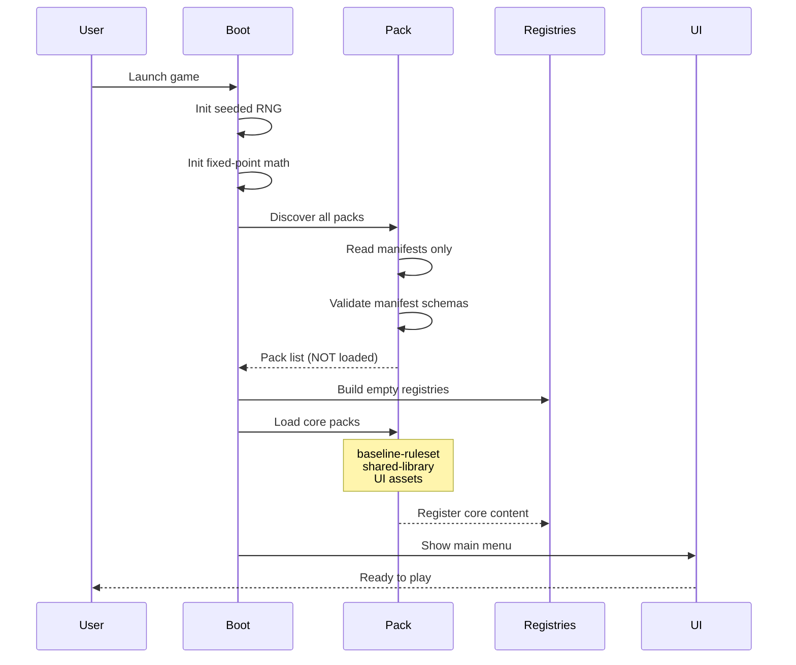

**What happens when you launch the game.** Engine boots, validates packs, builds registries, and shows the main menu. Asset packs are discovered but not loaded yet (lazy loading).

## Notes

- RNG is seeded deterministically for replay support
- Pack validation rejects invalid manifests early
- Only core packs (ruleset, shared library, UI) load at startup
- Faction packs load when player picks a race
- Scenario packs load when player picks a map
