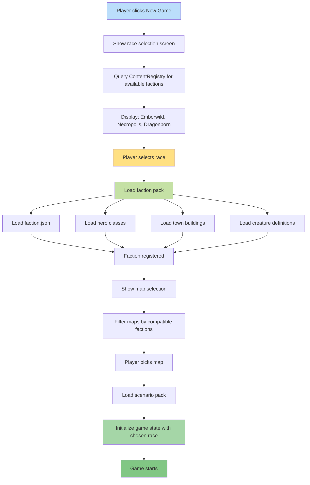

**Player clicks 'New Game'.** Available factions are listed from the registry. When player picks a race, that faction's pack is loaded and its assets prepared. Map options are filtered to those compatible with the chosen race.

## Notes

- Faction list comes from registry (mod-friendly)
- Each faction pack is self-contained
- Map selection filtered by faction compatibility
- Scenario pack pins required pack hashes for replay safety
