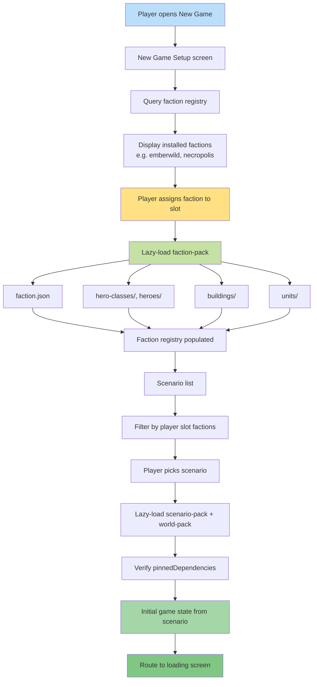

**Lazy faction + scenario load on the New Game path.** Startup only
loads the core packs (see [01 — Game Startup](./01-game-startup.md));
this diagram covers what happens after the player opens the New Game
screen. Picking a race resolves to a `faction-pack` load; picking a
scenario resolves to a `scenario-pack` + `world-pack` load. The
scenario pack pins every dependency by `(packId, version,
contentHash)` so replays remain byte-identical.

Canonical contracts: pack kinds in
[`content-platform.md` § Pack Types](../content-platform.md#pack-types)
(closed `manifest.kind` enum on
[`manifest.schema.json`](../../../content-schema/schemas/manifest.schema.json));
faction-pack folder layout in
[`pack-contract.md` § Folder Layout](../pack-contract.md#folder-layout);
faction record shape in
[`faction.schema.json`](../../../content-schema/schemas/faction.schema.json);
scenario record + `pinnedDependencies[]` in
[`scenario.schema.json`](../../../content-schema/schemas/scenario.schema.json);
resolver algorithm in [`pack-resolver.md`](../pack-resolver.md). The
authored UI surface that drives the user-facing flow is screen
[`02-new-game-setup`](../wiki/screens/02-new-game-setup/spec.md).

## Notes

- **Faction list is data-driven.** The faction registry is assembled
  by `src/content-runtime/` at pack load — see
  [`content-platform.md` § Runtime Responsibilities](../content-platform.md#runtime-responsibilities).
  Adding a faction is a new `faction-pack` folder under
  `resources/packs/`; no engine branch.
- **One folder = one faction-pack.** Canonical layout (manifest +
  `faction.json` + `units/` + `heroes/` + `hero-classes/` +
  `buildings/` + `abilities/` + `skills/` + `animations/` +
  `sounds/` + `assets/` + `locales/`) is pinned by
  [`pack-contract.md` § Folder Layout](../pack-contract.md#folder-layout).
- **Scenario compatibility is checked against pinned dependencies.**
  `scenario.players[].factionId` and `scenario.pinnedDependencies[]`
  (required by [`scenario.schema.json`](../../../content-schema/schemas/scenario.schema.json))
  are what filter the scenario list to the player's chosen factions.
- **Hash pinning is what makes replays safe.** Each entry in
  `pinnedDependencies[]` carries `packId`, `version`, and a
  16–128-char hex `contentHash`. Loader behaviour on mismatch is in
  [`version-policy.md`](../version-policy.md); the determinism rule
  is in [`determinism.md`](../determinism.md).
- **Race vs faction.** The player-facing term is "race" (UI copy);
  the schema and runtime term is "faction". The two are the same
  record — see
  [03 — Race → Castle](./03-race-castle.md) for how `factionId`
  drives presentation.

## Related diagrams

- [01 — Game Startup](./01-game-startup.md) — what is and is not
  loaded before this flow runs.
- [03 — Race → Castle](./03-race-castle.md) — how the chosen
  `factionId` resolves to town presentation assets.
- [04 — Map Loading](./04-map-loading.md) — the scenario-pack +
  world-pack load path this diagram terminates in.

---

## 🔍 Sync Check

- **UI: ⚠** — The actual New Game UI surface
  ([`wiki/screens/02-new-game-setup/spec.md`](../wiki/screens/02-new-game-setup/spec.md)
  and
  [`interactions.md`](../wiki/screens/02-new-game-setup/interactions.md))
  routes through mode tabs → scenario list → player slots (each slot
  carries a `factionId`) → Start, not the "race first, then map"
  ordering this diagram depicts. The lazy-load semantics still match
  (faction-pack on slot assignment, scenario-pack + world-pack on
  Start), but the ordering is conceptual, not literal screen flow.
  See `## ⚠ Issues`.
- **Schema: ✔** — Pack kinds (`faction-pack`, `scenario-pack`,
  `world-pack`) match the closed `manifest.kind` enum on
  [`manifest.schema.json`](../../../content-schema/schemas/manifest.schema.json);
  faction-pack folder list matches
  [`pack-contract.md` § Folder Layout](../pack-contract.md#folder-layout);
  `scenario.pinnedDependencies[].{packId,version,contentHash}` matches
  [`scenario.schema.json`](../../../content-schema/schemas/scenario.schema.json)
  (`pinnedDependencies` is required and `contentHash` matches the
  `^[a-f0-9]{16,128}$` pattern).
- **Tasks: ✔** — Authored UI owned by
  [`tasks/mvp/07-ui-shell/08-new-game-setup-screen.md`](../../../tasks/mvp/07-ui-shell/08-new-game-setup-screen.md);
  scenario load owned by
  [`tasks/mvp/08-persistence/04-scenario-loader.md`](../../../tasks/mvp/08-persistence/04-scenario-loader.md);
  on-load validation owned by
  [`tasks/mvp/04-faction-emberwild/05-content-loader-validate-on-load.md`](../../../tasks/mvp/04-faction-emberwild/05-content-loader-validate-on-load.md).
  No orphan tasks reference this diagram without reciprocal mention.

## ⚠ Issues

- **Diagram ordering vs authored UI ordering.** This diagram depicts
  "pick race → load faction → pick map → load scenario". The
  authored UI ([`wiki/screens/02-new-game-setup/spec.md`](../wiki/screens/02-new-game-setup/spec.md))
  is scenario-first: a scenario list is selected before player slots
  bind their `factionId`. The runtime semantics — lazy faction-pack
  load on slot binding, scenario-pack + world-pack load on Start —
  still hold either way. Per Hard Prohibition D (no edits to
  cross-checked files), the option for a follow-up pass is either
  to relabel this diagram as "lazy-load sequence (logical, not
  screen order)" or to redraw it to mirror the authored mode → list
  → slots → start path. Not CI-blocking.
- **Stale faction example removed: `Dragonborn`.** The previous text
  named `Dragonborn` as one of the displayed factions. No
  `dragonborn-faction` pack exists in `resources/packs/`,
  `content-schema/examples/packs/`, or any task; the real first-
  party factions are `emberwild` (MVP) and `necropolis` (phase-2,
  per
  [`tasks/phase-2/03-second-faction/`](../../../tasks/phase-2/03-second-faction/)),
  with `sylvan`, `stormspire`, `ashlord`, and `deepway` planned as
  reference packs under
  [`tasks/phase-2/05-mod-system/`](../../../tasks/phase-2/05-mod-system/).
  Rewrote the example to `emberwild, necropolis` (real installed
  factions) and added a "data-driven" caption so the example is
  illustrative, not authoritative. Meaning preserved.
- **`ContentRegistry` renamed to "faction registry".** The original
  diagram named a singleton `ContentRegistry`; that identifier does
  not appear in any schema, doc, or task — the canonical concept per
  [`content-platform.md` § Runtime Responsibilities](../content-platform.md#runtime-responsibilities)
  is a set of registries assembled by `src/content-runtime/`
  ("content registry assembly"). Narrowed the label to "faction
  registry" since this diagram only consults the faction set.
  Meaning preserved.
