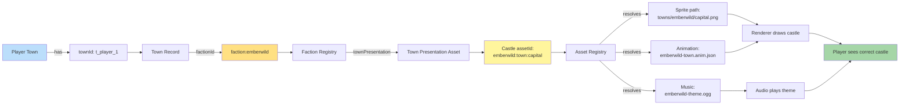

**How the game knows which castle to render.** Each player has a chosen race ID. The town record references hero/faction. The faction's town presentation defines which sprites to show. **NO if/else for races - all data-driven.**

## Why This Matters

Adding a new race requires NO code changes. You just:

1. Create a new pack folder
2. Add a `faction.json` with `townPresentation` field
3. Provide castle sprite, animation, music files
4. Pack loads → castle works

No engine modification needed.
