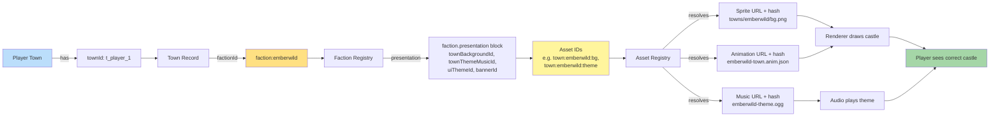

**How a chosen race resolves to the castle the renderer draws.** A
town record carries a `factionId`. The faction record's
`presentation` block carries asset IDs (`townBackgroundId`,
`townThemeMusicId`, `uiThemeId`, `bannerId`). The asset registry
resolves each ID to a concrete sprite, animation, and music handle.
**No engine `if/else` on faction — every fork is a data lookup.**

Canonical contracts: the faction record shape in
[`faction.schema.json`](../../../content-schema/schemas/faction.schema.json)
(`presentation` is required; the schema row lives in
[`schema-matrix.md`](../schema-matrix.md)); the richer optional
town-layout record in
[`town-presentation.schema.json`](../../../content-schema/schemas/town-presentation.schema.json);
the editor-time-vs-runtime split for asset references in
[`asset-path-resolution.md`](../asset-path-resolution.md) (gameplay
records reference logical IDs only — never raw paths); pack rules in
[`content-platform.md`](../content-platform.md) and folder layout in
[`pack-contract.md`](../pack-contract.md).

## Notes

- **Data-driven, not branched.** The renderer never switches on
  `factionId`. It reads `faction.presentation`, calls
  `PackRegistry.resolveAsset(logicalId)` per asset ID, and draws
  what comes back. The same code path serves every faction —
  first-party or community pack. See
  [05 — Castle Per Race](./05-castle-render.md) for the renderer
  side of the same flow.
- **Adding a new race = adding a `faction-pack`.** No engine edit:
  1. Create a `faction-pack` folder under `resources/packs/` (layout
     pinned by
     [`pack-contract.md` § Folder Layout](../pack-contract.md#folder-layout)).
  2. Add `faction.json` with the four required `presentation` IDs
     (`townBackgroundId`, `townThemeMusicId`, `uiThemeId`,
     `bannerId`).
  3. Register the underlying files in the pack's
     `assets/index.json` (logical ID → relative path + sha256, per
     [`asset-path-resolution.md` § 1](../asset-path-resolution.md#1-editor-time-strings-one-shot)).
  4. The faction registry picks the pack up at load time and the
     castle renders.
- **Logical IDs, not paths, in gameplay data.** Faction records
  hold asset IDs. Concrete URLs are returned by
  `PackRegistry.resolveAsset` at runtime. Raw asset paths are
  banned from gameplay records by the root contract (see
  [CLAUDE.md hard constraints](../../../CLAUDE.md#hard-constraints-ci-enforced)
  and
  [`asset-path-resolution.md`](../asset-path-resolution.md)).
- **Race vs faction.** "Race" is UI copy; `factionId` is the
  schema/runtime identifier. Same record. See
  [02 — New Game Flow](./02-new-game-flow.md) for how the player's
  race choice is bound to a slot.

## Related diagrams

- [02 — New Game Flow](./02-new-game-flow.md) — where the player
  picks a race and the faction-pack loads.
- [04 — Map Loading](./04-map-loading.md) — scenario load that
  places towns on the map with their `factionId`s already bound.
- [05 — Castle Per Race](./05-castle-render.md) — same flow from
  the renderer's perspective.

---

## 🔍 Sync Check

- **UI: ✔** — No authored UI surface is asserted by this diagram;
  the user-facing race choice is owned by
  [`wiki/screens/02-new-game-setup/spec.md`](../wiki/screens/02-new-game-setup/spec.md)
  and covered by [02 — New Game Flow](./02-new-game-flow.md).
- **Schema: ⚠** — Original prose named the resolution field
  `townPresentation`; the actual required field on
  [`faction.schema.json`](../../../content-schema/schemas/faction.schema.json)
  is `presentation` (a sub-object with `townBackgroundId`,
  `townThemeMusicId`, `uiThemeId`, `bannerId`). Rewrote inline.
  Schema row in
  [`schema-matrix.md`](../schema-matrix.md) is consistent.
- **Tasks: ✔** — Faction record shape is owned by
  [`tasks/mvp/02-content-schemas/`](../../../tasks/mvp/02-content-schemas/);
  the related town-presentation record by
  [`tasks/mvp/02-content-schemas/09-animation-vfx-sound-townpresentation-schemas.md`](../../../tasks/mvp/02-content-schemas/09-animation-vfx-sound-townpresentation-schemas.md);
  faction-pack folder + asset-index pipeline by
  [`tasks/mvp/02b-asset-pipeline/01-manifest-format-plus-pack-registry.md`](../../../tasks/mvp/02b-asset-pipeline/01-manifest-format-plus-pack-registry.md).
  No task references this diagram by filename, but none need to —
  diagrams are normatively secondary per
  [`README.md` § Normative Status](./README.md#normative-status).

## ⚠ Issues

- **Field name corrected: `townPresentation` → `presentation`.** The
  original diagram labelled the faction→assets edge `townPresentation`
  and the "Why This Matters" list referenced a `townPresentation`
  field on `faction.json`. No such field exists on
  [`faction.schema.json`](../../../content-schema/schemas/faction.schema.json);
  the canonical required field is `presentation`, with the four
  required IDs above. There is a separately-registered
  [`town-presentation.schema.json`](../../../content-schema/schemas/town-presentation.schema.json)
  record (richer town-layout data, optional), which likely caused
  the conflation. Rewrote inline per § 8 Option A. Meaning preserved.
- **Illustrative asset IDs aligned to canonical pattern.** The
  original used asset IDs of the form `<faction>:town:<key>` (e.g.
  `emberwild:town:capital`). The canonical pattern in
  [`content-schema/examples/packs/emberwild-faction/assets/index.json`](../../../content-schema/examples/packs/emberwild-faction/assets/index.json)
  is `town:<faction>:<key>` (e.g. `town:emberwild:bg`,
  `town:emberwild:theme`). Updated the diagram's example IDs to
  match. The IDs remain illustrative — the diagram is conceptual,
  not a normative ID list.
- **Resolved-URL leaves relabeled.** The original diagram terminated
  in nodes named "Sprite path: …", "Animation: …", "Music: …" — the
  registry actually returns `{ url, hash, format }` per
  [`asset-path-resolution.md` § 2](../asset-path-resolution.md#2-runtime-registry-mediated-synchronous).
  Relabeled the leaves to "URL + hash" so the diagram does not read
  as if gameplay records embed file paths. Conceptual flow preserved.
