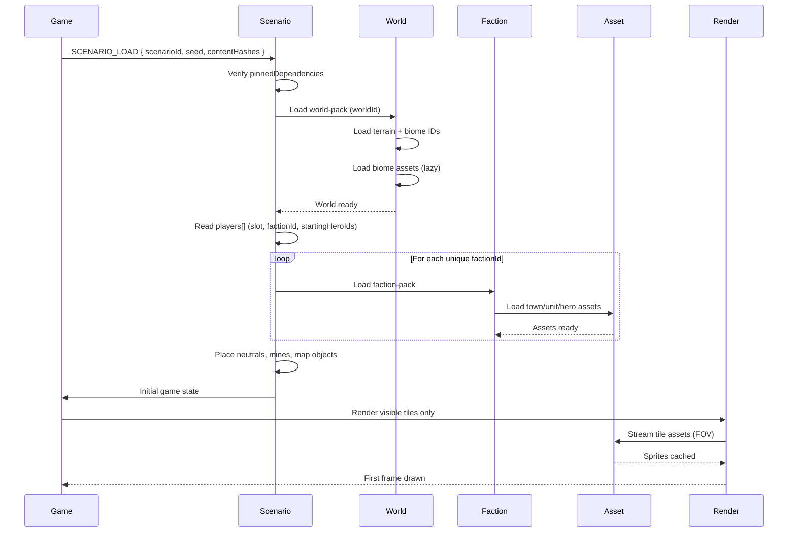

**How a scenario becomes a playable map.** The scenario record pins
its `worldId` and its `players[].factionId` (race per slot), then
lists every required pack in `pinnedDependencies[]`. The loader
resolves world-pack + faction-packs → builds initial state →
warms the renderer. Camera-driven tile streaming is a separate
in-game flow (see [14 — Enter Map](./14-enter-map.md) and
[17 — Cache Strategy](./17-cache-strategy.md)); this diagram
shows the once-per-game load that precedes it.

Canonical contracts: scenario record shape (`worldId`, `players[]`,
`pinnedDependencies[]`) in
[`scenario.schema.json`](../../../content-schema/schemas/scenario.schema.json);
world record shape (`biomeIds`, `generatorPresetIds`, `presentation`)
in [`world.schema.json`](../../../content-schema/schemas/world.schema.json);
pack kinds (`world-pack`, `scenario-pack`, `faction-pack`) in
[`content-platform.md` § Pack Types](../content-platform.md#pack-types);
the load command itself (`SCENARIO_LOAD`, including seed-source
precedence) in
[`command-schema.md` § SCENARIO_LOAD](../command-schema.md#scenario_load);
the warmup-phase machine and progress-bar contract this overview
abstracts over in
[28 — Loading Orchestration](./28-loading-orchestration.md).

## Notes

- **Faction is bound by slot, not derived from heroes.**
  `scenario.players[].factionId` is the canonical race binding (see
  [`scenario.schema.json`](../../../content-schema/schemas/scenario.schema.json)).
  `startingHeroIds` instantiate heroes into that slot but never
  decide the slot's faction. The loader iterates the distinct
  `factionId`s in `players[]` and lazy-loads each `faction-pack`
  once — see [02 — New Game Flow](./02-new-game-flow.md) for the
  upstream slot binding and [03 — Race → Castle](./03-race-castle.md)
  for the presentation resolve.
- **World pack supplies the map substrate.** Terrain types,
  `biomeIds`, generator presets, and the ambient presentation block
  (`ambientMusicId`, `loadingArtId`, optional `paletteId`) come from
  the world record (see
  [`world.schema.json`](../../../content-schema/schemas/world.schema.json)).
  Biome textures load lazily — the world record carries IDs, the
  asset registry resolves URL+hash per
  [`asset-path-resolution.md`](../asset-path-resolution.md).
- **Hash pinning is what makes replays safe.**
  `pinnedDependencies[]` (required, `minItems: 1`) carries
  `{ packId, version, contentHash? }` per scenario; mismatch
  behaviour is in [`version-policy.md`](../version-policy.md), and
  the determinism rule in [`determinism.md`](../determinism.md).
  `SCENARIO_LOAD.contentHashes` mirrors these for the command log.
- **Tile streaming is a separate flow.** The "Render visible tiles
  only" / "Stream tile assets (FOV)" steps above hand off to the
  in-game camera loop in [14 — Enter Map](./14-enter-map.md); cache
  residency, per-pack budgets, and eviction tiers are governed by
  [17 — Cache Strategy](./17-cache-strategy.md) and the cap table in
  [`asset-loading.md`](../asset-loading.md). The loading screen's
  progress bar is fed by the warmup phases in
  [28 — Loading Orchestration](./28-loading-orchestration.md);
  per-phase reducers are the single source of truth.

## Related diagrams

- [01 — Game Startup](./01-game-startup.md) — what is loaded before
  this flow runs (core packs only).
- [02 — New Game Flow](./02-new-game-flow.md) — where the player
  binds `factionId`s to slots and the scenario list is filtered.
- [14 — Enter Map](./14-enter-map.md) — the camera-driven tile-
  streaming loop this flow hands off to.
- [17 — Cache Strategy](./17-cache-strategy.md) — eviction tiers and
  per-pack residency that bound the FOV streamer.
- [28 — Loading Orchestration](./28-loading-orchestration.md) — the
  warmup-phase machine + progress-bar contract.

---

## 🔍 Sync Check

- **UI: ✔** — Diagram asserts no screen-spec copy strings; the
  loading-screen surface is owned by
  [`wiki/screens/59-loading-screen/architecture.md`](../wiki/screens/59-loading-screen/architecture.md#canvas-lifecycle-and-warmup-orchestration)
  via [28 — Loading Orchestration](./28-loading-orchestration.md).
- **Schema: ✔** — Field set (`worldId`, `players[].factionId`,
  `players[].startingHeroIds`, `pinnedDependencies[]`) matches
  [`scenario.schema.json`](../../../content-schema/schemas/scenario.schema.json);
  world fields (`biomeIds`, `generatorPresetIds`, `presentation`)
  match [`world.schema.json`](../../../content-schema/schemas/world.schema.json);
  pack kinds (`world-pack`, `scenario-pack`, `faction-pack`) match
  the closed `manifest.kind` enum in
  [`manifest.schema.json`](../../../content-schema/schemas/manifest.schema.json).
  Schema rows for `World` and `Scenario` resolve in
  [`schema-matrix.md`](../schema-matrix.md).
- **Tasks: ✔** — Scenario load owned by
  [`tasks/mvp/08-persistence/04-scenario-loader.md`](../../../tasks/mvp/08-persistence/04-scenario-loader.md)
  (`SCENARIO_LOAD` binding, initial-state build); world schema by
  [`tasks/mvp/02-content-schemas/15-world-schema.md`](../../../tasks/mvp/02-content-schemas/15-world-schema.md);
  pack-resolver + manifest validation by
  [`tasks/mvp/02b-asset-pipeline/12-pack-resolver-algorithm.md`](../../../tasks/mvp/02b-asset-pipeline/12-pack-resolver-algorithm.md);
  loader cap table by
  [`tasks/mvp/02b-asset-pipeline/05-async-asset-loader-with-caching.md`](../../../tasks/mvp/02b-asset-pipeline/05-async-asset-loader-with-caching.md).
  No orphan tasks reference this diagram without reciprocal mention.

## ⚠ Issues

- **"Starting heroes determine race" wording corrected.** The
  original prose said the scenario references "starting heroes
  (which determine race)". The canonical scenario record in
  [`scenario.schema.json`](../../../content-schema/schemas/scenario.schema.json)
  binds `factionId` (race) directly on each `players[]` entry,
  alongside an independent `startingHeroIds` array; the faction is
  not derived from the hero. Rewrote inline per § 8 Option A and
  clarified the loop key as "each unique `factionId`". Meaning
  preserved (faction-packs still load per slot's race).
- **"Load map_01.scenario.json" → `SCENARIO_LOAD` command.** The
  original sequence began with an illustrative filename. The
  canonical entry point is the `SCENARIO_LOAD` command in
  [`command-schema.md` § SCENARIO_LOAD](../command-schema.md#scenario_load),
  carrying `{ scenarioId, seed, contentHashes }`. Updated the first
  arrow accordingly so the diagram cites the real command and
  surfaces seed-source precedence by reference. Conceptual flow
  preserved.
- **Pre-game load vs. in-game tile streaming were conflated.** The
  original ended with "Render visible tiles only → Stream tile
  assets (FOV) → first frame", which mixes the once-per-game
  scenario load with the continuous camera loop. The continuous
  loop is canonically owned by [14 — Enter Map](./14-enter-map.md)
  and [17 — Cache Strategy](./17-cache-strategy.md), and the
  progress-bar contract by
  [28 — Loading Orchestration](./28-loading-orchestration.md). Kept
  the final render trio in the sequence (the load does culminate in
  the first frame) but labelled the boundary and added explicit
  hand-off pointers in the prose. No new facts introduced.
