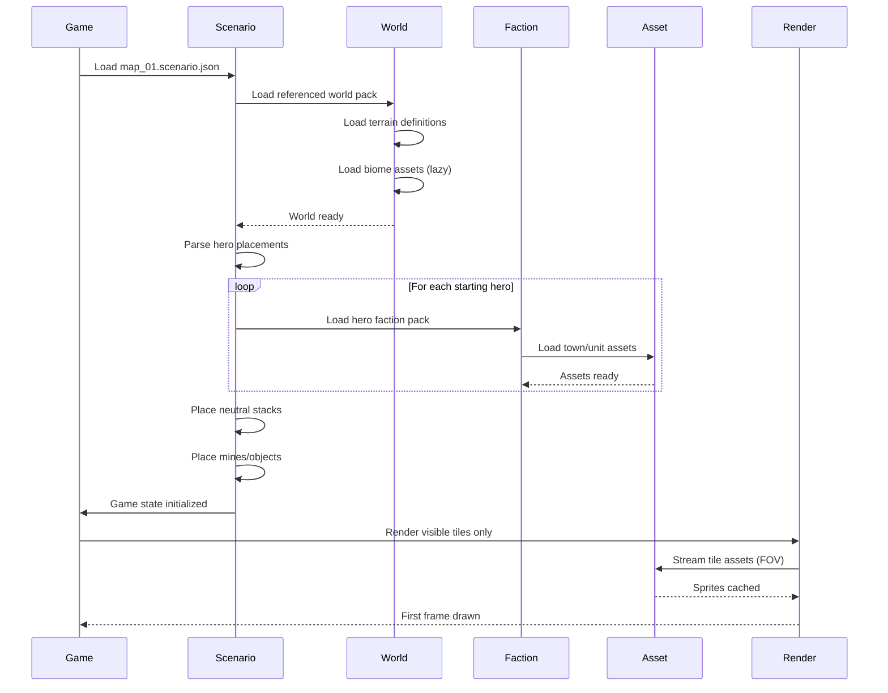

**Loading a scenario map.** The map file references a world pack (terrain, biomes), spawned objects (mines, neutrals), and starting heroes (which determine race). Assets load progressively as the camera moves.

## Notes

- World pack provides terrain types and biome assets
- Each starting hero brings their faction's assets
- Tiles outside field of view aren't loaded (memory savings)
- Camera movement triggers progressive asset streaming
