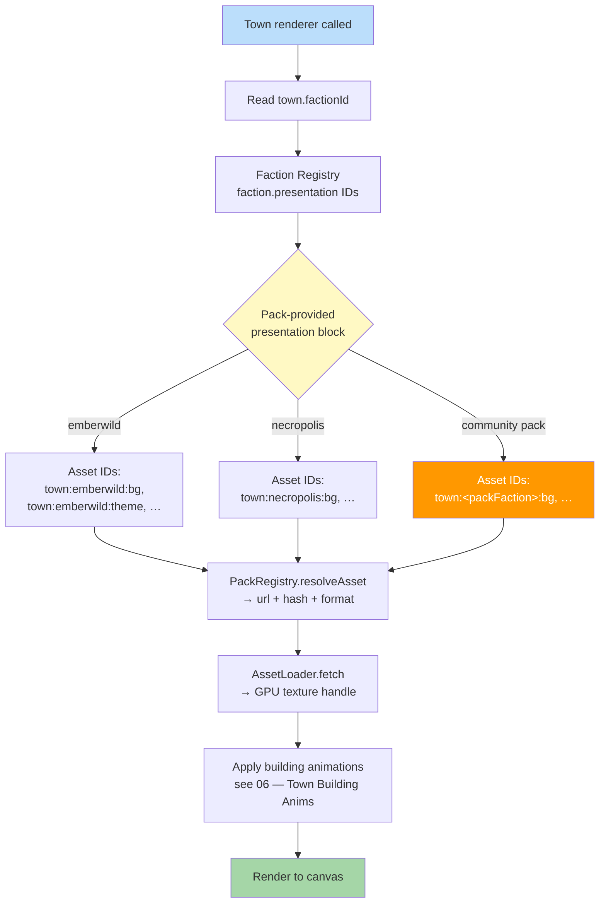

**Same code path, different visuals.** The town renderer reads the
town's `factionId`, asks the asset registry for that faction's
presentation IDs, and draws what comes back. No `if/else` on faction
in engine or renderer code — adding a new race is adding a
`faction-pack`, not patching a switch.

Canonical contracts: faction record (`presentation` required, with
`townBackgroundId`, `townThemeMusicId`, `uiThemeId`, `bannerId`) in
[`faction.schema.json`](../../../content-schema/schemas/faction.schema.json);
the optional richer town-layout record in
[`town-presentation.schema.json`](../../../content-schema/schemas/town-presentation.schema.json);
editor-time-vs-runtime split (gameplay records hold logical IDs;
`PackRegistry.resolveAsset` returns `{ url, hash, format }`) in
[`asset-path-resolution.md`](../asset-path-resolution.md); pack
layout in [`pack-contract.md`](../pack-contract.md); presentation
fallback rules in
[`pack-contract.md` § Asset Fallback And Placeholders](../pack-contract.md#asset-fallback-and-placeholders).

## Notes

- **Data lookup, not code branch.** The renderer never switches on
  `factionId`. It reads the faction's `presentation` block, calls
  `PackRegistry.resolveAsset(logicalId)` per ID, and draws the
  result. The same path serves every faction — first-party or
  community pack. See
  [03 — Race → Castle](./03-race-castle.md) for the schema-side view
  of the same flow.
- **Asset IDs follow the canonical `town:<faction>:<key>` pattern.**
  Illustrative IDs in the flowchart match the shape used by the
  reference pack (`content-schema/examples/packs/emberwild-faction/assets/index.json`).
  The diagram is conceptual; the normative list of required IDs is
  the faction `presentation` block in
  [`faction.schema.json`](../../../content-schema/schemas/faction.schema.json).
- **Faction-packs are loaded once per scenario.** The scenario
  loader iterates each unique `players[].factionId` and lazy-loads
  the matching faction-pack — see
  [04 — Map Loading](./04-map-loading.md). By the time the town
  renderer runs, the assets are already in the registry.
- **Building animations are a separate state machine.** "Apply
  building animations" hands off to the state graph in
  [06 — Town Building Anims](./06-town-animations.md) (idle,
  under-construction, active, upgraded, damaged, demolishing). This
  diagram stops at the renderer entry point; the per-building
  sequencing lives there.
- **Missing presentation falls back; missing gameplay fails loudly.**
  A missing town sprite resolves to the placeholder texture per
  [`pack-contract.md` § Asset Fallback And Placeholders](../pack-contract.md#asset-fallback-and-placeholders),
  consistent with
  [`fail-loud.md`](../fail-loud.md) (presentation may fall back;
  gameplay requirements must fail).

## Architecture Principle

"Switch on faction" is **a data lookup, not a code path**. The
renderer has no hardcoded race branches. A new race becomes available
the moment its `faction-pack` is mounted by the pack registry — no
engine edit, no recompile.

## Related diagrams

- [03 — Race → Castle](./03-race-castle.md) — schema-side resolution
  (`factionId` → `faction.presentation` → asset IDs).
- [04 — Map Loading](./04-map-loading.md) — when faction-packs are
  loaded into the registry (once per unique slot faction).
- [06 — Town Building Anims](./06-town-animations.md) — the
  per-building animation state machine this diagram hands off to.
- [15 — Enter Town](./15-enter-town.md) — the camera transition that
  triggers a town renderer call.

---

## 🔍 Sync Check

- **UI: ✔** — No authored UI surface is asserted; the town
  presentation surface is owned by
  [`wiki/screens/35-town-flyby/spec.md`](../wiki/screens/35-town-flyby/spec.md)
  and its sibling files.
- **Schema: ✔** — The four `presentation` IDs cited match the
  required keys on
  [`faction.schema.json`](../../../content-schema/schemas/faction.schema.json);
  the `town:<faction>:<key>` example IDs match the canonical pack
  (`content-schema/examples/packs/emberwild-faction/assets/index.json`);
  the resolved-asset shape (`url`, `hash`, `format`) matches
  [`asset-path-resolution.md` § 2](../asset-path-resolution.md#2-runtime-registry-mediated-synchronous).
  Schema rows for `Faction` and `TownPresentation` resolve in
  [`schema-matrix.md`](../schema-matrix.md).
- **Tasks: ✔** — Renderer surface owned by
  [`tasks/mvp/02b-asset-pipeline/04-asset-registry-id-based-resolution-no-hardcoded-paths.md`](../../../tasks/mvp/02b-asset-pipeline/04-asset-registry-id-based-resolution-no-hardcoded-paths.md)
  (`PackRegistry.resolveAsset`) and
  [`tasks/mvp/02b-asset-pipeline/05-async-asset-loader-with-caching.md`](../../../tasks/mvp/02b-asset-pipeline/05-async-asset-loader-with-caching.md)
  (loader + caching); faction record shape by
  [`tasks/mvp/02-content-schemas/02-faction-schema.md`](../../../tasks/mvp/02-content-schemas/02-faction-schema.md);
  faction-pack folder + asset-index pipeline by
  [`tasks/mvp/02b-asset-pipeline/01-manifest-format-plus-pack-registry.md`](../../../tasks/mvp/02b-asset-pipeline/01-manifest-format-plus-pack-registry.md);
  emberwild pack content by
  [`tasks/mvp/04-faction-emberwild.md`](../../../tasks/mvp/04-faction-emberwild.md).
  Diagrams are normatively secondary per
  [`README.md § Normative Status`](./README.md#normative-status).

## ⚠ Issues

- **Illustrative asset IDs aligned to canonical pattern.** The
  original flowchart used IDs of the form `<faction>:town:<key>`
  (e.g. `emberwild:town:fortress`, `necropolis:town:necropolis`).
  The canonical pattern in
  [`content-schema/examples/packs/emberwild-faction/assets/index.json`](../../../content-schema/examples/packs/emberwild-faction/assets/index.json)
  is `town:<faction>:<key>` (e.g. `town:emberwild:bg`,
  `town:emberwild:theme`). Updated the diagram's example IDs to
  match the canonical pattern and to align with the same fix in
  [03 — Race → Castle](./03-race-castle.md) `## ⚠ Issues`. IDs
  remain illustrative — the normative ID list is the faction
  `presentation` block in
  [`faction.schema.json`](../../../content-schema/schemas/faction.schema.json).
  No new facts introduced.
- **"Load sprite atlas" relabeled to registry + loader split.** The
  original collapsed two distinct steps ("Load sprite atlas" →
  "Get town animation") into one renderer-internal blob. At runtime
  the registry returns `{ url, hash, format }` synchronously per
  [`asset-path-resolution.md` § 2](../asset-path-resolution.md#2-runtime-registry-mediated-synchronous);
  the publish-time atlas bake is a separate concern owned by
  [`atlas-pipeline.md`](../atlas-pipeline.md). Relabeled the two
  nodes to "PackRegistry.resolveAsset" and "AssetLoader.fetch" so
  the diagram does not imply the renderer touches atlas binaries
  directly. Conceptual flow preserved.
- **Building-animation step delegated to 06.** The original ended
  "Get town animation → Play building anims → Render". The building
  animation state machine (idle / construct / active / upgraded /
  damaged / demolishing) is canonically owned by
  [06 — Town Building Anims](./06-town-animations.md). Kept a single
  "Apply building animations" node here and added an explicit
  hand-off pointer to 06 in both the diagram label and the Notes
  section. No facts removed.
