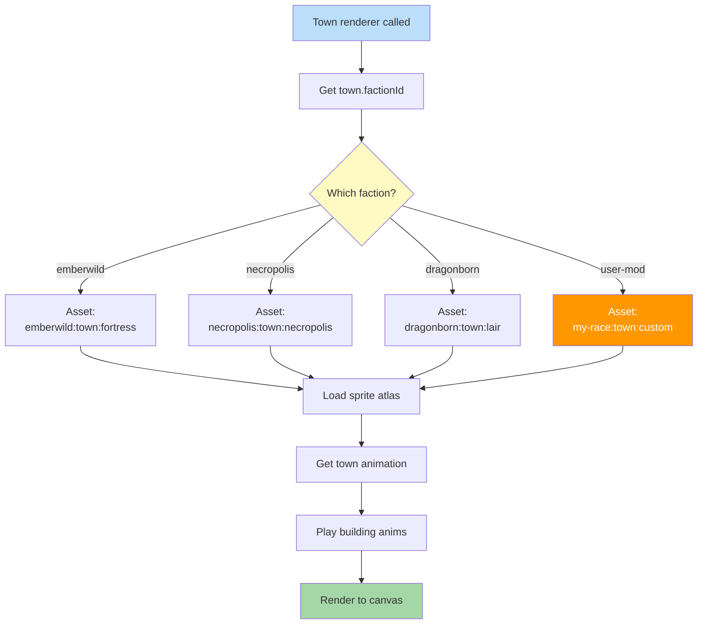

**Same code path, different visuals.** The town renderer just asks 'what's this town's faction?' and asks the asset registry for its sprites. Each race's pack provides its own castle art. Adding a new race means adding a pack — no code changes.

## Architecture Principle

The "switch on faction" is **handled by data lookup**, not code. The renderer never has hardcoded if/else branches per race. New races become available the moment their pack is loaded.
