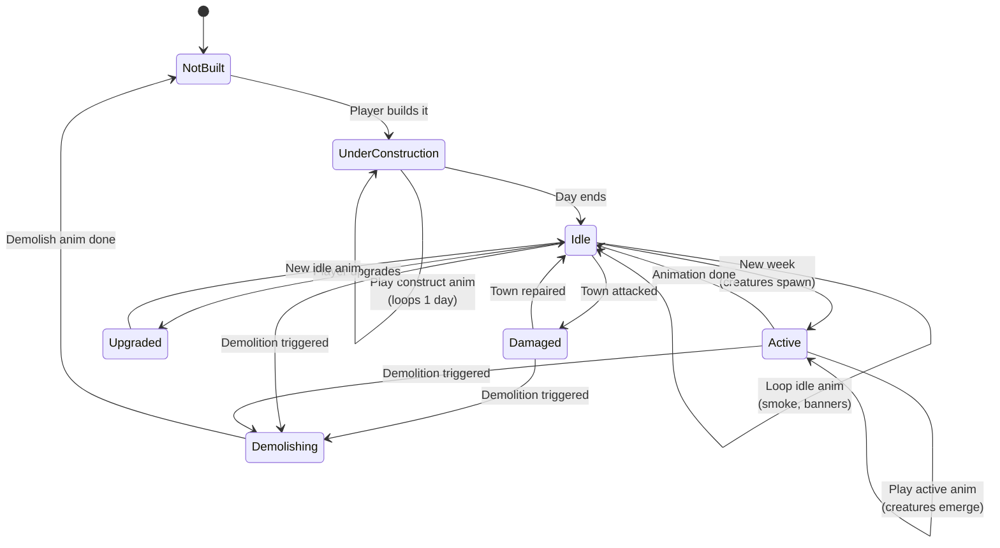

**Buildings have idle, construction, active, and demolishing
animations.** When the player enters town, all buildings load their
idle animations. New construction triggers construction animation.
Production buildings (e.g., kennels) show creature animations on
schedule. Demolition (siege loss, scripted scenario, or pack-defined
demolition order) plays the `demolishing` clip once before the
building reverts to `NotBuilt`.

## Animation Timing

| State | Trigger | Duration | Loops? |
|-------|---------|----------|--------|
| UnderConstruction | BUILD_BUILDING command | Until next day | Yes |
| Idle | Default state | Continuous | Yes |
| Active | Weekly tick | 2-4 seconds | No |
| Upgraded | UPGRADE_BUILDING command | One-time transition | No |
| Damaged | Town attacked | Until repaired | Yes |
| Demolishing | DEMOLISH_BUILDING command, siege loss, or scenario script | One-time transition | No |

## Mid-Loop Destruction

`Demolishing` is the body-channel terminal state for buildings. Per
[`../animation-contract.md` § Mid-Anim Destruction](../animation-contract.md#mid-anim-destruction):

- The `demolishing` sequence plays once.
- Concurrent active-spawn (status / fx) timelines are detached when
  the building enters `NotBuilt`.
- The engine writes the building's gameplay state to `NotBuilt` at
  command-application time; the animation does not gate the
  transition.
