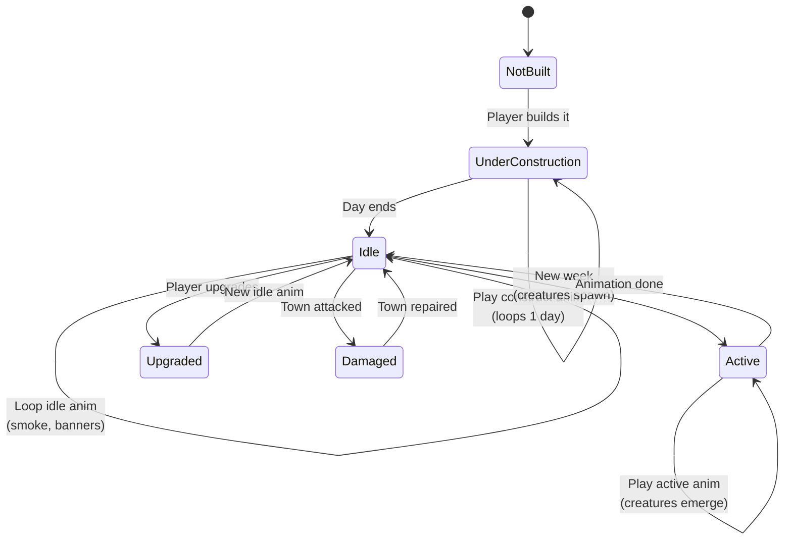

**Buildings have idle, construction, and active animations.** When player enters town, all buildings load their idle animations. New construction triggers construction animation. Production buildings (e.g., kennels) show creature animations on schedule.

## Animation Timing

| State | Trigger | Duration | Loops? |
|-------|---------|----------|--------|
| UnderConstruction | BUILD_BUILDING command | Until next day | Yes |
| Idle | Default state | Continuous | Yes |
| Active | Weekly tick | 2-4 seconds | No |
| Upgraded | UPGRADE_BUILDING command | One-time transition | No |
| Damaged | Town attacked | Until repaired | Yes |
