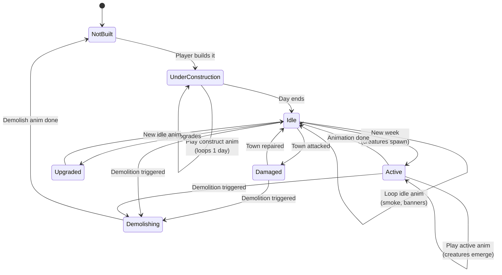

**Per-building state machine for the town renderer.** Each building
runs on the body channel through seven states (`NotBuilt`,
`UnderConstruction`, `Idle`, `Active`, `Upgraded`, `Damaged`,
`Demolishing`) driven by four authored clips (`construct`, `idle`,
`active`, `demolishing`). Construction starts on `BUILD_BUILDING` and
loops until the next day; `idle` runs continuously on the built
state; `active` plays once on the weekly tick (creature spawn);
`demolishing` plays once on siege loss, a scenario / pack-defined
demolition order, or a demolish command, then the building reverts
to `NotBuilt`. The animation never gates the engine's state
transitions; mid-loop destruction follows
[`../animation-contract.md` § Mid-Anim Destruction](../animation-contract.md#mid-anim-destruction).

Companion docs:

- [`../animation-contract.md`](../animation-contract.md) — channels,
  conflict resolution, mid-anim destruction, degradation tiers.
- [`../command-schema.md` § BUILD_BUILDING](../command-schema.md#build_building)
  — canonical construction command.
- [`./22-building-loop.md`](./22-building-loop.md) — per-frame
  building idle-loop render path (tier-1 degradation skips it
  off-screen).
- [`./05-castle-render.md`](./05-castle-render.md) — town renderer
  entry point that hands off to this state machine.

## Animation Timing

| State | Trigger | Duration | Loops? |
|-------|---------|----------|--------|
| UnderConstruction | `BUILD_BUILDING` command | Until next day | Yes |
| Idle | Default state | Continuous | Yes |
| Active | Weekly tick | 2–4 seconds | No |
| Upgraded | `UPGRADE_BUILDING` command | One-time transition to new idle | No |
| Damaged | Town attacked (siege damage) | Until repaired | Yes |
| Demolishing | `DEMOLISH_BUILDING` command, siege loss, or scenario script | One-time transition | No |

`Upgraded` and `Damaged` are state markers, not separate authored
clips: `Upgraded` swaps to the building's new `idle`, and `Damaged`
overlays the damaged tint over `idle` (the tint is derived from
`building.hp / building.hpMax` per
[`../animation-contract.md` § 3](../animation-contract.md#3-gameplay-vs-visual-state)).

## Channel & Degradation

- All seven states resolve on the **body** channel (one body track
  per building). Per-building `status` and `fx` timelines (smoke
  puffs, banner flutter, spawn sparkle) run concurrently and follow
  the `queue` policy from
  [`../animation-contract.md` § 4](../animation-contract.md#4-conflict-resolution).
- Off-screen buildings skip idle updates at degradation tier 1
  ([`../animation-contract.md` § 7](../animation-contract.md#7-degradation),
  [`./22-building-loop.md`](./22-building-loop.md)).

## Mid-Loop Destruction

`Demolishing` is the body-channel terminal state for buildings. Per
[`../animation-contract.md` § Mid-Anim Destruction](../animation-contract.md#mid-anim-destruction):

- The `demolishing` sequence plays once; on its last frame the
  building enters `NotBuilt`.
- Concurrent active-spawn (`status` / `fx`) timelines detach the
  instant the building enters `NotBuilt`.
- The engine writes the building's gameplay state to `NotBuilt` at
  command-application time; the animation is presentation-only and
  does not gate the transition.

---

## 🔍 Sync Check

- **UI: ✔** — The `BUILD_BUILDING` trigger row matches
  [`wiki/screens/30-build-tree/interactions.md`](../wiki/screens/30-build-tree/interactions.md)
  (action `buildTree.build` → `BUILD_BUILDING`). No other authored
  UI surface is asserted by this diagram.
- **Schema: ✔** — Animation clip names (`idle`, `active`,
  `construct`, `demolishing`) and the body/status/fx channel split
  match
  [`animation.schema.json`](../../../content-schema/schemas/animation.schema.json)
  and
  [`town-presentation.schema.json`](../../../content-schema/schemas/town-presentation.schema.json);
  schema rows resolve in
  [`../schema-matrix.md`](../schema-matrix.md).
- **Tasks: ⚠** — Presentation records are owned by
  [`tasks/mvp/02-content-schemas/09-animation-vfx-sound-townpresentation-schemas.md`](../../../tasks/mvp/02-content-schemas/09-animation-vfx-sound-townpresentation-schemas.md);
  `BUILD_BUILDING` is dispatched from the build-tree screen owned by
  [`tasks/mvp/05-adventure-map/05-town-visit-recruit-build-mage-guild.md`](../../../tasks/mvp/05-adventure-map/05-town-visit-recruit-build-mage-guild.md).
  No task currently owns the `UPGRADE_BUILDING` or
  `DEMOLISH_BUILDING` commands or the per-building `Damaged` /
  `Demolishing` renderer states — see Issues.

## ⚠ Issues

- **`UPGRADE_BUILDING` and `DEMOLISH_BUILDING` commands are not
  defined.** The Animation Timing table names both as triggers, but
  the closed `oneOf` in
  [`command.schema.json`](../../../content-schema/schemas/command.schema.json)
  and [`../command-schema.md`](../command-schema.md) only define
  `BUILD_BUILDING`. A Grep across `tasks/` and `content-schema/`
  returns no other reference. Per CLAUDE.md root contract (commands
  are the only mutation path; schema is canonical), the closing fix
  is one of: (a) add `upgradeBuilding` and `demolishBuilding` defs
  to `command.schema.json` and document them in `command-schema.md`
  alongside `BUILD_BUILDING`; or (b) model upgrades as a second
  `BUILD_BUILDING` against the tier-2 building ID and route
  demolition through a scripted pack event (no player-issued
  command). Suggested owner: a new task under
  `tasks/mvp/07-rules/` jointly with the build-tree screen task
  [`tasks/mvp/05-adventure-map/05-town-visit-recruit-build-mage-guild.md`](../../../tasks/mvp/05-adventure-map/05-town-visit-recruit-build-mage-guild.md).
  Skill preserved the table rows verbatim because command-vocabulary
  registration is structural (anti-cheat rule D).
- **No event-vocabulary entry for "Town attacked" or siege loss.**
  The `Damaged` trigger ("Town attacked") and the siege-loss leg of
  the `Demolishing` trigger imply renderer-side reactions to a
  battle-resolution event, but the closed 13-kind vocabulary in
  [`../event-schema.md`](../event-schema.md) and
  [`event.schema.json`](../../../content-schema/schemas/event.schema.json)
  has no `TOWN_ATTACKED` / `TOWN_SIEGE_RESOLVED` / `BUILDING_DAMAGED`
  kind. The same gap is flagged in
  [`../animation-contract.md` `## ⚠ Issues`](../animation-contract.md#-issues)
  for `BATTLE_RESOLVED` / `UNIT_DEFENDED` / `UNIT_WAIT` /
  `UNIT_DESPAWNED`. Per `event-schema.md` ("Adding a new kind
  requires extending `event.schema.json`, this doc, and
  `screen-event-coverage.json` in the same change"), the engine-side
  fix is to add the missing kind(s); the renderer-side fix lands
  alongside the same renderer task that consumes them. Skill
  preserved the prose because event-vocabulary registration is
  structural (anti-cheat rule D).
- **Section-anchor style is inconsistent across the repo.** The
  `#mid-anim-destruction` link here matches sibling diagrams
  ([`13-death-victory.md`](./13-death-victory.md)) and an unprefixed
  style used by some screen `data-contracts.md` files, while other
  arch docs (`renderer-technology-choice.md`,
  `runtime-requirements.md`, `asset-normalization.md`) prefer the
  numbered style `#5-mid-anim-destruction`. Not CI-blocking — both
  resolve under GitHub's anchor generator depending on the renderer
  used — but the inconsistency surfaces whenever a section is
  renumbered. Suggested fix: pick one style in a follow-up
  doc-style PR; the audit did not change the link here so the
  diagram stays consistent with its sibling.
