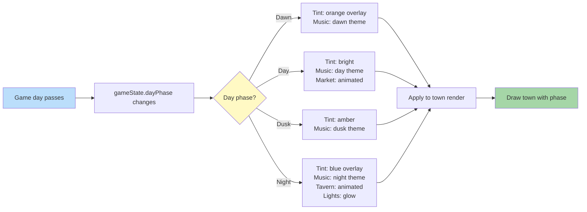

**Towns visually change with day count.** Each town has multiple presentation states. Lighting overlay shifts based on day phase. Some buildings only animate at certain phases (taverns at night, market in day).

## Phase Triggers

- **Dawn**: 0% - 25% of game day
- **Day**: 25% - 60% of game day
- **Dusk**: 60% - 80% of game day
- **Night**: 80% - 100% of game day

Phase transitions trigger music crossfade and lighting tween.
