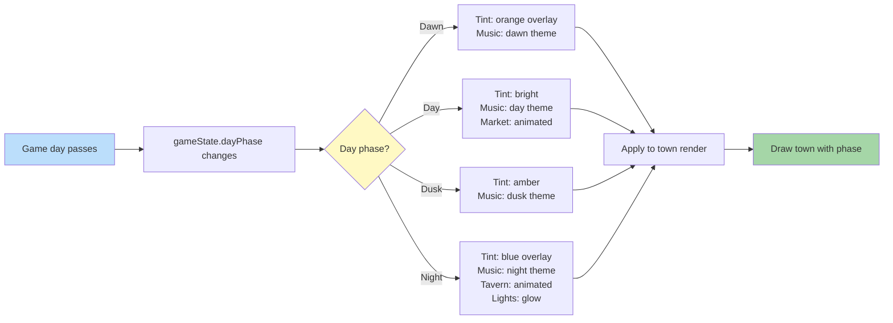

**Towns shift their visual state as the game day advances.** Each
town's presentation record declares one or more named visual
variants in its `stateVariants` map (the canonical example uses
`day`, `night`, and `sieged`); the renderer picks a variant based
on the current day phase, applies a tint overlay, crossfades the
music, and gates a small set of phase-specific building animations
(tavern at night, market in day).

Companion docs:

- [`./06-town-animations.md`](./06-town-animations.md) — per-building
  state machine these phase overlays sit on top of; tavern / market
  idle clips live there.
- [`./05-castle-render.md`](./05-castle-render.md) — town renderer
  entry point that resolves `stateVariants` against the active phase.
- [`../command-schema.md` § END_DAY](../command-schema.md#end_day) —
  the day-advance command that bumps `state.turn`; intraday phase is
  derived from a fractional position within the day.
- [`town-presentation.schema.json`](../../../content-schema/schemas/town-presentation.schema.json)
  — `stateVariants` field (string → asset id) where phase variants
  are authored; schema row in
  [`../schema-matrix.md`](../schema-matrix.md).
- [`sound-set.schema.json`](../../../content-schema/schemas/sound-set.schema.json)
  — sound-set records bound by `town-presentation.presentation.soundSetId`.

## Phase Triggers

Phase is a function of fractional position within the current game
day (0.0 → 1.0):

| Phase | Range       | Tint           | Music        | Phase-only building animation |
|-------|-------------|----------------|--------------|-------------------------------|
| Dawn  | 0 % – 25 %  | Orange overlay | `dawn`       | —                             |
| Day   | 25 % – 60 % | Bright         | `day`        | Market `active`               |
| Dusk  | 60 % – 80 % | Amber          | `dusk`       | —                             |
| Night | 80 % – 100 %| Blue overlay   | `night`      | Tavern `active`, lights glow  |

Each phase transition triggers:

- a **music crossfade** between the outgoing and incoming theme, and
- a **lighting tween** between the outgoing and incoming tint overlay.

The phase-only building animations ride on the `active` clip slot
defined in [`./06-town-animations.md`](./06-town-animations.md);
the day/night layer only decides *when* they may run, not *how*.

## Related diagrams

- [05 — Castle Render](./05-castle-render.md) — renderer entry point
  that consumes the chosen variant.
- [06 — Town Building Anims](./06-town-animations.md) — the
  per-building state machine these overlays compose with.
- [08 — Building Click](./08-building-click.md) — click → action flow
  that runs on top of whichever variant is currently rendered.

---

## 🔍 Sync Check

- **UI: ✔** — No authored UI surface is asserted by this diagram; the
  town presentation surfaces are owned by
  [`wiki/screens/24-town-screen/spec.md`](../wiki/screens/24-town-screen/spec.md)
  and [`wiki/screens/35-town-flyby/spec.md`](../wiki/screens/35-town-flyby/spec.md),
  neither of which reference a `dayPhase` binding.
- **Schema: ❌** — `gameState.dayPhase` is not declared in
  [`game-state.schema.json`](../../../content-schema/schemas/game-state.schema.json)
  (closed shape, `additionalProperties: false`); the canonical
  [`town-presentation`](../../../content-schema/examples/records/town-presentations/emberwild-main.town-presentation.json)
  example uses two visual phases (`day`, `night`) plus `sieged`,
  not the four-phase set drawn here; and
  [`sound-set.schema.json`](../../../content-schema/schemas/sound-set.schema.json)
  has no model for phase-keyed themes. See Issues.
- **Tasks: ❌** — No task under `tasks/mvp/` or `tasks/phase-*/` owns
  a day/night cycle, the `dayPhase` state field, or phase-keyed music
  themes. The closest neighbours
  ([`tasks/mvp/02-content-schemas/09-animation-vfx-sound-townpresentation-schemas.md`](../../../tasks/mvp/02-content-schemas/09-animation-vfx-sound-townpresentation-schemas.md)
  for the presentation schemas,
  [`tasks/mvp/05-adventure-map/01-strategic-game-state-model.md`](../../../tasks/mvp/05-adventure-map/01-strategic-game-state-model.md)
  for `state.turn`) do not cover intraday phase. See Issues.

## ⚠ Issues

- **`gameState.dayPhase` is not in the closed state shape.** The
  diagram routes on `gameState.dayPhase changes`, but
  [`game-state.schema.json`](../../../content-schema/schemas/game-state.schema.json)
  declares the top-level shape with `additionalProperties: false`
  and lists only `turn` (incremented on `END_DAY`) — no intraday
  phase field. Per CLAUDE.md root contract (saves and replays must
  be byte-identical), adding `dayPhase` to engine state would
  require a `schemaVersion` bump and migration per
  [`enum-lifecycle-policy.md`](../enum-lifecycle-policy.md). The
  canonical alternatives are: (a) derive phase in the renderer from
  `state.turn` plus a renderer-local fractional clock (presentation
  only — no state field needed); or (b) add `dayPhase` to
  `game-state.schema.json` plus a new task that owns the reducer
  legs. Skill preserved the diagram label because the routing claim
  is structural (anti-cheat rule D); the audit did not pick an
  option for the system.
- **Four-phase `stateVariants` vs. canonical two-phase example.**
  The Phase Triggers table names four variants (Dawn / Day / Dusk /
  Night), but
  [`town-presentation.schema.json`](../../../content-schema/schemas/town-presentation.schema.json)
  declares `stateVariants` as a free-form string-keyed map and the
  canonical example
  [`emberwild-main.town-presentation.json`](../../../content-schema/examples/records/town-presentations/emberwild-main.town-presentation.json)
  authors only `day`, `night`, and `sieged`. The schema is permissive
  (a pack could ship `dawn` / `dusk` variants), but no first-party
  pack does today and no pack-contract clause requires it. Suggested
  fix: either expand the canonical example with `dawn` / `dusk`
  variants and document the contract in the row for `TownPresentation`
  in [`../schema-matrix.md`](../schema-matrix.md), or simplify this
  diagram to a two-phase day/night flow. Owner: the
  pack-content task list under
  [`tasks/mvp/04-faction-emberwild.md`](../../../tasks/mvp/04-faction-emberwild.md)
  for the example expansion;
  [`tasks/mvp/02-content-schemas/09-animation-vfx-sound-townpresentation-schemas.md`](../../../tasks/mvp/02-content-schemas/09-animation-vfx-sound-townpresentation-schemas.md)
  for the schema-contract note. Skill flagged rather than rewrote
  because picking either option changes meaning beyond a doc audit.
- **No phase-keyed music model in `SoundSet`.** The diagram names a
  `dawn theme` / `day theme` / `dusk theme` / `night theme` switch,
  but [`sound-set.schema.json`](../../../content-schema/schemas/sound-set.schema.json)
  declares only `events` (an open string→string map keyed by event
  name) and `fallbacks`. There is no phase-indexed track-list field,
  and no first-party `SoundSet` example carries phase keys. Per the
  pack-contract additive-first rule, the closing fix is one of:
  (a) author phase-name events into the existing `events` map
  (e.g. `town.phase.dawn → <asset id>`) and let the renderer key off
  them; or (b) extend `SoundSet` with an optional `phaseTracks`
  object. Suggested owner: the same task above
  ([`09-animation-vfx-sound-townpresentation-schemas.md`](../../../tasks/mvp/02-content-schemas/09-animation-vfx-sound-townpresentation-schemas.md)).
  Skill did not edit the schema (anti-cheat rule D).
- **No task owns the day/night cycle.** A `Grep` across `tasks/`
  returns no implementation task for intraday phase derivation, the
  phase-tint overlay, the music-crossfade scheduler, or the
  tavern/market phase gating. Per CLAUDE.md root contract (every
  runtime behavior has an owning task), the renderer- and reducer-
  side legs of this diagram cannot ship today. Suggested owner: a
  new task under `tasks/mvp/05-adventure-map/` or
  `tasks/phase-2/08-meta-systems/` once the schema question above is
  resolved. Skill flagged rather than created a task — task creation
  is out of scope (anti-cheat rule D).
- **`END_DAY` link uses GitHub-style anchor.** The new
  `../command-schema.md#end_day` anchor matches the lowercased
  GitHub anchor generator and the `### END_DAY` heading at
  line 122 of [`../command-schema.md`](../command-schema.md). Same
  inconsistency between hyphenated, numbered, and unprefixed anchor
  styles flagged in
  [`./06-town-animations.md` `## ⚠ Issues`](./06-town-animations.md#-issues);
  not CI-blocking and not in scope here.
