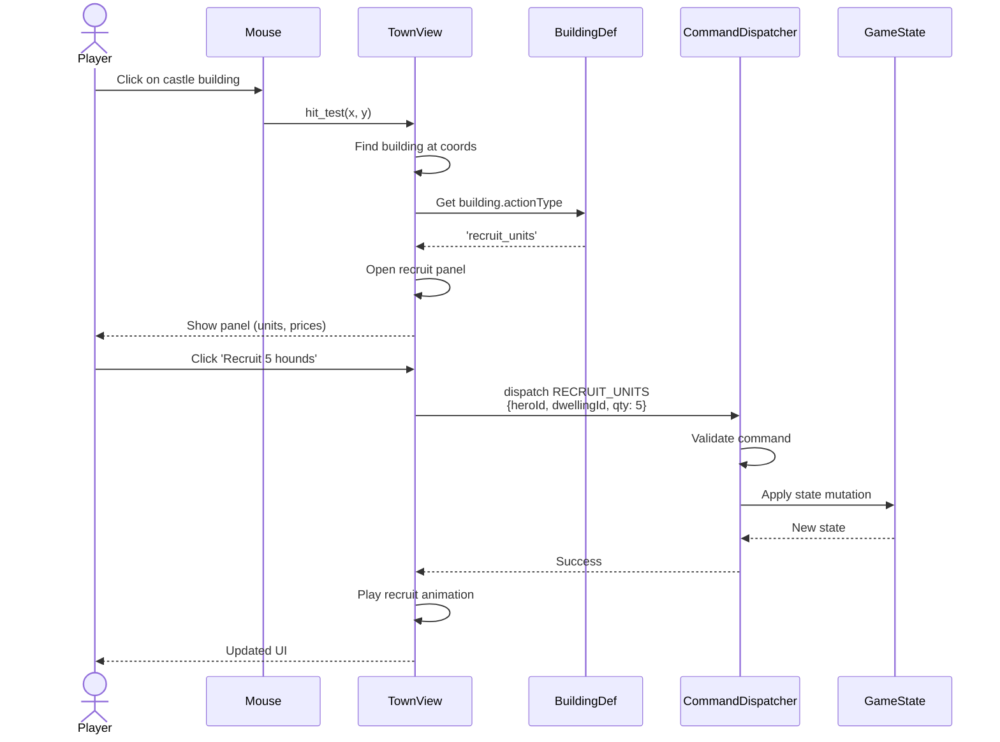

**Player clicks a building, game responds.** Click position is mapped to building. Building schema declares its action (recruit, learn spell, build, etc.). UI panel opens. Player command is dispatched.

## Action Types

Each building declares one of: `recruit_units`, `learn_spell`, `build`, `upgrade`, `tavern`, `market`, `none`

The action type maps to a panel component, which handles its specific UI flow.
