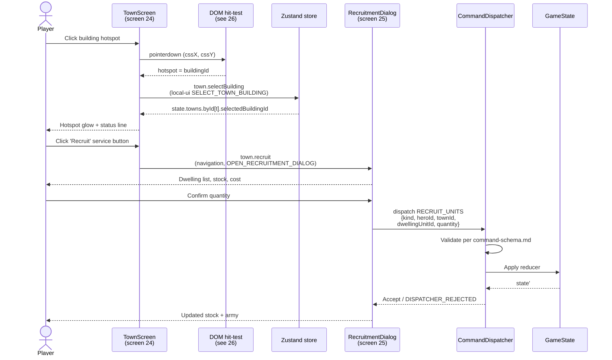

**Player clicks a town building; the click resolves to a screen
navigation or a `local-ui` selection, never an inline mutation.** A
hotspot click is first routed through the town screen's interaction
map (DOM hit-test per
[26 — Pointer Event Routing](./26-pointer-event-routing.md)). The
chosen action ID either highlights the building locally
(`SELECT_TOWN_BUILDING`) or navigates to a dedicated dialog (recruit,
build tree, mage guild) which then dispatches the canonical command.

Companion docs:

- [`../command-schema.md` § RECRUIT_UNITS](../command-schema.md#recruit_units),
  [`§ BUILD_BUILDING`](../command-schema.md#build_building),
  [`§ LEARN_SPELL`](../command-schema.md#learn_spell) — canonical
  command shapes the recruitment / build / mage-guild dialogs dispatch.
- [`./26-pointer-event-routing.md`](./26-pointer-event-routing.md) —
  DOM ↔ canvas hit-test that delivers the click.
- [`../wiki/screens/24-town-screen/interactions.md`](../wiki/screens/24-town-screen/interactions.md)
  — action IDs and navigation targets for the town hotspots.
- [`../wiki/screens/25-building-recruitment-dialog/interactions.md`](../wiki/screens/25-building-recruitment-dialog/interactions.md)
  — where `RECRUIT_UNITS` is actually dispatched.
- [`../state-flow.md`](../state-flow.md) — command dispatcher contract.
- [`../command-schema.md`](../command-schema.md) — canonical command
  vocabulary.

## Notes

- **No `actionType` on the building schema.**
  [`building.schema.json`](../../../content-schema/schemas/building.schema.json)
  carries `requires`, `cost`, `effects[]`, and `presentation` — there
  is no `actionType` enum. The mapping from a hotspot to a dialog is
  owned by the town screen's interaction map
  ([`wiki/screens/24-town-screen/interactions.md`](../wiki/screens/24-town-screen/interactions.md)),
  not by gameplay data.
- **Two hops, not one.** A hotspot click first dispatches a `local-ui`
  selection (`town.selectBuilding`), which writes to
  `state.ui.town.selectedBuildingId` (per the screen's State Changes
  table). Authoritative mutation only happens after the player
  confirms inside the navigated dialog.
- **Service routes are navigation actions, not engine commands.** The
  town screen exposes `town.openBuildTree` → screen 30,
  `town.recruit` → screen 25, `town.mageGuild` → screen 29, and
  `town.transferArmy` (only this one is `command`-typed and dispatches
  `TRANSFER_TOWN_ARMY_STACK` in place). The corresponding engine
  commands (`BUILD_BUILDING`, `RECRUIT_UNITS`, `LEARN_SPELL`) are
  dispatched from the destination dialog after its own guards pass.
- **`RECRUIT_UNITS` payload is canonical.**
  [`command-schema.md` § RECRUIT_UNITS](../command-schema.md#recruit_units)
  defines `{kind: "RECRUIT_UNITS", heroId, townId, dwellingUnitId,
  quantity}`. The dialog supplies all four; the dispatcher rejects
  any other shape (`DISPATCHER_REJECTED` per
  [`error-ux.md` § 2](../error-ux.md)).
- **Rejections stay in the dialog.** A failed validation keeps the
  current screen open, preserves the local draft, and surfaces an
  inline error per
  [`error-formatter.md`](../error-formatter.md) — never an inline
  toast string built at the call site.

## Related diagrams

- [05 — Castle Render](./05-castle-render.md) — how the town panorama
  the player just clicked is drawn.
- [06 — Town Animations](./06-town-animations.md) — the per-building
  state machine (`Idle`, `UnderConstruction`, …) that drives hotspot
  feedback.
- [26 — Pointer Event Routing](./26-pointer-event-routing.md) — the
  DOM ↔ canvas hit-test seam upstream of this flow.

---

## 🔍 Sync Check

- **UI: ✔** — Sequence matches the action IDs and navigation targets
  in
  [`wiki/screens/24-town-screen/interactions.md`](../wiki/screens/24-town-screen/interactions.md)
  (`town.selectBuilding`, `town.recruit`) and
  [`wiki/screens/25-building-recruitment-dialog/interactions.md`](../wiki/screens/25-building-recruitment-dialog/interactions.md)
  (`recruit.confirm` → `RECRUIT_UNITS`).
- **Schema: ✔** — `RECRUIT_UNITS` payload matches
  [`command-schema.md` § RECRUIT_UNITS](../command-schema.md#recruit_units);
  `building.schema.json` carries no `actionType` (the original
  diagram invented one — see Issues).
- **Tasks: ✔** — Town screen owned by
  [`tasks/mvp/07-ui-shell/04-town-screen-modal.md`](../../../tasks/mvp/07-ui-shell/04-town-screen-modal.md);
  recruit dialog by
  [`tasks/phase-2/07-ui-screen-backlog/25-building-recruitment-dialog-screen.md`](../../../tasks/phase-2/07-ui-screen-backlog/25-building-recruitment-dialog-screen.md);
  recruit + build + mage-guild engine surfaces by
  [`tasks/mvp/05-adventure-map.md` task 05](../../../tasks/mvp/05-adventure-map.md).
  Diagrams are normatively secondary per
  [`README.md § Normative Status`](./README.md#normative-status).

## ⚠ Issues

- **Original diagram invented a `building.actionType` enum.** The
  original claimed the building schema declares one of
  `recruit_units | learn_spell | build | upgrade | tavern | market |
  none`, and that the renderer reads it to pick a panel. No such
  field exists in
  [`building.schema.json`](../../../content-schema/schemas/building.schema.json)
  (its closed property set is `schemaVersion`, `id`, `name`,
  `factionId`, `requires`, `cost`, `effects`, `presentation`). The
  action surface is owned by the town screen's interaction map
  ([`wiki/screens/24-town-screen/interactions.md`](../wiki/screens/24-town-screen/interactions.md)),
  which routes hotspot clicks through action IDs and screen
  navigations rather than a gameplay-data enum. Per § 8 Option A
  (target wrong, system consistent), rewrote the diagram to match
  the canonical interaction map. No schema change implied; no new
  features introduced.
- **Original `RECRUIT_UNITS` payload disagreed with the command
  schema.** The original showed `{heroId, dwellingId, qty: 5}`; the
  canonical shape in
  [`command-schema.md` § RECRUIT_UNITS](../command-schema.md#recruit_units)
  is `{kind: "RECRUIT_UNITS", heroId, townId, dwellingUnitId,
  quantity}`. Three drifts: missing `kind` discriminator, missing
  `townId`, key rename `dwellingId` → `dwellingUnitId`, key rename
  `qty` → `quantity`. Updated the diagram to the canonical shape;
  the dispatcher refuses any other shape per
  [`error-ux.md` § 2](../error-ux.md). No code change implied.
- **"Open recruit panel" inline was misleading.** The original showed
  the recruit panel opening inside the town view. In the current UI
  contract, "Recruit" is a `navigation` action that routes to screen
  25 — a dedicated dialog with its own `recruit.selectDwelling`,
  `recruit.changeQuantity`, `recruit.max`, `recruit.confirm`,
  `recruit.cancel` actions. Updated the participant set to make the
  hop explicit (`TownScreen` → `RecruitmentDialog`). Behavioral
  preservation: a player still clicks a building, then chooses a
  quantity, then dispatches `RECRUIT_UNITS`; only the screen
  decomposition is corrected.
