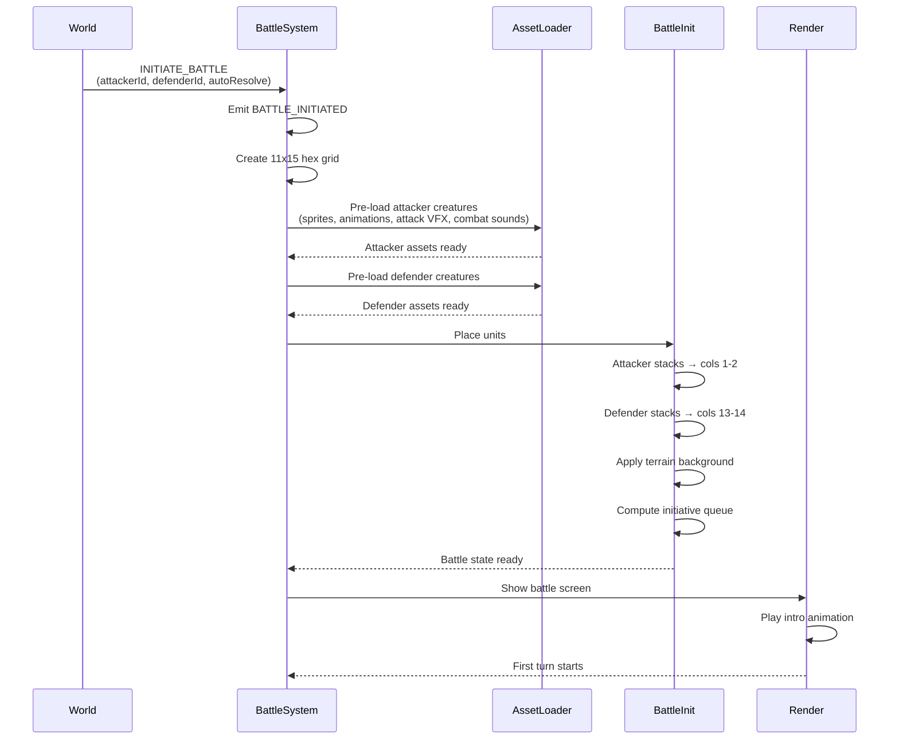

**Post-asset-load setup of `BattleState`.** After
[16 — Enter Battle](./16-enter-battle.md) pre-resolves both armies'
presentation assets, the engine builds the 11×15 hex grid, places
stacks (attacker columns 1–2, defender columns 13–14), computes the
speed-sorted initiative queue, mounts the combat screen, and plays
the intro before the first turn begins.

Canonical contracts: trigger command `INITIATE_BATTLE`
(`attackerId`, `defenderId`, `autoResolve`) in
[`command-schema.md` § INITIATE_BATTLE](../command-schema.md#initiate_battle)
and [`command.schema.json`](../../../content-schema/schemas/command.schema.json);
emitted event `BATTLE_INITIATED` (`battleId?`, `attackerId`,
`defenderId`) in
[`event-schema.md` § BATTLE_INITIATED](../event-schema.md) and
[`event.schema.json`](../../../content-schema/schemas/event.schema.json);
`BattleState` shape, 11×15 grid, attacker/defender column placement,
and speed-ordered initiative queue (with side-then-stack-index tie-
break) in
[`tasks/mvp/09-tactical-combat/01-battlestate-init-army-placement-plus-speed-order.md`](../../../tasks/mvp/09-tactical-combat/01-battlestate-init-army-placement-plus-speed-order.md);
WAIT / DEFEND / morale handling of the queue in
[`tasks/mvp/09-tactical-combat/02-initiative-queue-speed-order-wait-defend-morale.md`](../../../tasks/mvp/09-tactical-combat/02-initiative-queue-speed-order-wait-defend-morale.md);
battlefield stack cap `ruleset.combat.battlefieldMaxStacks`
(baseline `14`) in
[`in-combat-stack-rules.md`](../in-combat-stack-rules.md) and
[`ruleset.schema.json`](../../../content-schema/schemas/ruleset.schema.json);
asset pre-load pipeline (sprites, animation sets, sound banks,
backdrop, music) in [16 — Enter Battle](./16-enter-battle.md).

## 1. Hex Grid Layout

- **Grid.** 11×15 hex field.
- **Attacker stacks.** Columns 1–2.
- **Defender stacks.** Columns 13–14.
- **Open battlefield.** Center columns 5–9.
- **Stack cap.** `ruleset.combat.battlefieldMaxStacks` (baseline `14`)
  per [`in-combat-stack-rules.md`](../in-combat-stack-rules.md);
  summons/raises past the cap are rejected.

## 2. Initiative Queue

Speed-sorted descending, with the side-then-stack-index tie-break
defined in
[`tasks/mvp/09-tactical-combat/01-battlestate-init-army-placement-plus-speed-order.md`](../../../tasks/mvp/09-tactical-combat/01-battlestate-init-army-placement-plus-speed-order.md).
WAIT / DEFEND / morale interactions and the per-round rebuild are
in
[`tasks/mvp/09-tactical-combat/02-initiative-queue-speed-order-wait-defend-morale.md`](../../../tasks/mvp/09-tactical-combat/02-initiative-queue-speed-order-wait-defend-morale.md);
see [10 — Turn Order](./10-turn-order.md) for the per-round flow.

## 3. Notes

- **Asset pre-load is canonical in [16 — Enter Battle](./16-enter-battle.md).**
  The two `Pre-load … creatures` steps above are the engine-side
  hand-off into that flow; the registry-mediated resolve
  (`PackRegistry.resolveAsset(logicalId) → { url, hash, format }`)
  and the loader pre-flight pipeline are not repeated here.
- **Intro animation is presentation-only.** The intro plays after
  `BATTLE_INITIATED` is consumed and cannot gate or delay engine
  state per
  [`animation-contract.md` § 2](../animation-contract.md#2-damage_frame-ownership).
- **`initBattle(attacker, defender, terrain, rng)` is deterministic.**
  Same seed → same stack IDs and same initiative queue (acceptance
  criterion in task 01).

## Related diagrams

- [10 — Turn Order](./10-turn-order.md) — per-round queue dynamics
  the initial queue feeds into.
- [11 — Attack Anim](./11-attack-anim.md),
  [12 — Spell Anim](./12-spell-anim.md),
  [13 — Death & Victory](./13-death-victory.md) — battle-side
  animations driven by the pre-loaded creature sets.
- [16 — Enter Battle](./16-enter-battle.md) — canonical asset
  pre-load and screen-mount flow this diagram hands off from.

---

## 🔍 Sync Check

- **UI: ✔** — Combat-screen mount-on-entry resolves to
  [`wiki/screens/38-combat-screen/spec.md`](../wiki/screens/38-combat-screen/spec.md);
  upstream pre-battle dialog at
  [`wiki/screens/40-pre-battle-dialog/`](../wiki/screens/40-pre-battle-dialog/).
  No screen-spec copy strings are asserted in the target.
- **Schema: ⚠** — `INITIATE_BATTLE` matches the kind in
  [`command.schema.json`](../../../content-schema/schemas/command.schema.json)
  and [`command-schema.md` § INITIATE_BATTLE](../command-schema.md#initiate_battle);
  `BATTLE_INITIATED` matches the closed kind in
  [`event.schema.json`](../../../content-schema/schemas/event.schema.json);
  `ruleset.combat.battlefieldMaxStacks` matches
  [`ruleset.schema.json`](../../../content-schema/schemas/ruleset.schema.json).
  No schema-bound `battleMusicId` or per-terrain `backdropId` exists
  on `faction`, `world`, or `ruleset` (mirrored from
  [16 — Enter Battle ⚠ Issues](./16-enter-battle.md#-issues)); see
  `## ⚠ Issues`.
- **Tasks: ✔** — `BattleState`, 11×15 grid, column placement, and
  speed-ordered initiative queue owned by
  [`tasks/mvp/09-tactical-combat/01-battlestate-init-army-placement-plus-speed-order.md`](../../../tasks/mvp/09-tactical-combat/01-battlestate-init-army-placement-plus-speed-order.md);
  WAIT/DEFEND/morale interactions in
  [`tasks/mvp/09-tactical-combat/02-initiative-queue-speed-order-wait-defend-morale.md`](../../../tasks/mvp/09-tactical-combat/02-initiative-queue-speed-order-wait-defend-morale.md);
  `INITIATE_BATTLE` reducer in
  [`tasks/mvp/05-adventure-map/21-map-object-visit-and-battle-initiation-commands.md`](../../../tasks/mvp/05-adventure-map/21-map-object-visit-and-battle-initiation-commands.md);
  enemy-encounter wiring in
  [`tasks/mvp/09-tactical-combat/09-replace-auto-resolve-with-real-battle.md`](../../../tasks/mvp/09-tactical-combat/09-replace-auto-resolve-with-real-battle.md);
  battlefield renderer in
  [`tasks/mvp/06-renderer/05-1115-tactical-battlefield-renderer.md`](../../../tasks/mvp/06-renderer/05-1115-tactical-battlefield-renderer.md).
  Diagrams are normatively secondary per
  [README § Normative Status](./README.md#1-normative-status).

## ⚠ Issues

- **`INITIATE_BATTLE` → `BATTLE_INITIATED` made explicit (fixed in target).**
  The original sequence diagram named the trigger command but did
  not mark the corresponding emitted event. Added the `Emit
  BATTLE_INITIATED` step per
  [`event-schema.md`](../event-schema.md) and
  [`event.schema.json`](../../../content-schema/schemas/event.schema.json),
  matching the sibling [16 — Enter Battle](./16-enter-battle.md)
  flow. No new feature introduced (Hard Prohibition B); the event
  is already canonical.
- **Asset pre-load demoted to a cross-reference (fixed in target).**
  The original enumerated `Load creature sprites`, `Load creature
  animations`, `Load attack VFX`, and `Load combat sounds` as four
  sub-steps. The canonical pre-load flow (registry resolve, magic-
  byte → cap → SHA-256 → decoder pipeline, Pinned/Hot tier
  promotion) is owned by
  [16 — Enter Battle](./16-enter-battle.md) per
  [`asset-loading.md`](../asset-loading.md) and
  [`asset-path-resolution.md`](../asset-path-resolution.md).
  Collapsed to one `Pre-load … creatures` step per side with an
  inline parenthetical preserving the four asset categories. Meaning
  preserved; canonical statement now lives in one place per § 7 of
  the doc-audit skill.
- **No schema-bound battle-music ID.** The diagram's
  `Pre-load … (combat sounds)` step and the related "battle theme
  crossfade" in [16 — Enter Battle](./16-enter-battle.md) have no
  registered field: `faction.schema.json` exposes `townThemeMusicId`
  but no `battleThemeMusicId`, and
  [`ruleset.schema.json`](../../../content-schema/schemas/ruleset.schema.json)
  has no `battleMusicId`. Same gap as
  [16 — Enter Battle ⚠ Issues](./16-enter-battle.md#-issues). Per
  CLAUDE.md root contract ("Stable IDs are public API") and
  [`enum-lifecycle-policy.md`](../enum-lifecycle-policy.md), the
  schema cluster
  [`tasks/mvp/02-content-schemas/`](../../../tasks/mvp/02-content-schemas/)
  owns the fix: either add
  `faction.presentation.battleThemeMusicId` paralleling
  `townThemeMusicId`, or add `ruleset.presentation.battleMusicId`
  for global battle music. Diagram wording preserved verbatim; no
  schema or task file edited (Hard Prohibition D).
- **No schema-bound battle-backdrop ID.** The `Apply terrain
  background` step and the sibling's
  `Load battle backdrop matching adventure tile terrain` rely on a
  `terrain → backdropId` map owned by phase-2 task
  [`tasks/phase-2/06-visual-fidelity/12-battlefield-backdrop-terrain-backgrounds-per-terrain-type.md`](../../../tasks/phase-2/06-visual-fidelity/12-battlefield-backdrop-terrain-backgrounds-per-terrain-type.md),
  but no content-schema field registers per-terrain backdrop assets,
  making the mapping runtime-defined rather than content-defined.
  Same gap, same owner, same resolution path as the sibling's
  Issues row. Preserved verbatim pending owner decision; no task /
  schema file edited.
