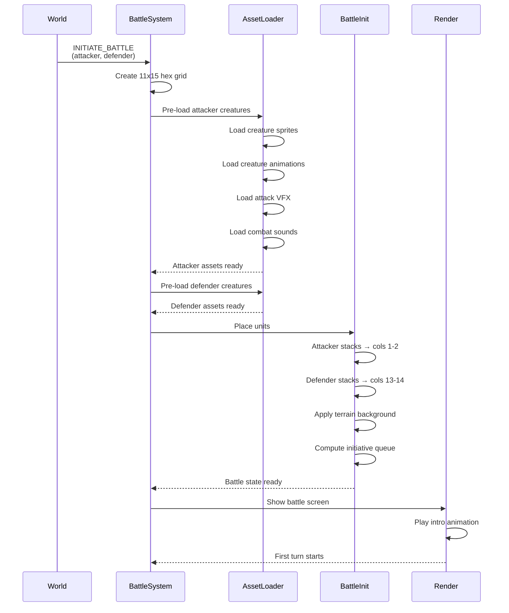

**When two armies meet.** A battle scenario is constructed from both heroes' armies. Hex grid is generated. Units placed on starting positions. All creature assets for both sides are loaded before first frame.

## Hex Grid Layout

The battle grid is 11 columns × 15 rows. Attacker stacks start in columns 1-2, defender in columns 13-14. Center columns (5-9) are open battlefield.
