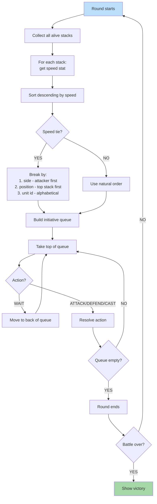

**Speed-based initiative with deterministic tie-breaking.** Each unit has a speed stat. Queue is sorted by speed descending. Ties broken by stack position (deterministic). WAIT moves unit to end. Same seed = same order.

## Tie-Breaking Rules

When two stacks have identical speed, the order is determined by (in order):

1. **Side**: Attacker stacks go first
2. **Position**: Top stack (smaller index) first
3. **Unit ID**: Alphabetical fallback (rare)

This ensures the same seed always produces the same turn order.
