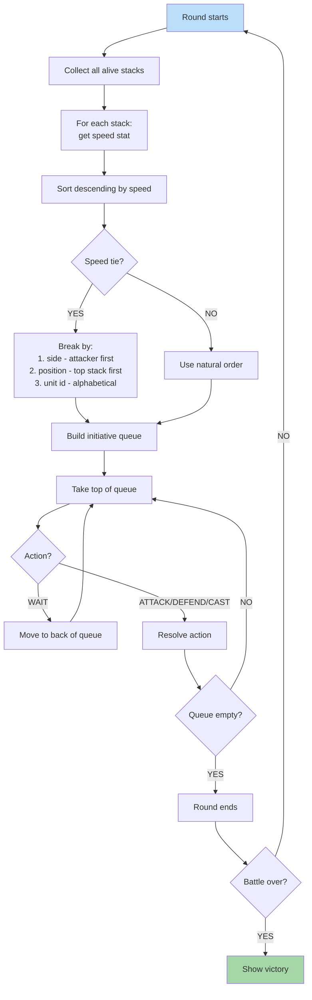

**Per-round speed-based initiative with deterministic tie-breaking.**
After [09 — Battle Init](./09-battle-init.md) seats the stacks, each
combat round rebuilds the initiative queue sorted by `speed`
descending, with ties broken in a fixed order so that the same seed
yields the same order on every replay.

Canonical contracts: round-start queue build, `WAIT` repositioning,
and `DEFEND` bonus lifecycle in
[`tasks/mvp/09-tactical-combat/02-initiative-queue-speed-order-wait-defend-morale.md`](../../../tasks/mvp/09-tactical-combat/02-initiative-queue-speed-order-wait-defend-morale.md);
`BattleState.initiativeQueue` shape (ordered array of stack ids) in
[`state-shape.md` § Tactical battle sub-state](../state-shape.md#tactical-battle-sub-state)
and [`game-state.schema.json`](../../../content-schema/schemas/game-state.schema.json);
side-then-stack-index tie-break and `initBattle` determinism in
[`tasks/mvp/09-tactical-combat/01-battlestate-init-army-placement-plus-speed-order.md`](../../../tasks/mvp/09-tactical-combat/01-battlestate-init-army-placement-plus-speed-order.md);
the action commands `BATTLE_ATTACK`, `BATTLE_WAIT`, `BATTLE_DEFEND`,
and `BATTLE_SPELL` in
[`command-schema.md` § Tactical Battle Commands](../command-schema.md#tactical-battle-commands)
and [`command.schema.json`](../../../content-schema/schemas/command.schema.json).

## 1. Tie-Breaking Rules

When two stacks have identical `speed`, the order is determined by,
in order:

1. **Side.** Attacker stacks go before defender stacks.
2. **Position.** Top stack (smaller stack-index) first.
3. **Unit ID.** Alphabetical fallback for the rare case where both
   prior tiers tie.

This chain is the deterministic completion of the
side-then-stack-index tie-break declared in
[`tasks/mvp/09-tactical-combat/01-battlestate-init-army-placement-plus-speed-order.md`](../../../tasks/mvp/09-tactical-combat/01-battlestate-init-army-placement-plus-speed-order.md);
same inputs → same queue ordering.

## 2. Action → Command Mapping

The four action labels on the flowchart map to closed-enum commands
defined in [`command-schema.md` § Tactical Battle Commands](../command-schema.md#tactical-battle-commands):

| Label | Command | Notes |
|---|---|---|
| `WAIT` | `BATTLE_WAIT` | Stack must not have waited this round; moves to back of queue and the round continues. |
| `ATTACK` | `BATTLE_ATTACK` | Resolves damage (and retaliation if any) synchronously; see [11 — Attack Anim](./11-attack-anim.md). |
| `DEFEND` | `BATTLE_DEFEND` | Sets `DEFENDING` flag (incoming damage × `(1000 − defendDamageReductionPermille) // 1000`, locked at 250 ‰ = 25 % reduction). |
| `CAST` | `BATTLE_SPELL` | Phase 2 — combat MVP does not include spells; the diagram label is reserved for the queue control flow only. |

## 3. Round Lifecycle

- **Build.** Queue is rebuilt at round start from every living stack;
  dead stacks drop out.
- **Drain.** Resolved actions remove the active stack from the head
  of the queue; `WAIT` re-inserts it at the back instead of dropping
  it.
- **End.** When the queue is empty, the round ends; victory check
  follows. Round-bound flags (e.g. `DEFENDING`, "already waited") are
  cleared as part of the next round's build per
  [`tasks/mvp/09-tactical-combat/02-initiative-queue-speed-order-wait-defend-morale.md`](../../../tasks/mvp/09-tactical-combat/02-initiative-queue-speed-order-wait-defend-morale.md).

## Related diagrams

- [09 — Battle Init](./09-battle-init.md) — initial queue and grid
  placement this flow drains.
- [11 — Attack Anim](./11-attack-anim.md),
  [12 — Spell Anim](./12-spell-anim.md),
  [13 — Death & Victory](./13-death-victory.md) — per-action visual
  flows the queue head dispatches into.

---

## 🔍 Sync Check

- **UI: ✔** — Combat-screen turn-queue HUD resolves to
  [`wiki/screens/38-combat-screen/spec.md`](../wiki/screens/38-combat-screen/spec.md);
  no copy strings are asserted in the target.
- **Schema: ✔** — `BATTLE_ATTACK`, `BATTLE_WAIT`, `BATTLE_DEFEND`,
  `BATTLE_SPELL` match
  [`command-schema.md` § Tactical Battle Commands](../command-schema.md#tactical-battle-commands)
  and [`command.schema.json`](../../../content-schema/schemas/command.schema.json);
  `battle.initiativeQueue` matches
  [`state-shape.md` § Tactical battle sub-state](../state-shape.md#tactical-battle-sub-state)
  and [`game-state.schema.json`](../../../content-schema/schemas/game-state.schema.json);
  `defendDamageReductionPermille` matches
  [`ruleset.schema.json`](../../../content-schema/schemas/ruleset.schema.json)
  via [`tasks/mvp/09-tactical-combat/02a-defend-damage-reduction.md`](../../../tasks/mvp/09-tactical-combat/02a-defend-damage-reduction.md).
- **Tasks: ⚠** — Round-build and `WAIT`/`DEFEND`/morale interactions
  owned by
  [`tasks/mvp/09-tactical-combat/02-initiative-queue-speed-order-wait-defend-morale.md`](../../../tasks/mvp/09-tactical-combat/02-initiative-queue-speed-order-wait-defend-morale.md);
  speed-order build and side-then-stack-index tie-break owned by
  [`tasks/mvp/09-tactical-combat/01-battlestate-init-army-placement-plus-speed-order.md`](../../../tasks/mvp/09-tactical-combat/01-battlestate-init-army-placement-plus-speed-order.md).
  Diagrams are normatively secondary per
  [README § Normative Status](./README.md#1-normative-status); see
  `## ⚠ Issues` for two gaps where this diagram is the only place a
  rule is stated.

## ⚠ Issues

- **Third-tier tie-break (unit-id alphabetical) is unanchored.** The
  flowchart's tie-break chain stops at `(side, stack-index, unit-id)`,
  but
  [`tasks/mvp/09-tactical-combat/01-battlestate-init-army-placement-plus-speed-order.md`](../../../tasks/mvp/09-tactical-combat/01-battlestate-init-army-placement-plus-speed-order.md)
  asserts only side-as-first-tier, and the sibling
  [09 — Battle Init ⚠](./09-battle-init.md) writes the contract as
  "side-then-stack-index" (two tiers). Stack IDs are unique per
  battle and minted via the deterministic
  [`id-allocator.md`](../id-allocator.md), so the third tier is
  unreachable today, but the diagram is currently the only place
  it is written down. Per
  [README § Normative Status](./README.md#1-normative-status) and
  CLAUDE.md root contract ("Stable IDs are public API"), task `01`
  should either (a) drop tier 3 from the diagram to match the
  task's two-tier rule, or (b) extend the task's acceptance
  criteria to formalize a tertiary `unit.id` tie-break. Wording
  preserved verbatim pending owner decision; no task or schema file
  edited (Hard Prohibition D).
- **`BATTLE_WAIT` reposition semantics disagree across canonical
  sources.** The flowchart's `Move to back of queue` matches
  [`command-schema.md` § BATTLE_WAIT](../command-schema.md#battle_wait)
  ("Moves stack to end of initiative queue"), but
  [`tasks/mvp/09-tactical-combat/02-initiative-queue-speed-order-wait-defend-morale.md`](../../../tasks/mvp/09-tactical-combat/02-initiative-queue-speed-order-wait-defend-morale.md)
  acceptance criterion 2 says "WAIT correctly repositions stack to
  after the last non-waited stack". The two definitions diverge when
  ≥ 2 stacks wait in the same round (does the second waiter go
  behind the first, or in front of it?). Per
  [README § Normative Status](./README.md#1-normative-status) the
  task wins; the canonical statement must be pinned in one place.
  Suggested resolution: task `02` and `command-schema.md § BATTLE_WAIT`
  adopt the same wording, then this diagram inherits. Diagram
  wording preserved verbatim (Hard Prohibition D).
