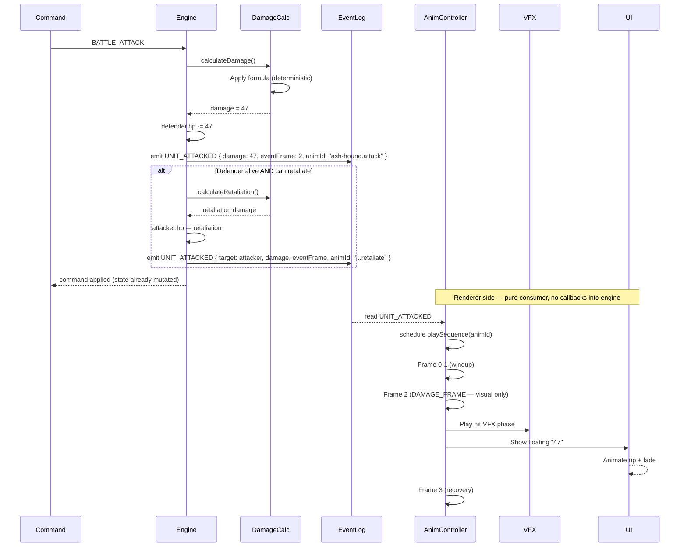

**From command to damage number.** The engine resolves `BATTLE_ATTACK`
synchronously and emits a `UNIT_ATTACKED` event into the log carrying
the `damage` value plus a declared `eventFrame`. The renderer reads
the event, plays the matching sequence, and surfaces the floating
damage number at `eventFrame` for cosmetic effect — it never calls
back into rules.

- `eventFrame` is a **zero-based index into the played sequence's
  `frames[]` list**, not a sprite-sheet frame number. In schema terms
  it is either `sequence.eventFrame` (single-event) or one entry of
  `sequence.events[]` with `kind: "damage"` (multi-event); see
  [`animation.schema.json`](../../../content-schema/schemas/animation.schema.json).
- Engine authority for the rule lives in
  [`../animation-contract.md` § DAMAGE_FRAME Ownership](../animation-contract.md#damage_frame-ownership).
- `UNIT_ATTACKED`'s canonical payload is defined in
  [`event.schema.json`](../../../content-schema/schemas/event.schema.json)
  and catalogued in
  [`../event-schema.md` § UNIT_ATTACKED](../event-schema.md#unit_attacked).

## DAMAGE_FRAME mechanic

Each animation declares which frame is the **damage frame** — the
moment the renderer surfaces the cosmetic visual impact (sword strike
flash, floating damage number, hit VFX). The damage itself is already
applied in engine state by the time the renderer reaches that frame.

- The `eventFrame` value rides on `UNIT_ATTACKED` so the renderer can
  align visuals with the prior gameplay event without consulting
  rules.
- One frame value carries one cosmetic phase. Multi-event sequences
  (multi-hit swings) use `sequence.events[]` with one entry per
  cosmetic phase; see
  [`animation.schema.json`](../../../content-schema/schemas/animation.schema.json).

> **Anti-pattern.** Do not let the animation timeline call into
> `DamageCalc` or any reducer. The engine has already scheduled the
> result; mutating state from the renderer at `eventFrame` desyncs
> replay and lockstep the moment a frame drops or a clock skews.
> Pinned in
> [`../renderer-technology-choice.md` § DON'T](../renderer-technology-choice.md#dont).

---

## 🔍 Sync Check

- **UI: ✔** — Diagram has no direct UI bindings. The DAMAGE_FRAME
  doctrine it illustrates is owned by
  [`../animation-contract.md`](../animation-contract.md) and surfaced
  in the debug-overlay screens
  ([`wiki/screens/66-debug-overlay`](../wiki/screens/66-debug-overlay/),
  [`wiki/screens/67-animation-debug-overlay`](../wiki/screens/67-animation-debug-overlay/));
  the diagram does not contradict either spec.
- **Schema: ⚠** — Command name `BATTLE_ATTACK` matches
  [`command.schema.json`](../../../content-schema/schemas/command.schema.json)
  (`battleAttack` $def). `eventFrame` mechanics line up with
  [`animation.schema.json`](../../../content-schema/schemas/animation.schema.json)
  (`sequence.eventFrame`, `events[].kind ∈ damage|sound|vfx|status`).
  The mermaid `UNIT_ATTACKED` payload diverges from
  [`event.schema.json`](../../../content-schema/schemas/event.schema.json)
  `unitAttacked` (`{ attackerStackId, defenderStackId, damage }`,
  `additionalProperties: false`) — no `eventFrame`, no `animId`, no
  `target` key — see Issues.
- **Tasks: ⚠** — Renderer-side consumer is
  [`tasks/mvp/06-renderer/07-event-log-animation-timeline.md`](../../../tasks/mvp/06-renderer/07-event-log-animation-timeline.md);
  it lists `UNIT_ATTACKED` in *Events to handle* but does not cite
  this diagram or
  [`../animation-contract.md`](../animation-contract.md) in
  *Read First*. Same gap is flagged in
  [`../animation-contract.md` ⚠ Issues](../animation-contract.md) and
  [`./12-spell-anim.md` ⚠ Issues](./12-spell-anim.md).

## ⚠ Issues

- **`UNIT_ATTACKED` payload drift between this diagram and the
  canonical event schema.** The mermaid emits
  `UNIT_ATTACKED { damage, eventFrame, animId, … target?: attacker }`;
  the canonical `unitAttacked` `$def` in
  [`event.schema.json`](../../../content-schema/schemas/event.schema.json)
  ships `{ attackerStackId, defenderStackId, damage }` with
  `additionalProperties: false`. The drift is multi-doc — the same
  shape appears in
  [`../animation-contract.md` § 2](../animation-contract.md#2-damage_frame-ownership)
  and
  [`./12-spell-anim.md`](./12-spell-anim.md), and both already flag
  it. Per CLAUDE.md (schemas are canonical), the closing fix is one
  of: **(a)** extend `event.schema.json` `unitAttacked` to add
  optional `eventFrame: integer ≥ 0` and `animId: stringId`, rename
  the retaliation-side carriage to use `defenderStackId` rather than
  `target`, then mirror the additions in
  [`../event-schema.md` § UNIT_ATTACKED](../event-schema.md#unit_attacked)
  and the
  [`../event-schema.md` § Summary](../event-schema.md#summary) row;
  or **(b)** move the `eventFrame` / `animId` carriage off
  `UNIT_ATTACKED` into a separate presentation-event kind registered
  the same way. Owning task:
  [`tasks/mvp/06-renderer/07-event-log-animation-timeline.md`](../../../tasks/mvp/06-renderer/07-event-log-animation-timeline.md)
  (renderer-side consumer) jointly with the engine task that emits
  `UNIT_ATTACKED` (tactical-battle reducer). Skill preserved the
  mermaid verbatim because the discrepancy points at a structural
  invariant (anti-cheat rule D).
- **Renderer-timeline task does not list this diagram or
  `animation-contract.md` in *Read First*.**
  [`tasks/mvp/06-renderer/07-event-log-animation-timeline.md`](../../../tasks/mvp/06-renderer/07-event-log-animation-timeline.md)
  is the runtime consumer of every event drawn in the mermaid above,
  yet its *Read First* block only points at `ui-renderer-seam.md`,
  `screen-scaling.md`, `overview.md`, `event-system.md`, and
  `event-schema.md` — neither this diagram nor
  [`../animation-contract.md`](../animation-contract.md) (the doc
  that defines `eventFrame`, the two-clock model, conflict
  resolution, and degradation) appears. Per
  [`.agents/rules/tasks.md`](../../../.agents/rules/tasks.md)
  (*Read First* surface), the owning task should cite both so an
  implementer pulling the spec also gets the contract. Suggested
  fix: append
  `[`docs/architecture/animation-contract.md`](../../../docs/architecture/animation-contract.md)`
  and
  `[`docs/architecture/diagrams/11-attack-anim.md`](../../../docs/architecture/diagrams/11-attack-anim.md)`
  to the task's *Read First* block. Skill did not edit the task file
  (anti-cheat rule D).
