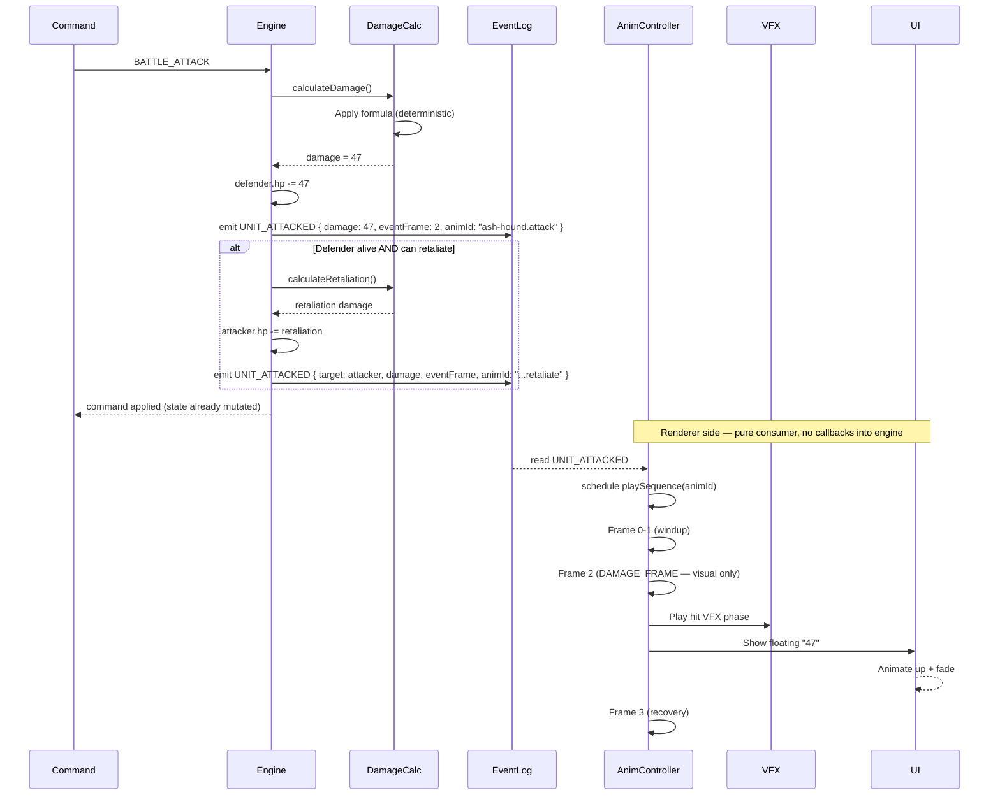

**From command to damage number.** The engine resolves the attack
synchronously when the command is applied, then emits a
`UNIT_ATTACKED` event into the event log carrying both the damage
value and a declared `eventFrame`. The renderer reads the event,
plays the matching sequence, and surfaces the floating damage number
at `eventFrame` for cosmetic effect. `eventFrame` is a zero-based
index into the played sequence's `frames[]` list, not a sprite-sheet
frame number. The renderer never calls back into rules. See
[`../animation-contract.md` § DAMAGE_FRAME Ownership](../animation-contract.md#damage_frame-ownership).

## DAMAGE_FRAME Mechanic

Each animation declares which frame is the "damage frame" — the
moment the renderer surfaces the cosmetic visual impact (sword strike
flash, floating damage number, hit VFX). The damage itself is already
applied in engine state when the renderer reaches that frame.

The `eventFrame` value is carried on the engine's `UNIT_ATTACKED`
event so the renderer can synchronize visuals with the prior gameplay
event without consulting rules. It is a sequence-relative, zero-based
index. In schema terms it is either `sequence.eventFrame`
(single-event) or one entry of
`sequence.events[]` with `kind: "damage"` (multi-event); see
[`animation.schema.json`](../../../content-schema/schemas/animation.schema.json).

> **Anti-pattern.** Do not let the animation timeline call into
> `DamageCalc` or any reducer. The engine has already scheduled the
> result. Mutating state from the renderer at `eventFrame` desyncs
> replay and lockstep the moment a frame drops or a clock skews.
> Pinned in
> [`../renderer-technology-choice.md` § DON'T](../renderer-technology-choice.md#dont).
