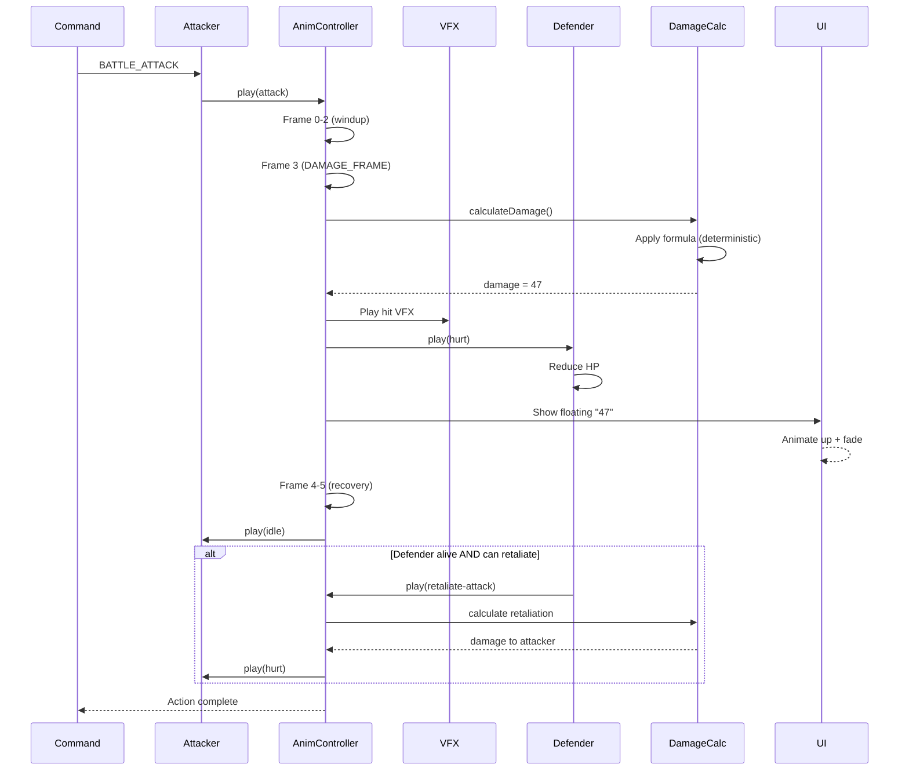

**From command to damage number.** Attacker plays attack animation, projectile spawns (if ranged), defender plays hurt animation, damage number floats up, retaliation triggers if applicable.

## DAMAGE_FRAME Mechanic

Each animation declares which frame is the "damage frame" — the moment when damage is actually applied. This synchronizes the damage event with the visual impact (e.g., sword strike).
