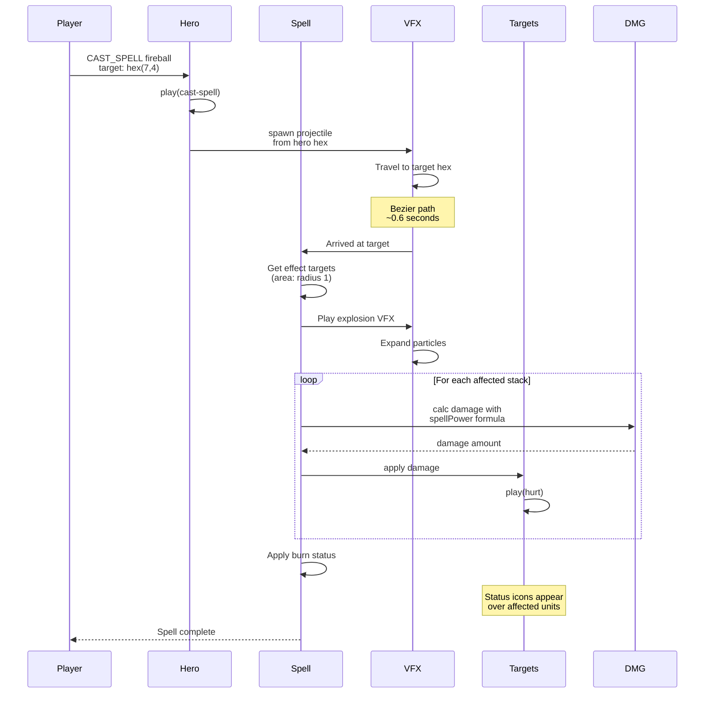

**Casting fireball at enemy stack.** Hero plays cast animation, particle VFX travel from hero to target, target stack plays hurt animation, area effect VFX expands, all affected stacks take damage.

## Area Effect Resolution

For area spells, the engine:

1. Computes affected hexes from spell definition
2. Finds all stacks in those hexes
3. Applies damage formula per stack
4. Plays VFX once for visual effect
5. Plays hurt animation on each affected stack
