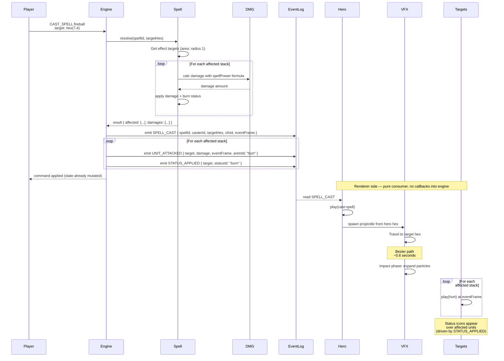

**Casting fireball at an enemy stack.** When `CAST_SPELL` is applied,
the engine resolves the spell synchronously, then describes the
outcome to the renderer through the event log. The renderer is a
pure consumer.

- **Engine side.** Compute affected hexes, apply damage per stack,
  apply status effects, mutate state.
- **Event log.** Emit one `SPELL_CAST` and one `UNIT_ATTACKED` per
  affected unit, each carrying its own `eventFrame`. Status
  applications ride `STATUS_APPLIED`.
- **Renderer side.** Read the events, play the cast pose, projectile
  travel, impact VFX, and per-unit hurt anims. Never call back into
  rules.

See
[`../animation-contract.md` § DAMAGE_FRAME Ownership](../animation-contract.md#damage_frame-ownership).

## Engine Resolution (area spells)

1. Compute affected hexes from the spell definition.
2. Find every stack on those hexes.
3. Apply the damage formula and status effects per stack; mutate
   state.
4. Emit one `SPELL_CAST` event plus one `UNIT_ATTACKED` per affected
   unit, each carrying its own `eventFrame`; emit `STATUS_APPLIED`
   per status-bearing stack.
5. The renderer plays VFX once and a per-unit `hurt` animation at
   the `eventFrame` of each `UNIT_ATTACKED`; status icons appear
   from `STATUS_APPLIED`.

---

## 🔍 Sync Check

- **UI: ✔** — Diagram makes no direct UI bindings. The animation
  doctrine it illustrates (DAMAGE_FRAME ownership, two-clock model)
  flows from [`../animation-contract.md`](../animation-contract.md)
  and is reflected in the debug-overlay screens
  ([`wiki/screens/66-debug-overlay`](../wiki/screens/66-debug-overlay/),
  [`wiki/screens/67-animation-debug-overlay`](../wiki/screens/67-animation-debug-overlay/)).
- **Schema: ⚠** — The diagram's command and event payloads diverge
  from the canonical schemas. The command is shown as `CAST_SPELL`
  but [`command.schema.json`](../../../content-schema/schemas/command.schema.json)
  defines `SPELL_CAST`. The `SPELL_CAST` event payload is shown as
  `{ spellId, casterId, targetHex, vfxId, eventFrame }` but
  [`event.schema.json`](../../../content-schema/schemas/event.schema.json)
  ships `{ casterId, spellId, target?: { stackId, position } }` with
  `additionalProperties: false`. The `UNIT_ATTACKED` payload is
  shown as `{ target, damage, eventFrame, animId }`; canonical is
  `{ attackerStackId, defenderStackId, damage }`. `STATUS_APPLIED`
  is not a member of the closed 13-kind event vocabulary in
  [`event-schema.md` § Summary](../event-schema.md#summary). All
  four drifts are surfaced below rather than silently rewritten,
  because each points at a structural invariant.
- **Tasks: ⚠** — Renderer-side consumer is
  [`tasks/mvp/06-renderer/07-event-log-animation-timeline.md`](../../../tasks/mvp/06-renderer/07-event-log-animation-timeline.md),
  but a Grep across `tasks/` does not show that task citing this
  diagram (or `animation-contract.md`) in its *Read First* block.
  The only inbound link from active arch docs is
  [`../animation-contract.md` § Related Files](../animation-contract.md);
  the diagrams index ([`./index.json`](./index.json)) registers the
  id. Engine emitter for `SPELL_CAST` is owned by the tactical-
  battle reducer (Phase-2 magic) — no task currently lists this
  diagram, see Issues.

## ⚠ Issues

- **`CAST_SPELL` command name drift.** The mermaid sequence opens
  with `Player->>Engine: CAST_SPELL fireball`; the closed
  `Command` `oneOf` in
  [`command.schema.json`](../../../content-schema/schemas/command.schema.json)
  defines `SPELL_CAST` (with payload
  `{ casterId, spellId, target: { stackId, position }, metadata }`),
  not `CAST_SPELL`. The same drift exists in
  [`command-schema.md` § Field Visibility](../command-schema.md)
  (already flagged in that doc's Sync Check) and in
  [`desync-redaction.md` § 3](../desync-redaction.md#3-worked-examples).
  Per CLAUDE.md ("Stable IDs are public API"), the closing fix is
  to sync this diagram to `SPELL_CAST` in the same change that
  syncs the command-schema and desync-redaction quick-reference
  tables. Owning task: the desync-redaction quick-reference owner
  (jointly with `mvp/06-renderer/07-event-log-animation-timeline`
  for the renderer-side `SPELL_CAST` consumer). Skill did not
  silently rewrite the kind because the same drift in two other
  docs is the load-bearing signal that the rename has not yet
  happened.
- **`SPELL_CAST` event payload diverges from the canonical
  schema.** Diagram emits
  `SPELL_CAST { spellId, casterId, targetHex, vfxId, eventFrame }`;
  the canonical `spellCast` `$def` in
  [`event.schema.json`](../../../content-schema/schemas/event.schema.json)
  ships `{ casterId, spellId, target?: { stackId, position } }`
  with `additionalProperties: false` — there is no `targetHex`, no
  `vfxId`, no `eventFrame`, and the canonical position lives under
  `target.position`. Per CLAUDE.md (schemas are canonical), the
  closing fix is one of: (a) extend `event.schema.json` `spellCast`
  to add optional `eventFrame: integer ≥ 0`, optional `vfxId:
  stringId`, and rename the position carriage to match `target`;
  or (b) move the `eventFrame` / `vfxId` carriage off `SPELL_CAST`
  into a separate presentation-event kind. Sibling drift on
  `UNIT_ATTACKED` is already flagged in
  [`../animation-contract.md` ⚠ Issues](../animation-contract.md).
  Owning task: `mvp/06-renderer/07-event-log-animation-timeline`
  jointly with the Phase-2 tactical-spell reducer task.
- **`UNIT_ATTACKED` event payload diverges from the canonical
  schema.** Diagram emits
  `UNIT_ATTACKED { target, damage, eventFrame, animId: "hurt" }`;
  canonical `unitAttacked` in
  [`event.schema.json`](../../../content-schema/schemas/event.schema.json)
  ships `{ attackerStackId, defenderStackId, damage }` with
  `additionalProperties: false`. Multi-doc drift already flagged in
  [`../animation-contract.md` ⚠ Issues](../animation-contract.md)
  and shared by
  [`./11-attack-anim.md`](./11-attack-anim.md). Suggested values:
  add optional `eventFrame: integer ≥ 0` and `animId: stringId` to
  `unitAttacked`; rename `target` to `defenderStackId` in this
  diagram's mermaid in the same change. Owner: renderer-side
  consumer task `mvp/06-renderer/07-event-log-animation-timeline`
  jointly with the engine task that emits `UNIT_ATTACKED`.
- **`STATUS_APPLIED` is outside the closed event vocabulary.** The
  mermaid emits `STATUS_APPLIED { target, statusId: "burn" }` and
  the trailing note ("Status icons appear … driven by
  STATUS_APPLIED") reinforces it, but
  [`event-schema.md` § Summary](../event-schema.md#summary) and
  [`event.schema.json`](../../../content-schema/schemas/event.schema.json)
  enumerate 13 kinds and `STATUS_APPLIED` is not among them. A
  repo-wide grep finds the token only in this diagram and the
  generated `architecture-wiki.html` bundle. Per
  `event-schema.md` ("Adding a new kind requires extending
  `event.schema.json`, this doc, and `screen-event-coverage.json`
  in the same change"), the engine-side fix is to add a
  `statusApplied` `$def` (suggested payload
  `{ targetStackId, statusId, durationTurns? }`), add the matching
  row to `event-schema.md`, and register the token in
  `screen-event-coverage.json`. Owning task: the Phase-2 tactical-
  battle reducer that owns status-effect wiring, jointly with
  `mvp/06-renderer/07-event-log-animation-timeline`. Skill
  preserved the kind verbatim because event-vocabulary registration
  is structural (anti-cheat rule D).
- **Cross-link gap on the renderer animation-timeline task.** The
  renderer animation timeline is the runtime consumer of every
  event this diagram emits, yet
  [`tasks/mvp/06-renderer/07-event-log-animation-timeline.md`](../../../tasks/mvp/06-renderer/07-event-log-animation-timeline.md)
  does not list this diagram (or its parent
  `animation-contract.md`) in its *Read First* block. Same gap is
  already flagged in
  [`../animation-contract.md` ⚠ Issues](../animation-contract.md);
  the closing fix is shared. Skill did not edit the task file
  (anti-cheat rule D).
