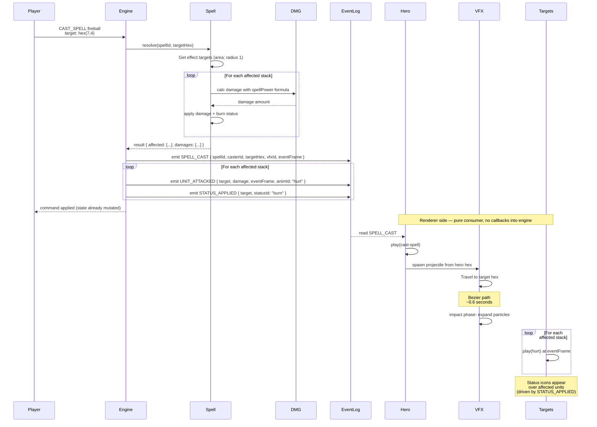

**Casting fireball at enemy stack.** The engine resolves the spell
synchronously when `CAST_SPELL` is applied: it computes affected
hexes, applies damage per affected stack, applies status effects, and
emits one `SPELL_CAST` event plus one `UNIT_ATTACKED` per affected
unit (each carrying its own `eventFrame`) into the event log. The
renderer reads those events and plays the cast pose, projectile
travel, impact VFX, and per-unit hurt anims. The renderer never calls
back into rules. See
[`../animation-contract.md` § DAMAGE_FRAME Ownership](../animation-contract.md#damage_frame-ownership).

## Area Effect Resolution

For area spells, the engine:

1. Computes affected hexes from spell definition
2. Finds all stacks in those hexes
3. Applies damage formula per stack and mutates state
4. Emits one `SPELL_CAST` event plus one `UNIT_ATTACKED` per affected
   unit, each carrying its own `eventFrame`
5. The renderer plays VFX once and per-unit hurt animations on the
   `eventFrame` of the corresponding `UNIT_ATTACKED` event
