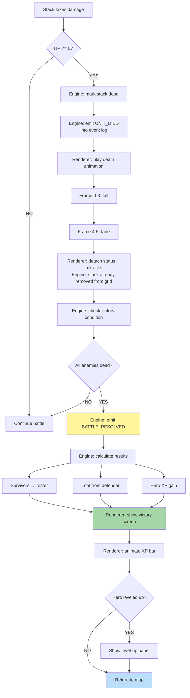

**When stack dies or battle ends.** The engine resolves death and
victory synchronously and emits `UNIT_DIED` / `BATTLE_RESOLVED`
events into the event log. The renderer reads those events and plays
the matching death and victory animations. Animation completion does
not gate the engine's state transitions; it only delays the next
visible step on the renderer side. See
[`../animation-contract.md` § Mid-Anim Destruction](../animation-contract.md#mid-anim-destruction).

## Battle Outcomes

- **Victory**: All enemy stacks dead. Loot distributed, XP awarded.
- **Defeat**: All player stacks dead. Hero defeated, possibly captured.
- **Retreat**: Player flees. Hero survives but loses army.
- **Surrender**: Player pays gold. Hero keeps army.

> **Renderer purity.** Removing the dead stack from the grid is an
> engine action emitted as part of `UNIT_DIED`. The renderer's death
> animation is purely cosmetic — it cannot block or alter the
> grid-removal step. Status and fx tracks attached to the dead unit
> are detached when the renderer finishes the `dying` clip; if the
> renderer drops frames, the engine's grid-state is unaffected.
