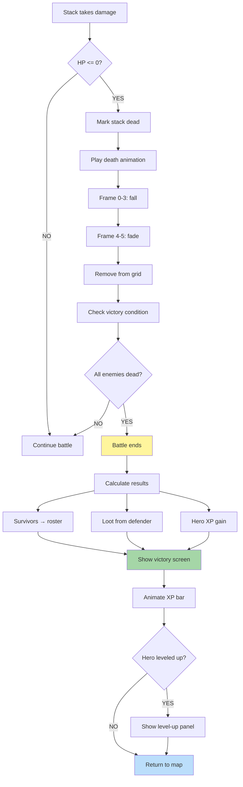

**When stack dies or battle ends.** Last unit in stack triggers death animation. Stack removed from grid. Battle checks if all enemies dead. Victory screen with replay option, loot distribution, hero XP gain.

## Battle Outcomes

- **Victory**: All enemy stacks dead. Loot distributed, XP awarded.
- **Defeat**: All player stacks dead. Hero defeated, possibly captured.
- **Retreat**: Player flees. Hero survives but loses army.
- **Surrender**: Player pays gold. Hero keeps army.
