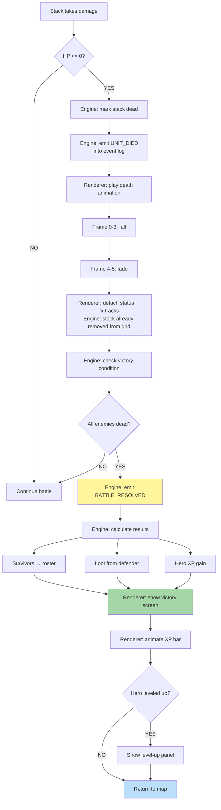

**When a stack dies or the battle ends.** The engine resolves both
synchronously: HP ≤ 0 emits a `UNIT_DIED` event into the event log,
and once a side has no living stacks the engine dispatches a
system-minted `BATTLE_RESOLVED` command that transitions phase from
`battle` back to `adventure`. The renderer reads the event log and
plays the matching death + victory sequences — animation completion
never gates engine state, it only delays the next visible step on the
renderer side. See
[`../animation-contract.md` § Mid-Anim Destruction](../animation-contract.md#mid-anim-destruction).

## Battle Outcomes

| Outcome | Trigger | Hero | Army |
|---|---|---|---|
| Victory | All enemy stacks dead | retained | survivors return; loot + XP awarded |
| Defeat | All player stacks dead | defeated, possibly captured | lost |
| Retreat | Player flees | retained | lost |
| Surrender | Player pays gold | retained | retained |

Retreat / Surrender mechanics and any disconnect-vs-leave penalty
classification live in
[`../abandon-penalty.md`](../abandon-penalty.md).

## Renderer Purity

- Grid removal of the dead stack is an engine-side effect of
  `UNIT_DIED`; the death animation is purely cosmetic and cannot
  block or alter it.
- Status and fx tracks attached to the dead unit detach when the
  renderer finishes the `dying` clip, per body-channel priority `9`
  in [`../animation-contract.md` § 4](../animation-contract.md#4-conflict-resolution).
- Dropped renderer frames never affect engine grid state.

---

## 🔍 Sync Check

- **UI: ✔** — Level-up panel binding flows through
  [`../wiki/screens/48-level-up-dialog/`](../wiki/screens/48-level-up-dialog/)
  via `HERO_LEVEL_UP` (already mapped in
  [`../screen-event-coverage.json`](../screen-event-coverage.json)).
  This diagram makes no direct copy-string claims.
- **Schema: ⚠** — `UNIT_DIED` is a valid member of the closed event
  vocabulary in
  [`../../../content-schema/schemas/event.schema.json`](../../../content-schema/schemas/event.schema.json)
  (`unitDied` payload `{ unitId }`). `BATTLE_RESOLVED` is **not** an
  event — it is a `Command` `kind` in
  [`../../../content-schema/schemas/command.schema.json`](../../../content-schema/schemas/command.schema.json)
  (`battleResolved` payload `{ winnerId, winnerArmy[], loserArmy[], metadata }`),
  engine-minted under actor `"system"` per
  [`../command-schema.md` § BATTLE_RESOLVED](../command-schema.md#battle_resolved).
  Lead prose clarifies the distinction; mermaid label preserved
  verbatim because the same wording-drift exists in two sibling docs
  and rewriting silently would mask the system-wide gap. See Issues.
- **Tasks: ⚠** — `BATTLE_RESOLVED` is owned by
  [`tasks/mvp/09-tactical-combat/08-battle-end-condition.md`](../../../tasks/mvp/09-tactical-combat/08-battle-end-condition.md)
  (dispatches the command after `checkBattleEnd`); the renderer side
  is consumed by
  [`tasks/mvp/06-renderer/07-event-log-animation-timeline.md`](../../../tasks/mvp/06-renderer/07-event-log-animation-timeline.md).
  Neither task currently lists this diagram in *Read First* — same
  cross-link gap already flagged in
  [`../animation-contract.md` ⚠ Issues](../animation-contract.md).

## ⚠ Issues

- **`BATTLE_RESOLVED` is mis-classed as an event in sibling docs.**
  This diagram's mermaid step `K[Engine: emit BATTLE_RESOLVED]` and
  the body-channel priority table in
  [`../animation-contract.md` § 4](../animation-contract.md#4-conflict-resolution)
  ("`defeated` ← engine emits `BATTLE_RESOLVED`") both describe
  `BATTLE_RESOLVED` as an event, but the closed 13-kind event
  vocabulary in
  [`../event-schema.md` § Summary](../event-schema.md#summary) and
  [`event.schema.json`](../../../content-schema/schemas/event.schema.json)
  does not include it. The canonical shape in
  [`command.schema.json`](../../../content-schema/schemas/command.schema.json)
  is a `Command` `kind` dispatched by the engine under actor
  `"system"` per
  [`../command-schema.md` § BATTLE_RESOLVED](../command-schema.md#battle_resolved).
  Per the project root contract ("schemas are the public contract"),
  the closing fix is one of: (a) add a `battleResolved` event `$def`
  to `event.schema.json` (suggested payload
  `{ winnerId: string | null, battleId? }`) and mirror it in
  `event-schema.md` + `screen-event-coverage.json` if the renderer
  needs an event-log entry separate from the command; or (b)
  rewrite the wording in this diagram and
  `animation-contract.md` § 4 to say "dispatches `BATTLE_RESOLVED`"
  rather than "emits". Owning task: jointly
  [`tasks/mvp/09-tactical-combat/08-battle-end-condition.md`](../../../tasks/mvp/09-tactical-combat/08-battle-end-condition.md)
  (engine emitter) and
  [`tasks/mvp/06-renderer/07-event-log-animation-timeline.md`](../../../tasks/mvp/06-renderer/07-event-log-animation-timeline.md)
  (renderer consumer of the resulting victory anim). Skill preserved
  the mermaid label verbatim because event-vocabulary registration
  is structural (anti-cheat rule D); lead prose now states the
  command-vs-event distinction inline.
- **Cross-link gap on owning tasks.** Neither
  [`tasks/mvp/09-tactical-combat/08-battle-end-condition.md`](../../../tasks/mvp/09-tactical-combat/08-battle-end-condition.md)
  (engine emitter of `UNIT_DIED` / `BATTLE_RESOLVED`) nor
  [`tasks/mvp/06-renderer/07-event-log-animation-timeline.md`](../../../tasks/mvp/06-renderer/07-event-log-animation-timeline.md)
  (renderer-side consumer) cites this diagram in its *Read First*.
  Per `.agents/rules/tasks.md` (*Read First* surface), both tasks
  should list `docs/architecture/diagrams/13-death-victory.md` so an
  implementer pulling the spec also gets the visual flow. Same gap
  is flagged for `animation-contract.md` and the sibling
  animation diagrams; the closing fix is shared. Skill did not edit
  the task files (anti-cheat rule D).
