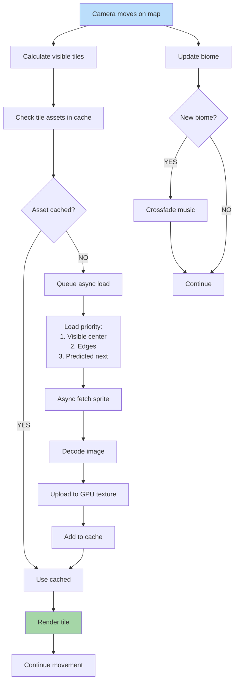

**Walking the world map.** Currently visible tiles drive asset loading. Distant assets unloaded if memory tight. Hero/army assets stay loaded. Music for current biome plays.

## Streaming Strategy

- Visible tiles: highest priority (loaded synchronously if cached)
- Adjacent tiles: medium priority (preloaded)
- Distant tiles: low priority (lazy)
- Out of FOV: candidates for eviction
