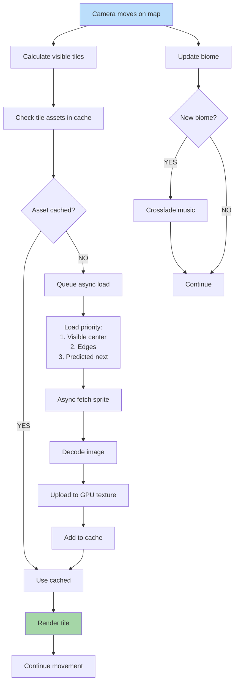

**Camera-driven asset streaming on the adventure map.** When the
camera pans, visible tile sprites are resolved against the asset
cache, async-loaded on miss, and rendered. Hero / army sprites are
pinned. Distant assets are evicted under memory pressure. Music
crossfades on biome change.

This is the in-game counterpart of [04 — Map Loading](./04-map-loading.md)
(the once-per-scenario load that ends with the first frame). Cache
residency, per-pack budgets, and eviction tiers are governed by
[17 — Cache Strategy](./17-cache-strategy.md); decoder caps and the
fetch → magic-byte → SHA-256 → decode pipeline by
[`asset-loading.md`](../asset-loading.md).

## Notes

- **Asset resolution is registry-mediated.** Tile / sprite records
  carry **logical IDs**, never raw paths; the runtime resolves
  through `PackRegistry.resolveAsset` per
  [`asset-path-resolution.md` § 2](../asset-path-resolution.md#2-runtime-registry-mediated-synchronous).
  The "Async fetch sprite" node abstracts the full pre-flight
  pipeline (magic-byte → cap pre-flight → SHA-256 → decoder Worker)
  in [`asset-loading.md` § 2](../asset-loading.md#2-pre-flight-pipeline).
- **Streaming applies to assets, not map data.** Map storage
  (terrain, objects, units, fog) lives **fully in memory** for M1
  per [`performance.md` § 4 — Map Memory](../performance.md#map-memory-in-memory-vs-streaming);
  this diagram only streams the per-tile sprite / atlas bytes.
- **Hero / army sprites are pinned, not Hot.** "Current hero" sits
  in the Pinned tier in
  [17 — Cache Strategy](./17-cache-strategy.md) and is never
  evicted regardless of pressure.
- **Adventure-map animation ceilings cap the renderer.** Active
  animations per frame (256 total / 128 on-screen) are pinned by
  [`performance.md` § 5](../performance.md#5-entity-ceilings) and
  enforced on the owning task
  [`tasks/mvp/06-renderer/03-map-renderer-terrain-objects-units-layers.md`](../../../tasks/mvp/06-renderer/03-map-renderer-terrain-objects-units-layers.md);
  off-screen animations skip frame-advance per
  [22 — Building Loop](./22-building-loop.md).

## Streaming Strategy

Priority bands map to the cache tiers in
[17 — Cache Strategy](./17-cache-strategy.md):

| Band | Cache tier (per 17) | Behavior |
|---|---|---|
| Visible tiles | Hot / Pinned (current hero, current town, UI) | Use cached synchronously; never evicted from Pinned. |
| Adjacent tiles | Hot | Preloaded; last to evict. |
| Distant tiles | Warm / Cold | Lazy; evicted first under memory pressure. |
| Out of FOV | Cold | Eviction candidates when total used crosses the 70 / 90 % thresholds. |

Eviction is **per-pack first** (each pack's residency bucket is
capped by `maxResidentBytesPerPack` per
[`asset-loading.md` § 1.2](../asset-loading.md#12-per-pack-budgets)),
then global per the tier rules in 17.

## Related diagrams

- [04 — Map Loading](./04-map-loading.md) — pre-game scenario load
  this flow hands off from.
- [15 — Enter Town](./15-enter-town.md) — town-entry asset pre-load.
- [16 — Enter Battle](./16-enter-battle.md) — battle pre-load.
- [17 — Cache Strategy](./17-cache-strategy.md) — eviction tiers and
  per-pack residency.
- [22 — Building Loop](./22-building-loop.md) — animation tick rules
  that bound on-screen vs off-screen work.

---

## 🔍 Sync Check

- **UI: ✔** — Camera-driven streaming feeds the adventure-map render
  loop owned by [`wiki/screens/07-adventure-map/data-contracts.md`](../wiki/screens/07-adventure-map/data-contracts.md)
  (`state.adventure.visibleTiles` selector). No screen-spec copy
  strings are claimed by this diagram.
- **Schema: ⚠** — Tile / sprite logical-ID shape and the closed
  `kind` enum (`tile`, `sprite`, `atlas`, `image`, `music`,
  `ambient`, …) match [`asset-index.schema.json`](../../../content-schema/schemas/asset-index.schema.json)
  via [`asset-policy.md`](../asset-policy.md). However, the diagram
  asserts **per-biome music**; [`world.schema.json`](../../../content-schema/schemas/world.schema.json)
  currently registers only `presentation.ambientMusicId` at the
  world level (no per-biome `musicId`). See `## ⚠ Issues`.
- **Tasks: ✔** — Renderer culling / camera loop owned by
  [`tasks/mvp/06-renderer/03-map-renderer-terrain-objects-units-layers.md`](../../../tasks/mvp/06-renderer/03-map-renderer-terrain-objects-units-layers.md)
  and [`tasks/mvp/06-renderer/04-camera-pan-zoom-clamp-to-map-bounds.md`](../../../tasks/mvp/06-renderer/04-camera-pan-zoom-clamp-to-map-bounds.md);
  async loader / cache by [`tasks/mvp/02b-asset-pipeline/05-async-asset-loader-with-caching.md`](../../../tasks/mvp/02b-asset-pipeline/05-async-asset-loader-with-caching.md);
  registry resolution by [`tasks/mvp/02b-asset-pipeline/04-asset-registry-id-based-resolution-no-hardcoded-paths.md`](../../../tasks/mvp/02b-asset-pipeline/04-asset-registry-id-based-resolution-no-hardcoded-paths.md).
  Sibling diagram [04 — Map Loading](./04-map-loading.md) reciprocally
  cites this diagram as the hand-off target.

## ⚠ Issues

- **Per-biome music has no schema binding.** The diagram crossfades
  music on biome change, but [`world.schema.json`](../../../content-schema/schemas/world.schema.json)
  registers only `presentation.ambientMusicId` (one music ID per
  world); no biome record carries a `musicId` field and no
  `biome.schema.json` exists in [`content-schema/schemas/`](../../../content-schema/schemas/).
  Per [`enum-lifecycle-policy.md`](../enum-lifecycle-policy.md) and
  the root rule that gameplay records reference IDs through schemas,
  a per-biome music switch needs either (a) a new `biome.schema.json`
  with `presentation.ambientMusicId`, or (b) a `musicByBiomeId` map
  on `world.presentation`. Owner: [`tasks/mvp/02-content-schemas/15-world-schema.md`](../../../tasks/mvp/02-content-schemas/15-world-schema.md)
  (world-schema task) — schema extension would land there. Diagram
  wording preserved per Hard Prohibition A; no edits to schema or
  task files (Hard Prohibition D).
- **"Predicted next" tile prefetch is not pinned to a task spec.**
  The load-priority node lists `Predicted next` as a third tier, but
  no owning task in
  [`tasks/mvp/02b-asset-pipeline/`](../../../tasks/mvp/02b-asset-pipeline/)
  or [`tasks/mvp/06-renderer/`](../../../tasks/mvp/06-renderer/)
  defines a movement-prediction prefetch policy (hero path preview
  in [`wiki/screens/07-adventure-map/`](../wiki/screens/07-adventure-map/)
  is a UI draft, not an asset-prefetch signal). Per the diagrams
  [README § Normative Status](./README.md#normative-status) (tasks
  win on disagreement), either a renderer task adds the prefetch
  policy or this band is downgraded to "future". Preserved verbatim
  pending owner decision; no task / file edited.
