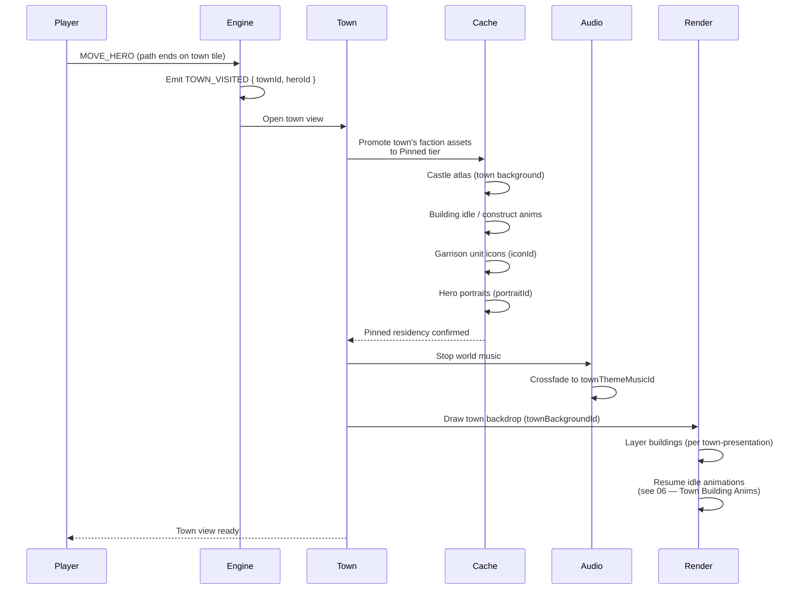

**A hero arrives on a town tile.** `MOVE_HERO` arrival emits the
`TOWN_VISITED` event; the renderer opens the town view, the cache
promotes the town's faction assets to the Pinned tier, music
crossfades from the world theme to the town theme, and building
idle animations resume. The faction-pack itself is **already
resident** — it was loaded once-per-scenario per
[04 — Map Loading](./04-map-loading.md); this flow promotes,
not fetches.

Canonical contracts: town-entry command `MOVE_HERO` in
[`command-schema.md` § MOVE_HERO](../command-schema.md#move_hero);
emitted event `TOWN_VISITED` in
[`event-schema.md` § TOWN_VISITED](../event-schema.md#town_visited)
(closed kind in
[`event.schema.json`](../../../content-schema/schemas/event.schema.json));
faction presentation IDs (`townBackgroundId`, `townThemeMusicId`,
`uiThemeId`, `bannerId`) in
[`faction.schema.json`](../../../content-schema/schemas/faction.schema.json);
optional town-layout record (`backgroundLayers`,
`presentation.ambientAnimationSetId`, `presentation.soundSetId`) in
[`town-presentation.schema.json`](../../../content-schema/schemas/town-presentation.schema.json);
cache-tier promotion ("current town" → Pinned) in
[17 — Cache Strategy](./17-cache-strategy.md); per-building idle
state machine in [06 — Town Building Anims](./06-town-animations.md);
the registry-mediated resolve (logical ID → `{ url, hash, format }`)
in [`asset-path-resolution.md` § 2](../asset-path-resolution.md#2-runtime-registry-mediated-synchronous).

## What Gets Loaded (Or Promoted)

All entries below are already resident in the asset registry by the
time `TOWN_VISITED` fires; town entry **promotes** them to the
Pinned tier per [17 — Cache Strategy](./17-cache-strategy.md), so
they survive global LRU pressure while the town view is open.

| Asset | Logical ID | Source schema |
|---|---|---|
| Town background / castle atlas | `faction.presentation.townBackgroundId` | [`faction.schema.json`](../../../content-schema/schemas/faction.schema.json) |
| Building atlas + idle / construct animations | `town-presentation.presentation.ambientAnimationSetId`, `…constructionAnimationSetId` | [`town-presentation.schema.json`](../../../content-schema/schemas/town-presentation.schema.json) |
| Garrison unit icons | `unit.presentation.iconId` / `portraitId` | [`unit.schema.json`](../../../content-schema/schemas/unit.schema.json) |
| Visiting / garrisoned hero portraits | `hero.presentation.portraitId` | [`hero.schema.json`](../../../content-schema/schemas/hero.schema.json) |
| Town theme music | `faction.presentation.townThemeMusicId` | [`faction.schema.json`](../../../content-schema/schemas/faction.schema.json) |
| Town sound bank | `town-presentation.presentation.soundSetId` → `sound-set.schema.json` | [`sound-set.schema.json`](../../../content-schema/schemas/sound-set.schema.json) |

`PackRegistry.resolveAsset(logicalId)` returns `{ url, hash, format }`
synchronously per
[`asset-path-resolution.md` § 2](../asset-path-resolution.md#2-runtime-registry-mediated-synchronous);
the loader's pre-flight pipeline (magic-byte → cap pre-flight →
SHA-256 → decoder Worker) is in
[`asset-loading.md` § 2](../asset-loading.md#2-pre-flight-pipeline).

## Notes

- **Town entry is registry-mediated, not path-driven.** The
  renderer reads `town.factionId` → `faction.presentation` →
  logical IDs, then calls `PackRegistry.resolveAsset` per
  [05 — Castle Per Race](./05-castle-render.md). No raw paths
  appear in gameplay records.
- **Music crossfade is the only fresh I/O.** Both themes are
  already decoded (Hot tier) by the time the player arrives; the
  audio engine swaps the active stream and the cache promotes
  `townThemeMusicId` to Pinned while the town view is open.
- **Building animations don't restart from scratch.** Per-building
  idle / fx timelines belong to the body / status / fx channels in
  [06 — Town Building Anims](./06-town-animations.md); ambient
  effects (smoke, banner flutter) are authored `idle` clips on the
  buildings themselves, not a separate "particle" asset kind.
- **Missing presentation falls back; missing gameplay fails
  loudly.** Per
  [`pack-contract.md` § Asset Fallback And Placeholders](../pack-contract.md#asset-fallback-and-placeholders)
  and [`fail-loud.md`](../fail-loud.md): a missing portrait or town
  backdrop resolves to a placeholder; a missing `factionId` or
  required `presentation` block refuses the pack at validation
  time.

## Related diagrams

- [04 — Map Loading](./04-map-loading.md) — when faction-packs are
  first resolved (once per unique slot faction).
- [05 — Castle Per Race](./05-castle-render.md) — the same
  faction → asset-ID lookup the town renderer uses on entry.
- [06 — Town Building Anims](./06-town-animations.md) — body /
  status / fx channels for each on-screen building.
- [14 — Enter Map](./14-enter-map.md) — the camera streamer this
  flow detaches from while the town view is open.
- [16 — Enter Battle](./16-enter-battle.md) — sibling pre-load
  flow for battle entry.
- [17 — Cache Strategy](./17-cache-strategy.md) — Pinned-tier
  promotion + per-pack residency that bound this flow.
- [22 — Building Loop](./22-building-loop.md) — per-frame building
  idle tick rules referenced by the resume step.

---

## 🔍 Sync Check

- **UI: ✔** — The town view this flow opens is owned by
  [`wiki/screens/24-town-screen/spec.md`](../wiki/screens/24-town-screen/spec.md);
  its state bindings (`state.towns.selectedTownId`,
  `state.towns.byId[selected].buildings`,
  `state.adventure.visitingHeroId`) and command set
  (`SELECT_TOWN_BUILDING`, `OPEN_BUILD_TREE`,
  `OPEN_RECRUITMENT_DIALOG`, `OPEN_MAGE_GUILD`,
  `TRANSFER_TOWN_ARMY_STACK`, `CLOSE_TOWN_SCREEN`) live in
  [`wiki/screens/24-town-screen/data-contracts.md`](../wiki/screens/24-town-screen/data-contracts.md).
  This diagram asserts no screen-spec copy strings.
- **Schema: ✔** — Required faction `presentation` keys
  (`townBackgroundId`, `townThemeMusicId`, `uiThemeId`, `bannerId`)
  match [`faction.schema.json`](../../../content-schema/schemas/faction.schema.json);
  optional town-layout fields (`backgroundLayers`,
  `presentation.ambientAnimationSetId`,
  `presentation.constructionAnimationSetId`,
  `presentation.soundSetId`) match
  [`town-presentation.schema.json`](../../../content-schema/schemas/town-presentation.schema.json);
  unit `iconId` / `portraitId` and hero `portraitId` match
  [`unit.schema.json`](../../../content-schema/schemas/unit.schema.json)
  and [`hero.schema.json`](../../../content-schema/schemas/hero.schema.json);
  emitted event `TOWN_VISITED` matches the closed kind in
  [`event.schema.json`](../../../content-schema/schemas/event.schema.json).
  Schema rows for `Faction`, `TownPresentation`, `Unit`, `Hero`,
  and `SoundSet` resolve in [`schema-matrix.md`](../schema-matrix.md).
- **Tasks: ✔** — Town-entry command path (`MOVE_HERO` arrival,
  `TOWN_VISITED` emission) owned by
  [`tasks/mvp/05-adventure-map/05-town-visit-recruit-build-mage-guild.md`](../../../tasks/mvp/05-adventure-map/05-town-visit-recruit-build-mage-guild.md);
  faction-pack residency by
  [`tasks/mvp/02b-asset-pipeline/01-manifest-format-plus-pack-registry.md`](../../../tasks/mvp/02b-asset-pipeline/01-manifest-format-plus-pack-registry.md)
  and
  [`tasks/mvp/02b-asset-pipeline/05-async-asset-loader-with-caching.md`](../../../tasks/mvp/02b-asset-pipeline/05-async-asset-loader-with-caching.md);
  event-driven animation / sound timelines by
  [`tasks/mvp/06-renderer/07-event-log-animation-timeline.md`](../../../tasks/mvp/06-renderer/07-event-log-animation-timeline.md)
  and
  [`tasks/phase-3/04-polish/02-sound-system-event-log-driven.md`](../../../tasks/phase-3/04-polish/02-sound-system-event-log-driven.md)
  (both registered as `TOWN_VISITED` consumers in
  [`screen-event-coverage.json`](../screen-event-coverage.json));
  diagrams are normatively secondary per
  [README § Normative Status](./README.md#normative-status).

## ⚠ Issues

- **"VISIT_TOWN" trigger label corrected to `MOVE_HERO` →
  `TOWN_VISITED`.** The original sequence detected a `VISIT_TOWN`
  command, but no such command exists in
  [`command-schema.md`](../command-schema.md) or
  [`command.schema.json`](../../../content-schema/schemas/command.schema.json).
  Town entry is canonically a `MOVE_HERO` arrival that emits
  `TOWN_VISITED` per
  [`event-schema.md` § TOWN_VISITED](../event-schema.md#town_visited)
  and the `townVisited` `oneOf` branch in
  [`event.schema.json`](../../../content-schema/schemas/event.schema.json).
  Rewrote the trigger arrow and the engine "Emit" node per § 8
  Option A; the conceptual flow (player arrives → town view
  opens → music / animations resume) is preserved verbatim.
- **"Load town's faction pack (if not already)" relabeled to
  Pinned-tier promotion.** The original implied a fresh load on
  town entry. Faction-packs are loaded once per unique
  `players[].factionId` at scenario-load time per
  [04 — Map Loading](./04-map-loading.md), and "current town"
  sits in the **Pinned** cache tier per
  [17 — Cache Strategy](./17-cache-strategy.md). Renamed the
  cache-side nodes to "Promote … to Pinned tier" so the
  diagram does not assert a network fetch that does not happen
  in M1. No facts removed; the "if not already" hedge in the
  original is now explicit ("already resident → promote").
- **"Ambient particle definitions" delegated to building
  animations.** The original listed "Ambient particle
  definitions" as a separate asset bullet, but
  [`vfx.schema.json`](../../../content-schema/schemas/vfx.schema.json)
  closes phases to `cast` / `projectile` / `impact` only — no
  ambient particle slot exists, and the smoke / banner ambient
  effects called out in the prose are per-building `idle` clips
  on the body / status / fx channels per
  [06 — Town Building Anims](./06-town-animations.md) and
  [22 — Building Loop](./22-building-loop.md). Replaced the
  bullet with an explicit hand-off to 06 and 22, and added the
  optional `town-presentation.presentation.ambientAnimationSetId`
  row in the asset table. No new asset kind invented (Hard
  Prohibition B).
- **"Creature thumbnails" → `unit.presentation.iconId`,
  "hero portraits" → `hero.presentation.portraitId`.** The
  original used unbound English labels; the asset table now cites
  the exact schema fields so an implementer can resolve them
  through `PackRegistry.resolveAsset`. The semantic intent
  (recruit-panel thumbnail, hero-panel portrait) is preserved.
