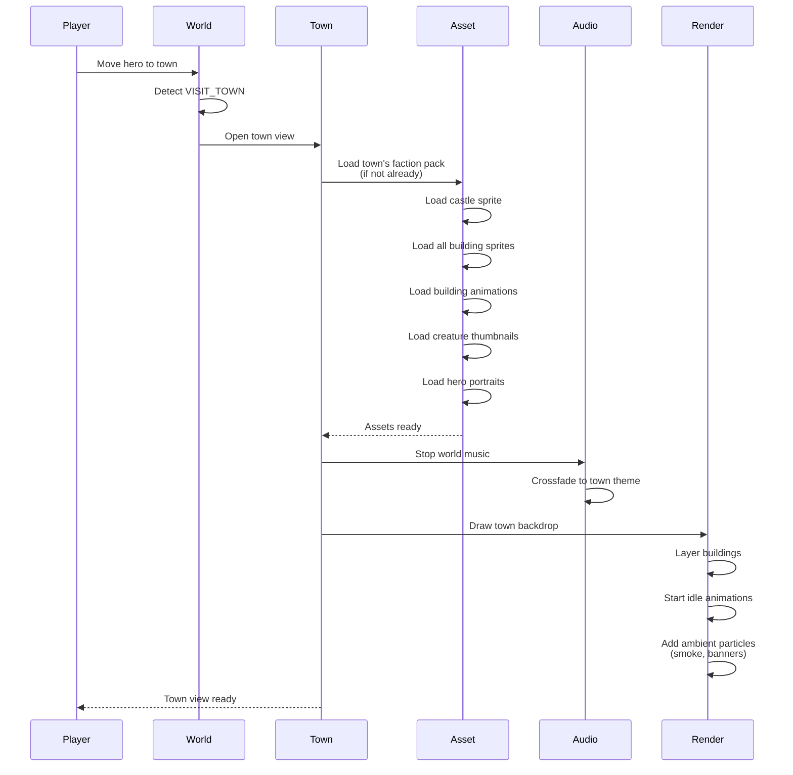

**Player visits a town.** Town's faction assets all loaded. Building animations start. Town music plays. Heroes in town are shown. Garrison creature thumbnails loaded.

## What Gets Loaded

- Castle sprite atlas (single PNG with all buildings)
- Building animation definitions
- Creature thumbnails (for recruit panel)
- Hero portraits (for hero panel)
- Town music (per faction)
- Ambient particle definitions
