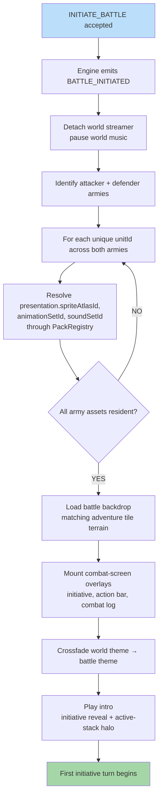

**Two armies meet on the adventure map.** `INITIATE_BATTLE` is
accepted, the engine emits the `BATTLE_INITIATED` event, the world
streamer detaches, and both armies' unit / hero presentation assets
are resolved through the asset registry before the first battle
frame is drawn. The battle backdrop matches the adventure tile's
terrain, the combat-screen overlays are mounted, music crossfades
from the world theme to the battle theme, and the initiative queue
plays the intro.

Canonical contracts: trigger command `INITIATE_BATTLE`
(`attackerId`, `defenderId`, `autoResolve`) in
[`command-schema.md` § INITIATE_BATTLE](../command-schema.md#initiate_battle)
and [`command.schema.json`](../../../content-schema/schemas/command.schema.json);
emitted event `BATTLE_INITIATED` (`battleId?`, `attackerId`,
`defenderId`) in
[`event-schema.md` § Summary](../event-schema.md) (closed kind in
[`event.schema.json`](../../../content-schema/schemas/event.schema.json));
per-unit presentation IDs (`spriteAtlasId`, `animationSetId`,
`soundSetId`, `portraitId`) in
[`unit.schema.json`](../../../content-schema/schemas/unit.schema.json);
per-hero presentation IDs (`animationSetId`, `soundSetId`,
`portraitId`) in
[`hero.schema.json`](../../../content-schema/schemas/hero.schema.json);
required creature animation states (`idle`, `walking`, `attacking`,
`hurt`, `dying` + optional `casting` / `defending` / `special`) in
[21 — Creature States](./21-creature-states.md); battle backdrop
matching the adventure tile in
[`tasks/phase-2/06-visual-fidelity/12-battlefield-backdrop-terrain-backgrounds-per-terrain-type.md`](../../../tasks/phase-2/06-visual-fidelity/12-battlefield-backdrop-terrain-backgrounds-per-terrain-type.md);
combat-screen overlay (initiative, action bar, combat log) in
[`wiki/screens/38-combat-screen/spec.md`](../wiki/screens/38-combat-screen/spec.md);
the registry-mediated resolve (logical ID → `{ url, hash, format }`)
in
[`asset-path-resolution.md` § 2](../asset-path-resolution.md#2-runtime-registry-mediated-synchronous);
the loader pre-flight pipeline (magic-byte → cap pre-flight →
SHA-256 → decoder Worker) in
[`asset-loading.md` § 2](../asset-loading.md#2-pre-flight-pipeline);
cache-tier promotion (current battle assets → Pinned / Hot) in
[17 — Cache Strategy](./17-cache-strategy.md).

## What Gets Loaded (Or Promoted)

All entries below are pre-loaded **before the first battle frame is
drawn** and held in the Pinned / Hot tiers for the duration of the
battle per [17 — Cache Strategy](./17-cache-strategy.md). Faction
packs themselves are already resident from scenario load per
[04 — Map Loading](./04-map-loading.md); this flow resolves and
promotes the per-unit / per-hero presentation slots, not the packs.

| Asset | Logical ID | Source schema |
|---|---|---|
| Per-unit sprite atlas | `unit.presentation.spriteAtlasId` | [`unit.schema.json`](../../../content-schema/schemas/unit.schema.json) |
| Per-unit animation set (idle / walking / attacking / hurt / dying + optional casting / defending / special) | `unit.presentation.animationSetId` → [`animation.schema.json`](../../../content-schema/schemas/animation.schema.json) | [`unit.schema.json`](../../../content-schema/schemas/unit.schema.json), required states in [21 — Creature States](./21-creature-states.md) |
| Per-unit sound bank | `unit.presentation.soundSetId` → `sound-set.schema.json` | [`sound-set.schema.json`](../../../content-schema/schemas/sound-set.schema.json) |
| Hero portrait + animation / sound (for tactical and victory cinematics) | `hero.presentation.portraitId`, `animationSetId`, `soundSetId` | [`hero.schema.json`](../../../content-schema/schemas/hero.schema.json) |
| Battle backdrop (terrain match) | (no schema field; owned by task) | [`tasks/phase-2/06-visual-fidelity/12-battlefield-backdrop-terrain-backgrounds-per-terrain-type.md`](../../../tasks/phase-2/06-visual-fidelity/12-battlefield-backdrop-terrain-backgrounds-per-terrain-type.md) |
| Combat-screen overlay assets | `ui.combat-screen.background`, `ui.combat-screen.frame`, `ui.combat-screen.icons.*` | [`wiki/screens/38-combat-screen/data-contracts.md`](../wiki/screens/38-combat-screen/data-contracts.md) |
| Battle music + per-event SFX | `audio.battle.*` (asset-index logical IDs) | [`wiki/screens/38-combat-screen/data-contracts.md`](../wiki/screens/38-combat-screen/data-contracts.md) — no schema-bound `battleMusicId` exists (see Issues) |

`PackRegistry.resolveAsset(logicalId)` returns
`{ url, hash, format }` synchronously per
[`asset-path-resolution.md` § 2](../asset-path-resolution.md#2-runtime-registry-mediated-synchronous);
the loader's pre-flight pipeline (magic-byte → cap pre-flight →
SHA-256 → decoder Worker) is in
[`asset-loading.md` § 2](../asset-loading.md#2-pre-flight-pipeline).

## Notes

- **All army assets resolve before the first frame.** Pre-loading
  avoids mid-battle stutter when a clip first plays, inconsistent
  frame timing under the two-clock model (see
  [`animation-contract.md` § 1](../animation-contract.md)), and
  asset fetch errors during gameplay. Missing presentation falls
  back through the placeholder path; missing gameplay requirements
  fail loudly per [`fail-loud.md`](../fail-loud.md) and
  [`pack-contract.md` § Asset Fallback And Placeholders](../pack-contract.md#asset-fallback-and-placeholders).
- **Battle entry is registry-mediated, not path-driven.** The
  renderer reads each unit / hero's `presentation` block → logical
  IDs → `PackRegistry.resolveAsset`. No raw paths appear in
  gameplay records.
- **Hex grid + initiative are engine-side, not pre-load.** Grid
  construction (11×15), starting-column placement (attacker 1–2,
  defender 13–14), and speed-sorted initiative queue happen in the
  reducer per
  [`tasks/mvp/09-tactical-combat/01-battlestate-init-army-placement-plus-speed-order.md`](../../../tasks/mvp/09-tactical-combat/01-battlestate-init-army-placement-plus-speed-order.md);
  this diagram only covers what the loader resolves.
- **Intro animation is presentation-only.** The active-stack halo
  and initiative reveal are renderer timelines triggered after
  `BATTLE_INITIATED` is consumed; they cannot gate or delay engine
  state per [`animation-contract.md` § 2](../animation-contract.md#2-damage_frame-ownership).

## Related diagrams

- [09 — Battle Init](./09-battle-init.md) — the post-load
  initialization (hex grid, placement, initiative queue) this flow
  hands off to.
- [11 — Attack Anim](./11-attack-anim.md),
  [12 — Spell Anim](./12-spell-anim.md),
  [13 — Death & Victory](./13-death-victory.md) — battle-side
  animations the pre-loaded creature sets serve.
- [14 — Enter Map](./14-enter-map.md) — the world streamer this
  flow detaches from.
- [15 — Enter Town](./15-enter-town.md) — sibling pre-load flow for
  town entry.
- [17 — Cache Strategy](./17-cache-strategy.md) — Pinned / Hot tier
  promotion and per-pack residency that bound this flow.
- [21 — Creature States](./21-creature-states.md) — required
  per-creature animation states pre-loaded here.

---

## 🔍 Sync Check

- **UI: ✔** — Combat-screen overlay mount-on-entry maps to
  [`wiki/screens/38-combat-screen/spec.md`](../wiki/screens/38-combat-screen/spec.md)
  (CombatScreen component tree: Battlefield, HexOverlay, ArmyStacks,
  ActiveStackHalo, TargetPreview, HeroPortraits, ActionBar,
  CombatLog) and its state bindings (`state.battle.phase`,
  `state.battle.activeStackId`, `state.battle.legalTargets`,
  `state.battle.log`) in
  [`wiki/screens/38-combat-screen/data-contracts.md`](../wiki/screens/38-combat-screen/data-contracts.md).
  Pre-battle dialog at
  [`wiki/screens/40-pre-battle-dialog/`](../wiki/screens/40-pre-battle-dialog/)
  is the gating dialog upstream of `INITIATE_BATTLE`. This diagram
  asserts no screen-spec copy strings.
- **Schema: ⚠** — Per-unit / per-hero `presentation` fields
  (`spriteAtlasId`, `animationSetId`, `soundSetId`, `portraitId`)
  match
  [`unit.schema.json`](../../../content-schema/schemas/unit.schema.json)
  and
  [`hero.schema.json`](../../../content-schema/schemas/hero.schema.json);
  trigger command `INITIATE_BATTLE` matches the kind in
  [`command.schema.json`](../../../content-schema/schemas/command.schema.json)
  and [`command-schema.md` § INITIATE_BATTLE](../command-schema.md#initiate_battle);
  emitted event `BATTLE_INITIATED` matches the closed kind in
  [`event.schema.json`](../../../content-schema/schemas/event.schema.json).
  Battle-music and battle-backdrop slots have **no** schema-bound IDs
  on `faction`, `world`, or `ruleset` (see `## ⚠ Issues`).
- **Tasks: ✔** — Trigger command path
  (`INITIATE_BATTLE` reducer + pending-battle state) owned by
  [`tasks/mvp/05-adventure-map/21-map-object-visit-and-battle-initiation-commands.md`](../../../tasks/mvp/05-adventure-map/21-map-object-visit-and-battle-initiation-commands.md);
  post-load battle initialization (hex grid, placement, initiative
  queue) by
  [`tasks/mvp/09-tactical-combat/01-battlestate-init-army-placement-plus-speed-order.md`](../../../tasks/mvp/09-tactical-combat/01-battlestate-init-army-placement-plus-speed-order.md);
  tactical battlefield renderer by
  [`tasks/mvp/06-renderer/05-1115-tactical-battlefield-renderer.md`](../../../tasks/mvp/06-renderer/05-1115-tactical-battlefield-renderer.md);
  terrain-match backdrop by
  [`tasks/phase-2/06-visual-fidelity/12-battlefield-backdrop-terrain-backgrounds-per-terrain-type.md`](../../../tasks/phase-2/06-visual-fidelity/12-battlefield-backdrop-terrain-backgrounds-per-terrain-type.md);
  async loader / cache by
  [`tasks/mvp/02b-asset-pipeline/05-async-asset-loader-with-caching.md`](../../../tasks/mvp/02b-asset-pipeline/05-async-asset-loader-with-caching.md)
  and
  [`tasks/mvp/02b-asset-pipeline/04-asset-registry-id-based-resolution-no-hardcoded-paths.md`](../../../tasks/mvp/02b-asset-pipeline/04-asset-registry-id-based-resolution-no-hardcoded-paths.md).
  Diagrams are normatively secondary per
  [README § Normative Status](./README.md#normative-status).

## ⚠ Issues

- **"Combat triggered" trigger label aligned to `INITIATE_BATTLE` →
  `BATTLE_INITIATED` (fixed in target).** The original mermaid step
  read "Combat triggered" with no command binding. The canonical
  trigger is the `INITIATE_BATTLE` command (`attackerId`,
  `defenderId`, `autoResolve`) per
  [`command-schema.md` § INITIATE_BATTLE](../command-schema.md#initiate_battle),
  which emits the `BATTLE_INITIATED` event per
  [`event-schema.md`](../event-schema.md) and
  [`event.schema.json`](../../../content-schema/schemas/event.schema.json).
  Rewrote the entry node and the engine "Emit" node per § 8 Option
  A; the conceptual flow (battle starts → both armies' assets
  pre-loaded → terrain + UI mounted → music swap → intro → first
  turn) is preserved verbatim.
- **Per-state animation enumeration collapsed to `animationSetId`
  (fixed in target).** The original diagram listed four pre-load
  nodes — `Pre-load idle anim`, `walk`, `attack`, `death` — but
  [`unit.schema.json`](../../../content-schema/schemas/unit.schema.json)
  exposes a single `presentation.animationSetId` that resolves
  through [`animation.schema.json`](../../../content-schema/schemas/animation.schema.json),
  and the required per-creature state list (`idle`, `walking`,
  `attacking`, `hurt`, `dying`) is canonical in
  [21 — Creature States](./21-creature-states.md) — the original
  enumeration also dropped the required `hurt` state. Collapsed
  the per-state nodes to one "Resolve …animationSetId…" node and
  cited 21 for the authoritative state list. No animation
  invented; no required state removed (Hard Prohibition B).
- **No schema-bound battle-music ID.** The diagram (and
  [09 — Battle Init](./09-battle-init.md), and combat-screen
  `data-contracts.md`) reference a "battle music" / "combat
  sounds" track via the `audio.battle.*` asset-index prefix, but
  no schema field on `faction`, `world`, or `ruleset` registers a
  `battleMusicId` (cf.
  [`faction.schema.json`](../../../content-schema/schemas/faction.schema.json)
  which has `townThemeMusicId` for towns and
  [`world.schema.json`](../../../content-schema/schemas/world.schema.json)
  which has only `presentation.ambientMusicId`). Same shape as the
  per-biome-music gap in
  [14 — Enter Map ⚠ Issues](./14-enter-map.md#-issues). Per
  CLAUDE.md ("Stable IDs are public API") and
  [`enum-lifecycle-policy.md`](../enum-lifecycle-policy.md), a
  schema extension is needed: either (a) add
  `faction.presentation.battleThemeMusicId` paralleling
  `townThemeMusicId`, or (b) add `ruleset.presentation.battleMusicId`
  for global battle music. Owner: schema task
  [`tasks/mvp/02-content-schemas/`](../../../tasks/mvp/02-content-schemas/)
  cluster (faction or ruleset schema, depending on the chosen
  scope). Diagram wording preserved verbatim pending owner
  decision; no schema or task file edited (Hard Prohibition D).
- **No schema-bound battle-backdrop ID.** The diagram says "Load
  battle backdrop matching adventure tile terrain". The owning
  task
  [`tasks/phase-2/06-visual-fidelity/12-battlefield-backdrop-terrain-backgrounds-per-terrain-type.md`](../../../tasks/phase-2/06-visual-fidelity/12-battlefield-backdrop-terrain-backgrounds-per-terrain-type.md)
  defines a `loadBattleBackdrop(terrain)` resolver in
  `src/renderer/battle-backdrop.ts`, but no content-schema field
  registers a per-terrain backdrop asset ID, so the mapping
  `terrain → backdropId` is currently runtime-defined rather than
  content-defined. This is acceptable for a phase-2 task with no
  pack-override expectation, but is incompatible with the
  third-party / community-pack extensibility the rest of the asset
  loader assumes (per
  [`content-platform.md`](../content-platform.md)). Per
  [README § Normative Status](./README.md#normative-status) (tasks
  win on disagreement), either the phase-2 task adds a content-
  registered `backdropIdByTerrain` map (e.g. on `world.presentation`
  or a new `battle-presentation.schema.json`) or this diagram step
  is downgraded to "runtime-resolved" when phase-2 lands.
  Preserved verbatim pending owner decision; no task / schema file
  edited.
- **"Battle intro animation" has no event binding.** The original
  closing animation node is preserved as "Play intro / initiative
  reveal + active-stack halo", but no event in
  [`event.schema.json`](../../../content-schema/schemas/event.schema.json)
  is emitted to drive it; the halo is presentation-only per
  [`wiki/screens/38-combat-screen/spec.md` § Animation Contract](../wiki/screens/38-combat-screen/spec.md)
  ("Active stack halo pulses … after command acceptance") and
  [`animation-contract.md` § 2](../animation-contract.md#2-damage_frame-ownership)
  (engine schedules, renderer displays). No gap to surface — the
  semantic intent (a presentation-only intro flourish triggered by
  `BATTLE_INITIATED` consumption) is consistent with the
  animation contract. Listed here as a clarification rather than
  an issue.
