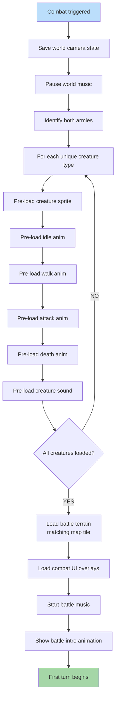

**Battle starts.** Both armies' creature assets pre-loaded. Battle terrain (matches map tile) loaded. Combat music starts. UI overlays (initiative, action bar) loaded. World map paused.

## Pre-Load Optimization

All creature assets are loaded BEFORE the first frame is drawn. This avoids:

- Mid-battle stutter when an animation first plays
- Inconsistent frame timing
- Asset fetch errors during gameplay
