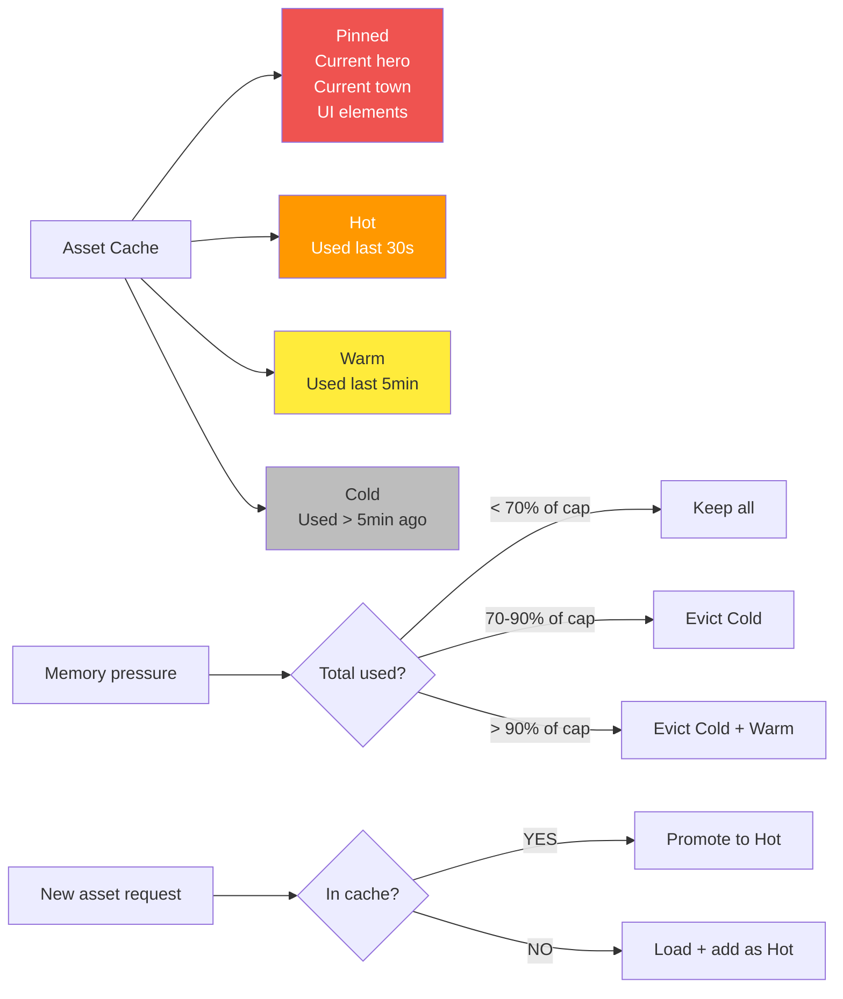

**Asset-cache memory management.** Recently used assets stay
resident; LRU evicts under memory pressure. Critical assets
(current hero, current town, UI) are pinned. Cache promotion runs
on transitions.

Canonical contracts: per-category memory ceilings in
[`performance.md` § 4](../performance.md#4-memory-budget)
(Reference **1 GB** total / Minimum-spec **500 MB** total — every
category halved on the lower tier; per-category cap values
— textures 400 / 200 MB, audio 150 / 75 MB, sim state 150 / 75 MB,
save snapshots 50 / 25 MB, UI 100 / 50 MB, headroom 150 / 75 MB —
live in that table and are not duplicated here);
per-pack residency cap `maxResidentBytesPerPack` in
[`asset-loading.md` § 1.2](../asset-loading.md#12-per-pack-budgets)
(64 MB for canonical / community-signed packs, 32 MB for sandboxed
packs per
[`sandbox-model.md` § 2](../sandbox-model.md#2-capability-matrix));
loader pre-flight pipeline that registers bytes with this cache in
[`asset-loading.md` § 2](../asset-loading.md#2-pre-flight-pipeline).

The percentages in the diagram below are taken **per category cap**:
each cache (texture/atlas, audio, sim state, save snapshots, UI/DOM)
evicts against its own cap from
[`performance.md` § 4](../performance.md#4-memory-budget),
independently of other categories.

## Eviction Rules

| Tier   | Pinned | Eviction behavior                                  |
|--------|--------|----------------------------------------------------|
| Pinned | Yes    | Never evicted                                      |
| Hot    | No     | Last to evict                                      |
| Warm   | No     | Evict at > 90% of category cap                     |
| Cold   | No     | Evict at 70–90% of category cap (first to evict)   |

"Category cap" is the per-category MB ceiling from
[`performance.md` § 4](../performance.md#4-memory-budget). The
texture / atlas cache sees the texture cap; the audio cache sees
the audio cap; etc. Crossing **any** category cap triggers
eviction within that category, independently of other categories.

## Per-Pack Accounting Bucket

Each cached asset is attributed to its owning `packId`. The cache
keeps a **per-pack residency bucket** in addition to the per-tier
accounting. Eviction order:

1. **Per-pack LRU first.** If pack `P` exceeds
   `maxResidentBytesPerPack` (64 MB canonical / community-signed,
   32 MB sandboxed, per
   [`asset-loading.md` § 1.2](../asset-loading.md#12-per-pack-budgets)
   and
   [`sandbox-model.md` § 2](../sandbox-model.md#2-capability-matrix)),
   evict the oldest non-Pinned asset belonging to `P` until the
   pack's bucket is back under cap — regardless of global pressure.
2. **Per-category tier eviction next.** Once every per-pack bucket
   is under cap, the Cold / Warm / Pinned rules above run inside
   each category.

The per-pack-first rule prevents one pack from monopolising the
Pinned tier — a hostile pack could otherwise pin "current hero /
town / UI" entries until the LRU never fires inside that pack.

Atlas-tracker bytes (renderer atlas pages) are likewise attributed
to the owning `packId`, so a renderer-resident atlas counts against
the same per-pack bucket. The cache contract (per-pack bucket,
eviction ordering) is owned by
[`tasks/mvp/02b-asset-pipeline/05-async-asset-loader-with-caching.md`](../../../tasks/mvp/02b-asset-pipeline/05-async-asset-loader-with-caching.md);
the atlas-tracker side lives in the renderer cluster
[`tasks/mvp/06-renderer/`](../../../tasks/mvp/06-renderer/).

## Related diagrams

- [04 — Map Loading](./04-map-loading.md) — pre-game scenario load
  that first populates this cache.
- [14 — Enter Map](./14-enter-map.md) — camera-driven tile streamer
  whose visible / adjacent / distant bands map to Hot / Warm / Cold.
- [15 — Enter Town](./15-enter-town.md) — Pinned-tier promotion on
  town entry.
- [16 — Enter Battle](./16-enter-battle.md) — Pinned / Hot tier
  promotion on battle entry.
- [28 — Loading Orchestration](./28-loading-orchestration.md) —
  warmup-phase machine that primes this cache during scenario load.

---

## 🔍 Sync Check

- **UI: ✔** — Diagram asserts no screen-spec copy strings. Cache-tier promotion is consumed by [15 — Enter Town](./15-enter-town.md) ("Pinned tier" on town entry) and [16 — Enter Battle](./16-enter-battle.md) ("Pinned / Hot tier" for the duration of the battle), both reciprocally citing this diagram; [14 — Enter Map](./14-enter-map.md) maps the FOV bands to Hot / Warm / Cold here.
- **Schema: ✔** — No JSON schema is owned by this diagram. `maxResidentBytesPerPack` resolves in [`asset-loading.md` § 1.2](../asset-loading.md#12-per-pack-budgets) (64 MB canonical / community-signed) and [`sandbox-model.md` § 2](../sandbox-model.md#2-capability-matrix) (32 MB sandboxed); per-category memory budgets resolve in [`performance.md` § 4](../performance.md#4-memory-budget) and are not duplicated here.
- **Tasks: ✔** — Cache contract owned by [`tasks/mvp/02b-asset-pipeline/05-async-asset-loader-with-caching.md`](../../../tasks/mvp/02b-asset-pipeline/05-async-asset-loader-with-caching.md) (acceptance criterion "Per-pack memory budget" reciprocally cites `maxResidentBytesPerPack: 64 MB` / `32 MB sandboxed` and the per-pack-LRU-first rule); atlas-tracker side owned by the renderer cluster [`tasks/mvp/06-renderer/`](../../../tasks/mvp/06-renderer/). Memory-regression gate lives in [`tasks/mvp/00-perf/03-memory-regression-gate.md`](../../../tasks/mvp/00-perf/03-memory-regression-gate.md). Diagrams are normatively secondary per [README § Normative Status](./README.md#normative-status).

## ⚠ Issues

- **"Total used" wording diverges from [`performance.md` § 4](../performance.md#4-memory-budget).** Performance.md phrases the cache trigger as "the meaning of 'total used' is the sum of the categories above", which reads as a global aggregate trigger. The Eviction Rules table and the trailing clarifying note in this file describe a **per-category** trigger ("Crossing any category cap triggers eviction within that category, independently of other categories"), and both `14 — Enter Map` and the loader task `mvp.02b-asset-pipeline.05` consume the per-category reading. Per § 8 Option A, the rewrite clarified the per-category interpretation in the intro sentence above the mermaid — the simpler, internally consistent reading — while preserving the mermaid, table, and trailing note verbatim. Owner of follow-up reconciliation: same task that owns the memory budget, [`tasks/mvp/00-perf/03-memory-regression-gate.md`](../../../tasks/mvp/00-perf/03-memory-regression-gate.md). Suggested wording for performance.md § 4's forward-reference: "Each per-category cache (textures, audio, sim state, save snapshots, UI) evicts independently against its own cap above, per `diagrams/17-cache-strategy.md` § Eviction Rules (relative path `./diagrams/17-cache-strategy.md#eviction-rules` from `performance.md`)." No edit was made to performance.md (Hard Prohibition D).
- **Cache-contract owner was attributed solely to the renderer cluster (fixed in target).** Original prose said "Owning task: `tasks/mvp/06-renderer/`" for the per-pack accounting bucket, but the cache contract itself (per-pack bucket, eviction ordering, per-pack LRU before global) is owned by [`tasks/mvp/02b-asset-pipeline/05-async-asset-loader-with-caching.md`](../../../tasks/mvp/02b-asset-pipeline/05-async-asset-loader-with-caching.md) (acceptance criterion "Per-pack memory budget" reciprocally cites this diagram and the canonical `maxResidentBytesPerPack` value). The renderer cluster owns the atlas-tracker attribution side; both pointers are now explicit. No fact removed; the original (incomplete) attribution was extended, not replaced.
