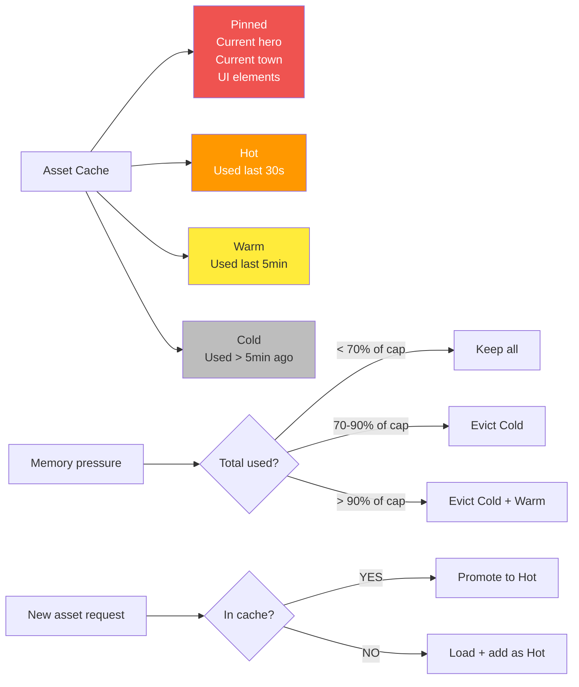

**Memory management.** Recently used assets stay cached. LRU eviction when memory tight. Critical assets (current hero, current town) pinned. Pre-fetch on transitions.

The percentage thresholds below trigger eviction; the **meaning** of
"total used" is the sum of the per-category memory budget pinned in
[`docs/architecture/performance.md` § 4](../performance.md#4-memory-budget).

- Reference tier total: **1 GB** (textures 400 MB, audio 150 MB,
  sim state 150 MB, save snapshots 50 MB, UI 100 MB,
  headroom 150 MB).
- Minimum-spec tier total: **500 MB** (every category halved).

## Eviction Rules

| Tier | Pinned | Eviction Behavior |
|------|--------|-------------------|
| Pinned | Yes | Never evicted |
| Hot | No | Last to evict |
| Warm | No | Evict at 90% of category cap |
| Cold | No | Evict at 70% of category cap |

"Category cap" is the per-category MB ceiling from
[`performance.md` § 4](../performance.md#4-memory-budget). The
texture / atlas cache sees the texture cap; the audio cache sees
the audio cap; etc. Crossing **any** category cap triggers
eviction within that category, independently of other categories.

## Per-Pack Accounting Bucket

Each cached asset is attributed to its owning `packId`. The cache
keeps a **per-pack residency bucket** in addition to the global
tier accounting. Eviction order:

1. **Per-pack LRU first.** If pack `P` exceeds
   `maxResidentBytesPerPack` (64 MB canonical / 32 MB sandboxed,
   per [`asset-loading.md` § 1.2](../asset-loading.md#12-per-pack-budgets)),
   evict the oldest non-Pinned asset belonging to `P` until the
   pack's bucket is back under cap, regardless of global pressure.
2. **Global tier eviction next.** Once every per-pack bucket is
   under cap, the global Cold/Warm/Pinned rules above run.

The per-pack first rule prevents one pack from monopolising the
Pinned tier — a common attack mode where a hostile pack pins
"current hero / town / UI" entries until the global LRU never
fires inside that pack.

Atlas-tracker bytes (renderer atlas pages) are likewise attributed
to the owning `packId` so a renderer-resident atlas counts against
the pack's bucket. Owning task:
[`tasks/mvp/06-renderer/`](../../../tasks/mvp/06-renderer/).
