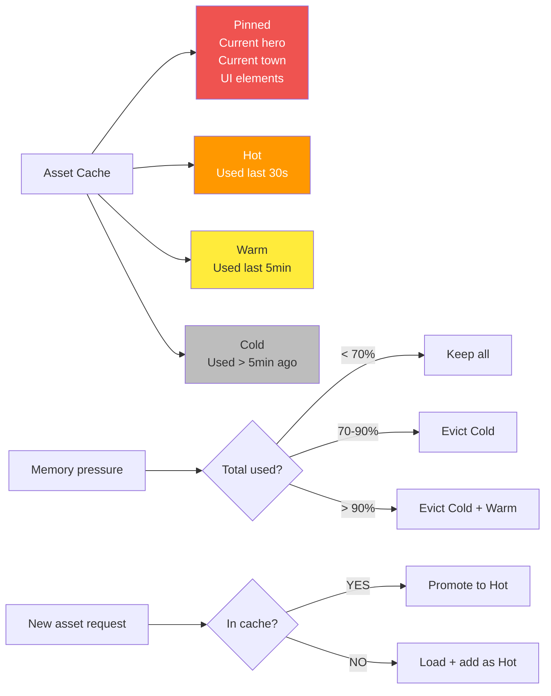

**Memory management.** Recently used assets stay cached. LRU eviction when memory tight. Critical assets (current hero, current town) pinned. Pre-fetch on transitions.

## Eviction Rules

| Tier | Pinned | Eviction Behavior |
|------|--------|-------------------|
| Pinned | Yes | Never evicted |
| Hot | No | Last to evict |
| Warm | No | Evict at 90% memory |
| Cold | No | Evict at 70% memory |
