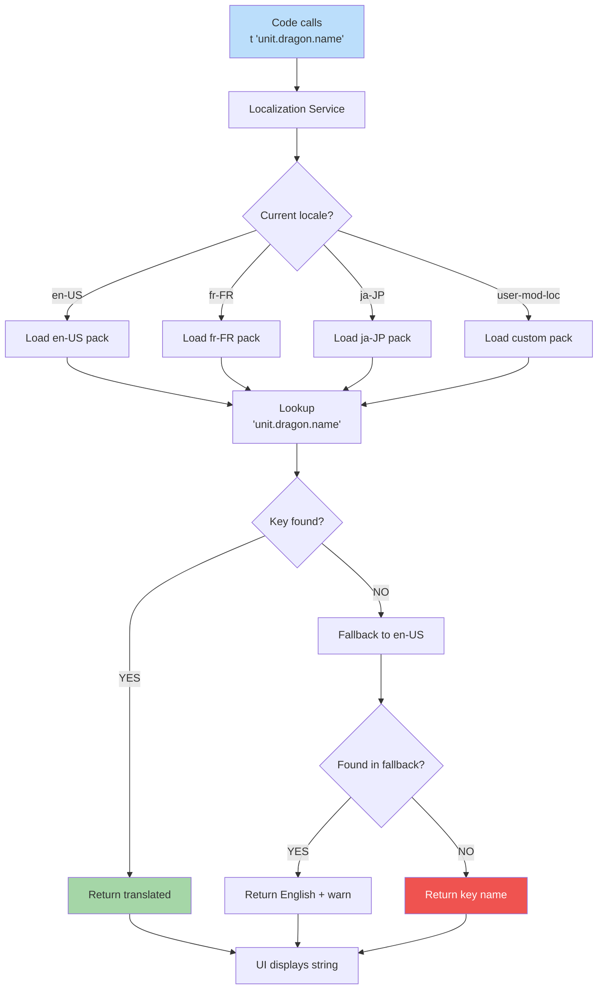

**How text appears in the player's language.** UI strings are referenced
by stable IDs (e.g. `unit.dragon.name`); the active locale pack supplies
translations. Missing keys fall back through `fallbackLocale`, then the
raw key name. Mid-game locale swap is presentation-only — never a
deterministic command.

Companion docs:
[`ui-technology-choice.md § Localization Runtime`](../ui-technology-choice.md#localization-runtime),
[`edge-cases-policy.md § 10`](../edge-cases-policy.md#10-locale-swap-mid-game-q214),
[diagram 19](./19-locale-variants.md),
[diagram 20](./20-number-format.md).
Schema:
[`localization.schema.json`](../../../content-schema/schemas/localization.schema.json).



## Resolution Contract

- **Inputs.** Key (stable ID, `^[a-z0-9]+([.-][a-z0-9*]+)*$`) and
  optional `params?` (resolved by the locale pack's interpolation tier:
  `literal | named | icu`, see schema).
- **Outputs.** Display string ready for render.
- **Side-effects.** A one-shot dev-mode warning on fallback hits; no
  state mutation, no command-log entry, no IndexedDB write.
- **Access.** UI tasks read keys through the `useTranslation()` hook
  (Zustand-backed) so every consumer re-renders on locale change. No
  imperative `t()` calls outside the hook.

Missing keys are a **bind-time** fail-loud per
[`mvp.02-content-schemas.14-localization-schema`](../../../tasks/mvp/02-content-schemas/14-localization-schema.md);
the runtime fallback chain shown above protects translator gaps in
non-default locales, not missing canonical keys.

## Locale Pack Structure

The first-party locale pack ships under `strings/*.json`:

```
locale-en-US/
├── manifest.json
├── strings/
│   ├── ui.json         # UI labels
│   ├── units.json      # Creature names
│   ├── spells.json     # Spell names/descriptions
│   ├── heroes.json     # Hero names/biographies
│   └── tooltips.json   # Help text
```

Every locale pack uses identical keys; translators edit values only.
Per-content-pack locale extensions follow the canonical
`<pack>/locales/<locale>.localization.json` layout per
[`content-system-policy.md § 6`](../content-system-policy.md#6-localization-bundling).

## Mid-Game Locale Swap

Locale change is **presentation-only**, never a deterministic command.
The Options screen Apply emits `LOCALE_CHANGED` to a side-channel
observable (not the command log):

- All subscribed selectors re-render.
- Open transient surfaces (tooltips, popovers, hover cards) are
  dismissed; modals requiring a player choice re-render in-place with
  new strings.
- Setting `dir="rtl"` on the body element flips logical-property layout
  (`margin-inline-start` etc.); no per-component overrides.
- The battle canvas does **not** mirror in MVP — combat layout is
  symmetric (see [diagram 19](./19-locale-variants.md)).

Save metadata captures `localeAtSave`; loading under a different locale
shows no warning (display strings re-resolve normally). Full policy in
[`edge-cases-policy.md § 10`](../edge-cases-policy.md#10-locale-swap-mid-game-q214);
UI binding in
[`wiki/screens/56-options/interactions.md § Locale Swap`](../wiki/screens/56-options/interactions.md).

---

## 🔍 Sync Check

- **UI: ✔** — `LOCALE_CHANGED` event, `dir="rtl"` toggle, transient-surface dismissal, and `localeAtSave` capture match [`wiki/screens/56-options/interactions.md § Locale Swap`](../wiki/screens/56-options/interactions.md) and [`edge-cases-policy.md § 10`](../edge-cases-policy.md#10-locale-swap-mid-game-q214) verbatim.
- **Schema: ⚠** — Key shape and interpolation tiers align with [`localization.schema.json`](../../../content-schema/schemas/localization.schema.json), but the schema's `fallbackLocale` is configurable per bundle while the diagram hardcodes `en-US` as the fallback step. Documented as a default; no enum drift.
- **Tasks: ✔** — Owner task [`mvp.02-content-schemas.14-localization-schema`](../../../tasks/mvp/02-content-schemas/14-localization-schema.md) references the schema and `t()` helper; cross-cut runtime described in [`ui-technology-choice.md § Localization Runtime`](../ui-technology-choice.md#localization-runtime) cites this diagram.

## ⚠ Issues

- **Anchor slug mismatch in `edge-cases-policy.md § 10` cross-link.** Target preserves `#10-locale-swap-mid-game-q214` (also used by `wiki/screens/56-options/interactions.md`), but the heading at [`edge-cases-policy.md:187`](../edge-cases-policy.md) is `## 10. Locale swap mid-game` (GitHub slug `#10-locale-swap-mid-game`, no `-q214` tail). Per the cross-reference convention shared with screen 56, either the heading should be restored to include the `Q214` historical tag or both inbound links should be retargeted; closing this is the owning task for `edge-cases-policy.md` (no per-doc task ID is currently registered for that file). Skill did not silently rewrite the anchor (Hard Prohibition C — links survive the rewrite; cross-file slug fixes belong to the owning doc).
- **Locale-pack folder layout has two canonical forms.** Diagram shows the first-party layout `locale-<id>/strings/{ui,units,spells,heroes,tooltips}.json` (consistent with [`ui-technology-choice.md`](../ui-technology-choice.md#localization-runtime)), while [`mvp.02-content-schemas.14-localization-schema`](../../../tasks/mvp/02-content-schemas/14-localization-schema.md) pins per-content-pack extensions at `<pack>/locales/<locale>.localization.json` (owned by [`mvp.02b-asset-pipeline.14-per-pack-localization-and-merge`](../../../tasks/mvp/02b-asset-pipeline/14-per-pack-localization-and-merge.md)). The rewrite notes both, but the relationship — whether the first-party pack also follows the per-pack convention, or remains the only `strings/*.json`-style pack — is not pinned anywhere. Resolution belongs in [`content-system-policy.md § 6`](../content-system-policy.md#6-localization-bundling) (owned by the per-pack-localization task).
