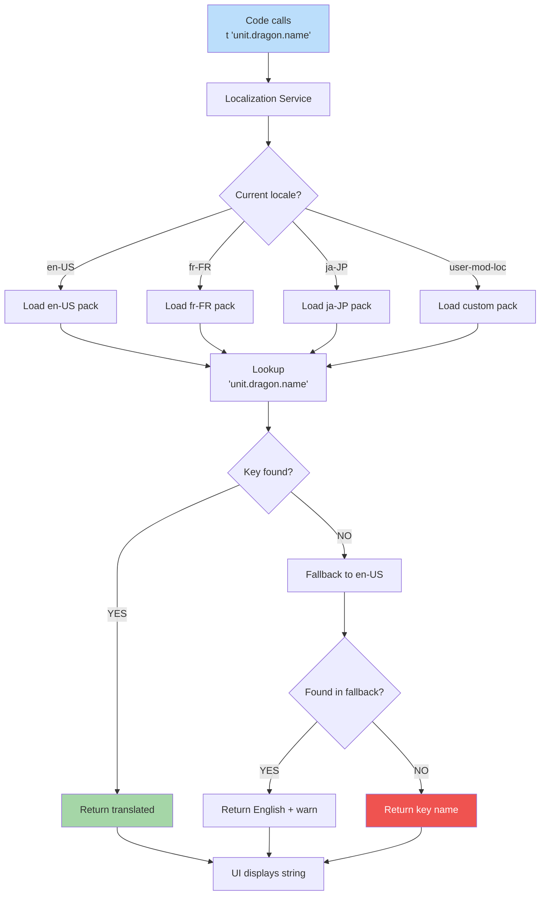

**How text appears in player's language.** All UI strings have IDs (e.g., `unit.dragon.name`). Locale pack provides translations. Fallback to English if missing. Right-to-left layouts handled by UI engine.



## Locale Pack Structure

Each locale pack contains:

```
locale-en-US/
├── manifest.json
├── strings/
│   ├── ui.json         # UI labels
│   ├── units.json      # Creature names
│   ├── spells.json     # Spell names/descriptions
│   ├── heroes.json     # Hero names/biographies
│   └── tooltips.json   # Help text
```

Strings use the same key in every locale pack. Translators only edit values.
