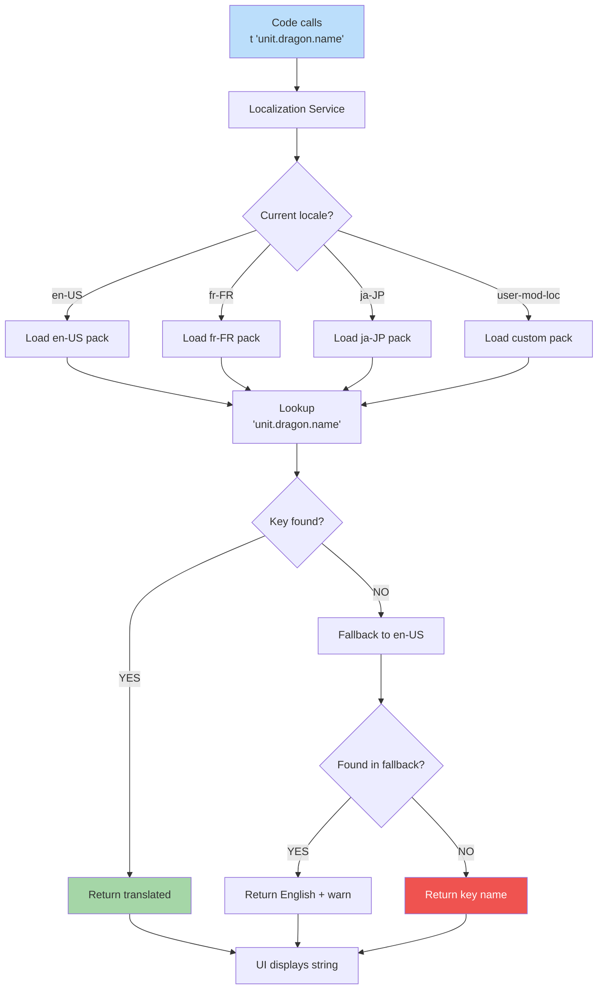

**How text appears in player's language.** All UI strings have IDs (e.g., `unit.dragon.name`). Locale pack provides translations. Fallback to English if missing. Right-to-left layouts handled by UI engine.



## Locale Pack Structure

Each locale pack contains:

```
locale-en-US/
├── manifest.json
├── strings/
│   ├── ui.json         # UI labels
│   ├── units.json      # Creature names
│   ├── spells.json     # Spell names/descriptions
│   ├── heroes.json     # Hero names/biographies
│   └── tooltips.json   # Help text
```

Strings use the same key in every locale pack. Translators only edit values.

## Mid-Game Locale Swap

Locale change is **presentation-only**, never a deterministic
command. The Options screen Apply emits `LOCALE_CHANGED` to a
side-channel observable (not the command log). All subscribed
selectors re-render; open transient surfaces (tooltips, popovers,
hover cards) are dismissed; modals that require a player choice
re-render in-place with new strings. Setting `dir="rtl"` on the
body element flips logical-property layout. The battle canvas does
**not** mirror in MVP (combat layout is symmetric — see
[diagram 19](./19-locale-variants.md)).

Save metadata captures `localeAtSave`; loading under a different
locale shows no warning (display strings re-resolve normally).
Cross-cutting framing in
[`docs/architecture/edge-cases-policy.md` § 10](../edge-cases-policy.md#10-locale-swap-mid-game-q214).
