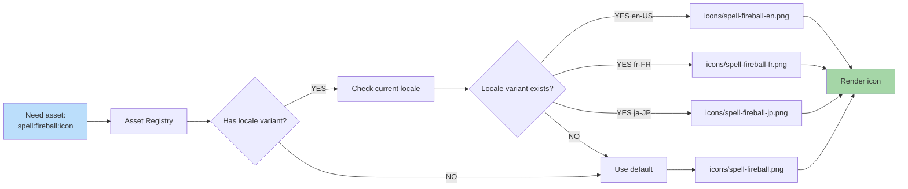

**Some assets vary by locale.** Creature names rendered as text in art. Currency symbols. Cultural icons. Locale pack can override art with localized version.

## When to Use Locale Variants

- Icons containing readable text
- Currency or numeric symbols
- Cultural imagery (e.g., regional decoration)
- Right-to-left UI mirroring assets

Most game assets (creatures, terrain) don't need locale variants.
