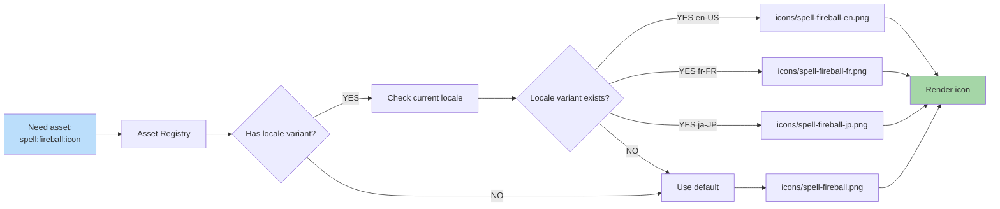

**Some assets vary by locale.** A handful of textures bake readable
text, currency glyphs, or cultural imagery. The asset registry picks
a per-locale override when one exists; otherwise the faction default
is used. Most gameplay assets (creatures, terrain, projectiles) do
**not** vary by locale.

Companion docs:
[diagram 18](./18-string-resolution.md),
[diagram 20](./20-number-format.md),
[`edge-cases-policy.md § 12`](../edge-cases-policy.md#12-asset-load-failure-q215),
[`content-system-policy.md § 6`](../content-system-policy.md#6-localization-bundling),
[`asset-policy.md`](../asset-policy.md).
Owner task:
[`mvp.02b-asset-pipeline.04-asset-registry-id-based-resolution-no-hardcoded-paths`](../../../tasks/mvp/02b-asset-pipeline/04-asset-registry-id-based-resolution-no-hardcoded-paths.md).



## When To Use Locale Variants

- Icons containing readable text.
- Currency or numeric symbols baked into art.
- Cultural imagery (e.g. regional decoration).
- Right-to-left mirrored UI chrome.

Creatures, terrain, projectiles, and combat VFX do **not** vary by
locale — keep them in the faction default to preserve replay parity
across locales.

## Fallback Chain

Resolution order, canonical in
[`edge-cases-policy.md § 12`](../edge-cases-policy.md#12-asset-load-failure-q215):

```
locale variant → faction default → generic placeholder
```

- **Inputs.** Asset ID + active locale (from
  [diagram 18](./18-string-resolution.md)).
- **Output.** A pixel-only URL (or `Blob`); no gameplay fields.
- **Retry.** One retry with 500 ms backoff on `404` / fetch
  failure; subsequent failures in the session use the placeholder
  without further retry.
- **Notification.** One non-modal toast — `"Some visuals couldn't
  load"` — per session, not per asset.
- **Placeholder.** Bundled with the app; never absent.

## Battle Canvas Mirroring

The battle canvas does **not** mirror in MVP. Combat layout is
symmetric, so RTL locales render the canvas identically (also noted
in [diagram 18 § Mid-Game Locale Swap](./18-string-resolution.md#mid-game-locale-swap)).
Future renderer work that introduces an asymmetric layout must
update this section before flipping the mirror.

---

## 🔍 Sync Check

- **UI: ✔** — The "Some visuals couldn't load" toast and once-per-session policy match [`edge-cases-policy.md § 12`](../edge-cases-policy.md#12-asset-load-failure-q215); no dedicated screen package owns locale-variant resolution.
- **Schema: ⚠** — Locale-variant selection is a runtime behavior of the asset registry; [`asset-index.schema.json`](../../../content-schema/schemas/asset-index.schema.json) carries no `locale` discriminator on `assets[]`, and [`manifest.schema.json`](../../../content-schema/schemas/manifest.schema.json) declares no per-locale asset override field. The diagram describes resolver behavior layered over the asset registry, not a declarative schema feature. See `## ⚠ Issues`.
- **Tasks: ✔** — Owner [`mvp.02b-asset-pipeline.04-asset-registry-id-based-resolution-no-hardcoded-paths`](../../../tasks/mvp/02b-asset-pipeline/04-asset-registry-id-based-resolution-no-hardcoded-paths.md) pins the identical fallback chain, 500 ms retry, and once-per-session toast in its Acceptance Criteria.

## ⚠ Issues

- **Anchor slug mismatch in `edge-cases-policy.md § 12` cross-link.** Target preserves `#12-asset-load-failure-q215` (the same slug used by the owning task `mvp.02b-asset-pipeline.04` and by [`mvp.02b-asset-pipeline.04`](../../../tasks/mvp/02b-asset-pipeline/04-asset-registry-id-based-resolution-no-hardcoded-paths.md) AC § Gameplay-vs-presentation), but the heading at [`edge-cases-policy.md:226`](../edge-cases-policy.md) is `## 12. Asset-load failure` (GitHub slug `#12-asset-load-failure`, no `-q215` tail). The same `-qNNN` historical-tag convention is flagged in [diagram 18](./18-string-resolution.md) for `§ 10` — either `edge-cases-policy.md` restores the `Q215` tag in the heading or every inbound link drops the suffix. Skill did not silently rewrite the anchor (Hard Prohibition C — links survive the rewrite; cross-file slug fixes belong to the owning doc, which has no per-doc task ID currently registered).
- **No declarative slot for locale-variant assets.** Diagram describes the registry probing for a per-locale asset (e.g. `icons/spell-fireball-en.png`) before falling back to the faction default, but [`asset-index.schema.json`](../../../content-schema/schemas/asset-index.schema.json) `assets[]` carries no `locale` field and [`manifest.schema.json`](../../../content-schema/schemas/manifest.schema.json) has no per-locale asset-override block. Either the registry derives locale variants by filename suffix (an implicit convention worth pinning in [`asset-path-resolution.md`](../../../docs/architecture/asset-path-resolution.md)), or a future schema change registered via [`schema-matrix.md`](../../../docs/architecture/schema-matrix.md) should add an explicit `locale` discriminator. Closing this belongs in the asset-registry owner task above; skill did not add the field (Hard Prohibition B — never invent features).
