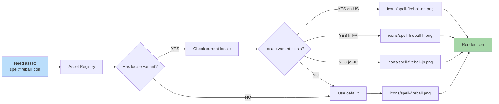

**Some assets vary by locale.** Creature names rendered as text in art. Currency symbols. Cultural icons. Locale pack can override art with localized version.

## When to Use Locale Variants

- Icons containing readable text
- Currency or numeric symbols
- Cultural imagery (e.g., regional decoration)
- Right-to-left UI mirroring assets

Most game assets (creatures, terrain) don't need locale variants.

## Fallback Chain Order

`locale variant → faction default → generic placeholder`. The
generic placeholder is a built-in asset bundled with the app and is
never absent. On a `404` / fetch failure the resolver retries once
with a 500 ms backoff, then falls back to the placeholder for the
remainder of the session. A non-modal toast "Some visuals couldn't
load" is shown once per session, not per asset. Full policy in
[`docs/architecture/edge-cases-policy.md` § 12](../edge-cases-policy.md#12-asset-load-failure-q215).

## Battle Canvas Mirroring

The battle canvas does **not** mirror in MVP — combat layout is
symmetric, so RTL locales render the canvas identically. Document
this exception so future renderer work does not invent an
asymmetric mirror without updating this section first.
