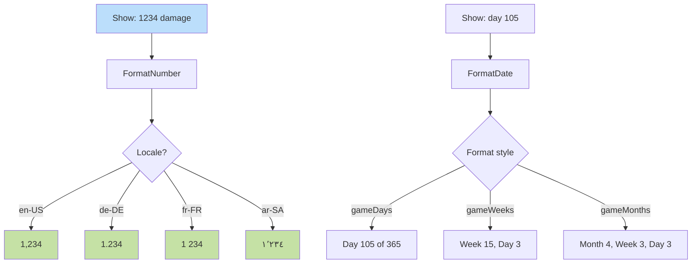

**Locale-aware formatting.** Damage numbers, gold counts, dates use Intl API. RTL languages flip number alignment. Decimal/thousand separators per locale.



## Implementation

Uses native browser `Intl.NumberFormat` and `Intl.DateTimeFormat` APIs. No external library needed. Locale data is built into the browser.

```javascript
new Intl.NumberFormat(locale).format(1234)
// "1,234" en-US
// "1.234" de-DE
// "1 234" fr-FR
```
