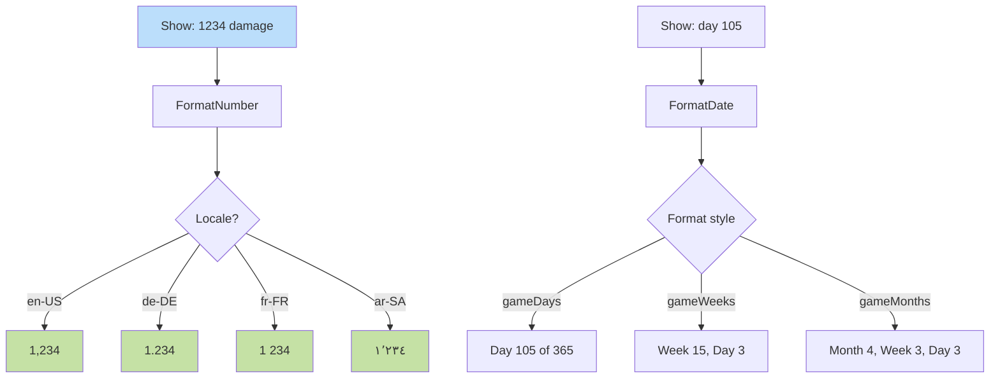

**Locale-aware presentation of numeric and date values.** Damage
numbers, gold counts, and in-game dates render through the browser's
`Intl` APIs so decimal/thousand separators, digit shaping, and date
strings track the active locale. RTL locales inherit number alignment
from `text-align: start`; no per-call mirroring. Formatters are
**presentation-only** — they never run inside deterministic paths.

Companion docs:
[`ui-technology-choice.md § Pluralization, formatting, numbers`](../ui-technology-choice.md#pluralization-formatting-numbers),
[diagram 18](./18-string-resolution.md),
[diagram 19](./19-locale-variants.md),
[`determinism.md § Clock Policy`](../determinism.md#clock-policy),
[`determinism.md § Wall-clock readers`](../determinism.md#wall-clock-readers).
Schema:
[`localization.schema.json`](../../../content-schema/schemas/localization.schema.json).



## Formatter Contract

- **Inputs.** A raw number or a calendar tuple drawn from
  `state.calendar.currentDate` (see
  [`wiki/screens/58-week-month-popup/data-contracts.md`](../wiki/screens/58-week-month-popup/data-contracts.md)),
  plus the active locale ID.
- **Output.** A display string ready for render. No gameplay state
  is written back.
- **Side-effects.** None — formatters are pure with respect to
  `state.*`. No command-log entry, no IndexedDB write.
- **Access.** UI code calls the formatter helpers; ad-hoc
  `toLocaleString()` or `new Intl.NumberFormat(...)` calls outside
  the helpers are out of contract per
  [`ui-technology-choice.md § Pluralization, formatting, numbers`](../ui-technology-choice.md#pluralization-formatting-numbers).

## Implementation

Native browser
[`Intl.NumberFormat`](https://developer.mozilla.org/en-US/docs/Web/JavaScript/Reference/Global_Objects/Intl/NumberFormat)
and
[`Intl.DateTimeFormat`](https://developer.mozilla.org/en-US/docs/Web/JavaScript/Reference/Global_Objects/Intl/DateTimeFormat).
No external library; locale data ships with the browser.

```javascript
new Intl.NumberFormat(locale).format(1234)
// "1,234" en-US
// "1.234" de-DE
// "1 234" fr-FR
```

## Determinism Boundary

`Intl.DateTimeFormat(..., { now: ... })` and any wall-clock-reading
formatter call are forbidden inside `src/engine/**`, `src/rules/**`,
`src/content-runtime/**`, and `src/net/webrtc/**`. The lint rule that
machine-enforces this is
[`mvp.01-engine-core.11-no-wall-clock-lint`](../../../tasks/mvp/01-engine-core/11-no-wall-clock-lint.md);
the policy is canonical in
[`determinism.md § Wall-clock readers`](../determinism.md#wall-clock-readers).
This diagram describes UI-side rendering only — `state.*` stores raw
numbers and calendar tuples, never pre-formatted strings.

---

## 🔍 Sync Check

- **UI: ✔** — Inbound reference from [`ui-technology-choice.md § Pluralization, formatting, numbers`](../ui-technology-choice.md#pluralization-formatting-numbers) cites this diagram as the canonical place for the formatter contract; RTL/`text-align: start` behavior matches [`ui-technology-choice.md § Right-To-Left`](../ui-technology-choice.md#right-to-left).
- **Schema: ⚠** — [`localization.schema.json`](../../../content-schema/schemas/localization.schema.json) declares no formatter API. The `interpolation` block introduced by [`mvp.02-content-schemas.37-localization-interpolation-block`](../../../tasks/mvp/02-content-schemas/37-localization-interpolation-block.md) lists `number` / `date` as ICU formatter tokens, but the per-style names `gameDays` / `gameWeeks` / `gameMonths` exist only in this diagram. See `## ⚠ Issues`.
- **Tasks: ❌** — No task in [`tasks/task-registry.json`](../../../tasks/task-registry.json) owns the runtime formatter helpers, the `gameDays` / `gameWeeks` / `gameMonths` style enum, or the "UI never formats numbers ad hoc" rule cited by [`ui-technology-choice.md § Pluralization, formatting, numbers`](../ui-technology-choice.md#pluralization-formatting-numbers). Sibling diagrams 18 and 19 carry explicit `Owner task:` lines; this diagram does not.

## ⚠ Issues

- **No owner task for the formatter contract.** This diagram is cited by [`ui-technology-choice.md § Pluralization, formatting, numbers`](../ui-technology-choice.md#pluralization-formatting-numbers) as the canonical definition of "the formatters" UI must route through, but no entry in [`tasks/task-registry.json`](../../../tasks/task-registry.json) implements `FormatNumber` / `FormatDate` helpers or enforces the ad-hoc-formatter ban. Sibling diagrams 18 and 19 are owned by [`mvp.02-content-schemas.14-localization-schema`](../../../tasks/mvp/02-content-schemas/14-localization-schema.md) and [`mvp.02b-asset-pipeline.04`](../../../tasks/mvp/02b-asset-pipeline/04-asset-registry-id-based-resolution-no-hardcoded-paths.md) respectively; a parallel task under `mvp/02-content-schemas/` or under the UI module should pin the helper surface, the style enum, and the lint that catches raw `toLocaleString()` / `new Intl.NumberFormat(...)` use outside the helpers. Skill did not add the task (Hard Prohibition B — never invent features).
- **`gameDays` / `gameWeeks` / `gameMonths` style enum has no canonical definition.** The three style values appear only in this diagram (verified by repo-wide grep). They are not enumerated in [`localization.schema.json`](../../../content-schema/schemas/localization.schema.json), in [`localization-schema task acceptance criteria`](../../../tasks/mvp/02-content-schemas/14-localization-schema.md), or in [`wiki/screens/58-week-month-popup/data-contracts.md`](../wiki/screens/58-week-month-popup/data-contracts.md) (which exposes `state.calendar.currentDate` as the formatter input). Either the style enum needs a schema home registered through [`schema-matrix.md`](../schema-matrix.md), or it should be pinned in the missing formatter-helper task above. Skill kept the names verbatim in the diagram (Hard Prohibition A — never change meaning) and surfaced the gap rather than rewriting them.
- **No Companion docs block in the original.** Sibling diagrams 18 and 19 lead with a Companion docs block and an Owner task line; the pre-audit version of this file had neither. The rewrite adds the Companion docs block from already-cited references only (`ui-technology-choice.md`, diagrams 18/19, `determinism.md`, `localization.schema.json`); the Owner task line is omitted pending resolution of the first issue above.
