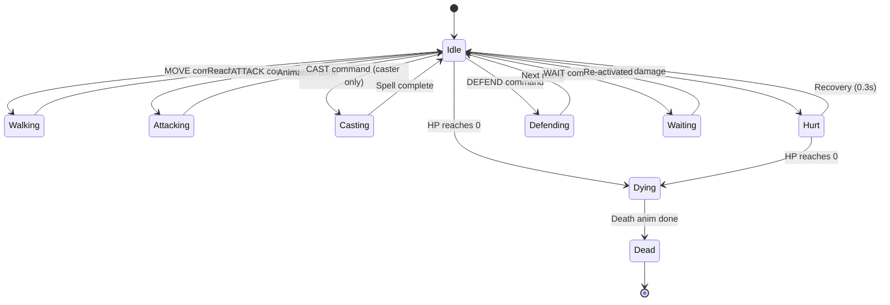

**Each creature on screen has an animation state.** States transition based on game events. Animation player handles frame timing. Same machine works for all creatures - data-driven.

## Required Animations Per Creature

Every creature MUST provide:
- `idle` (looping)
- `walking` (looping)
- `attacking` (one-shot with damage frame)
- `hurt` (one-shot, ~0.3s)
- `dying` (one-shot)

OPTIONAL:
- `casting` (only for spell-using creatures)
- `defending` (defaults to idle if missing)
- `special` (creature-specific abilities)

## Conflict Resolution

The states above are mutually exclusive on the body channel. When two
events fire concurrently (e.g. `attacking` in flight while a hit
arrives), the higher-priority state wins. The full priority table —
plus the `status` and `fx` channel policies and the rules for
mid-anim destruction (killed-mid-`hurt`, retaliation-mid-`attacking`,
projectile-orphan, summon-timer-expiry) — lives in
[`../animation-contract.md` § Conflict Resolution](../animation-contract.md#conflict-resolution).
