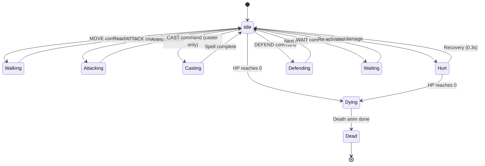

**Body-channel state machine for every creature on screen.** Each
creature runs the same machine, parameterized by its
`AnimationSet`. States transition on engine events; the animation
player handles frame timing. The renderer never gates engine state —
all transitions are presentation-only reactions to events already in
the log.

Companion docs:

- [`../animation-contract.md`](../animation-contract.md) — clock
  model, channels, body-channel priority, mid-anim destruction,
  asset fallback, degradation.
- [`../event-schema.md`](../event-schema.md) — closed event
  vocabulary consumed by the state machine.
- [`./11-attack-anim.md`](./11-attack-anim.md),
  [`./12-spell-anim.md`](./12-spell-anim.md),
  [`./13-death-victory.md`](./13-death-victory.md) — per-state
  sequence walk-throughs.
- [`../../content-schema/schemas/animation.schema.json`](../../../content-schema/schemas/animation.schema.json)
  — sequence + channel schema (clip names, `eventFrame`,
  body/status/fx tracks).

## State → Event Mapping

Each transition is driven by an engine event on the body channel.
Numbers in parentheses are the body-channel priorities from
[`../animation-contract.md` § Conflict Resolution](../animation-contract.md#conflict-resolution);
higher priorities preempt running lower-priority sequences.

| State | Triggering event | Engine source command |
|---|---|---|
| `walking` (2) | `UNIT_MOVED` | `BATTLE_MOVE` / `MOVE_HERO` |
| `attacking` (6) | `UNIT_ATTACKED` (this unit = attacker) | `BATTLE_ATTACK` |
| `casting` (5) | `SPELL_CAST` (this unit = caster) | `SPELL_CAST` |
| `hurt` (7) | `UNIT_ATTACKED` (this unit = defender) | `BATTLE_ATTACK`, `BATTLE_SPELL` |
| `dying` (9) | `UNIT_DIED` | `BATTLE_ATTACK`, `BATTLE_SPELL`, `AUTO_RESOLVE_BATTLE` |
| `defending` (4) | `UNIT_DEFENDED` (see Issues — not yet in event vocabulary) | `BATTLE_DEFEND` |
| `waiting` (3) | `UNIT_WAIT` (see Issues — not yet in event vocabulary) | `BATTLE_WAIT` |
| `idle` (1) | default | — |

## Required Animations Per Creature

Every creature pack **must** provide:

- `idle` (looping)
- `walking` (looping)
- `attacking` (one-shot with declared `eventFrame`)
- `hurt` (one-shot, ~0.3 s recovery)
- `dying` (one-shot)

A missing required clip is a fail-loud pack validation error per
[`../animation-contract.md` § Asset Fallback](../animation-contract.md#asset-fallback).

Optional clips and their documented substitutes (per the same § 8
table):

- `casting` → `idle` (only declared by spell-using creatures)
- `defending` → `idle`
- `special` → `attacking` (creature-specific abilities)

## Conflict Resolution

The states above are mutually exclusive on the body channel. When
two events fire concurrently (e.g. `attacking` is in flight while a
hit arrives), the higher-priority state interrupts the running one
and the new sequence starts at frame 0. Status and fx channels run
concurrently as overlays and never interrupt the body channel.

The full priority table, the `status` and `fx` channel policies,
and the rules for mid-anim destruction (killed-mid-`hurt`,
retaliation-mid-`attacking`, projectile-orphan, summon-timer-expiry)
live in
[`../animation-contract.md` § Conflict Resolution](../animation-contract.md#conflict-resolution)
and § Mid-Anim Destruction.

---

## 🔍 Sync Check

- **UI: ✔** — No direct UI bindings. Body-channel state is surfaced
  per entity in the animation debug overlay
  ([`../wiki/screens/67-animation-debug-overlay/`](../wiki/screens/67-animation-debug-overlay/)),
  matching the channel split in
  [`../animation-contract.md` § Conflict Resolution](../animation-contract.md#conflict-resolution).
- **Schema: ✔** — Clip names (`idle`, `walking`, `attacking`,
  `casting`, `hurt`, `dying`, `defending`, `special`) and the
  body/status/fx channel split match
  [`animation.schema.json`](../../../content-schema/schemas/animation.schema.json).
  Required-vs-optional clip set matches
  [`../animation-contract.md` § Asset Fallback](../animation-contract.md#asset-fallback)
  verbatim, including the `casting → idle`, `defending → idle`,
  `special → attacking` substitutes.
- **Tasks: ⚠** — A Grep across `tasks/` returns no reference to
  this diagram. The owning runtime task is the renderer animation
  timeline
  ([`mvp/06-renderer/07-event-log-animation-timeline.md`](../../../tasks/mvp/06-renderer/07-event-log-animation-timeline.md),
  per `../animation-contract.md` ⚠ Issues); the events the state
  machine consumes are emitted by tactical-combat tasks under
  [`mvp/09-tactical-combat/`](../../../tasks/mvp/09-tactical-combat/).
  Neither cites this diagram in *Read First* — see Issues.

## ⚠ Issues

- **`defending` / `waiting` / summon-expiry have no entry in the
  closed event vocabulary.** The State → Event Mapping table needs
  `UNIT_DEFENDED` and `UNIT_WAIT`, and § Mid-Anim Destruction in
  the parent contract needs `UNIT_DESPAWNED`. The closed 13-kind
  vocabulary in [`../event-schema.md`](../event-schema.md) and
  [`event.schema.json`](../../../content-schema/schemas/event.schema.json)
  includes none of them. Same gap is already flagged in
  [`../animation-contract.md` `## ⚠ Issues`](../animation-contract.md#-issues)
  and [`./06-town-animations.md` `## ⚠ Issues`](./06-town-animations.md#-issues).
  Per `event-schema.md` ("Adding a new kind requires extending
  `event.schema.json`, this doc, and `screen-event-coverage.json` in
  the same change"), the closing fix is to add `unitDefended`,
  `unitWaited`, and `unitDespawned` event `$defs` plus matching
  `BATTLE_DEFEND` / `BATTLE_WAIT` commands. Owning tasks: jointly
  the tactical-combat reducer ([`mvp/09-tactical-combat/`](../../../tasks/mvp/09-tactical-combat/),
  engine emitters) and
  [`mvp/06-renderer/07-event-log-animation-timeline.md`](../../../tasks/mvp/06-renderer/07-event-log-animation-timeline.md)
  (renderer consumer). Skill preserved the diagram and Source
  column because event-vocabulary registration is structural
  (anti-cheat rule D).
- **`UNIT_ATTACKED` payload drift between the diagram cluster and
  the canonical event schema.** Both rows that map to
  `UNIT_ATTACKED` (`attacking`, `hurt`) assume the event carries an
  `eventFrame` / `animId` — that is the contract used by
  [`./11-attack-anim.md`](./11-attack-anim.md) and
  [`../animation-contract.md` § DAMAGE_FRAME Ownership](../animation-contract.md#damage_frame-ownership).
  The canonical `unitAttacked` payload in
  [`event.schema.json`](../../../content-schema/schemas/event.schema.json)
  is `{ attackerStackId, defenderStackId, damage }` with
  `additionalProperties: false` — there is no `eventFrame`, no
  `animId`, and the names are `*StackId`, not the `*Id` used in
  this and sibling docs. Same gap already flagged in
  [`../animation-contract.md` `## ⚠ Issues`](../animation-contract.md#-issues).
  Per CLAUDE.md root contract (schemas are canonical), closing fix
  is one of: (a) extend `event.schema.json` `unitAttacked` to add
  optional `eventFrame: integer ≥ 0` and `animId: stringId`; or
  (b) carry presentation fields on a separate event kind. Owning
  task: jointly the engine task that emits `UNIT_ATTACKED` under
  [`mvp/09-tactical-combat/`](../../../tasks/mvp/09-tactical-combat/)
  and
  [`mvp/06-renderer/07-event-log-animation-timeline.md`](../../../tasks/mvp/06-renderer/07-event-log-animation-timeline.md).
  Skill did not edit cross-checked files (anti-cheat rule D).
- **Owning renderer task does not cite this diagram in *Read
  First*.** A Grep across `tasks/` shows no task references
  `diagrams/21-creature-states.md`. Per
  [`.agents/rules/tasks.md`](../../../.agents/rules/tasks.md)
  (*Read First* surface), the renderer animation timeline task
  ([`mvp/06-renderer/07-event-log-animation-timeline.md`](../../../tasks/mvp/06-renderer/07-event-log-animation-timeline.md))
  should list it explicitly so an implementer pulling the spec
  also gets the state machine. Same cross-link gap is already
  flagged for `../animation-contract.md` and the sibling
  animation diagrams; the closing fix is shared. Skill did not
  edit task files (anti-cheat rule D).
